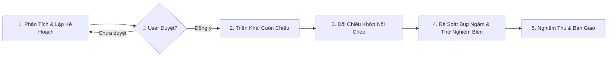

# HƯỚNG DẪN DÀNH CHO AI AGENT (GEMINI CLI ASSISTANT)
## DỰ ÁN: HỆ THỐNG HỖ TRỢ RA QUYẾT ĐỊNH MUA HÀNG TÍCH HỢP AI (DSS AI PURCHASE)

> **Mục tiêu:** Tài liệu này đóng vai trò là "Kim chỉ nam" (Single Source of Guidance) cho AI Agent trong suốt quá trình phát triển mã nguồn, kiểm thử, refactor và bảo trì hệ thống. Mọi phản hồi và hành động của Agent **BẮT BUỘC** phải tuân thủ nghiêm ngặt các nguyên tắc, bảng điều hướng tài liệu và quy trình kiểm tra dưới đây.

---

## 1. TRIẾT LÝ PHÁT TRIỂN & CAM KẾT CHẤT LƯỢNG (CORE ETHOS)

1. **Tuân thủ tài liệu tuyệt đối (Zero Deviation):**
   * Toàn bộ kiến trúc, bảng cơ sở dữ liệu, tên trường, công thức toán học, hợp đồng API và mã lỗi đã được thiết kế hoàn chỉnh trong thư mục `docs/`.
   * **CẤM** tự ý thay đổi tên trường, thêm bớt bảng, thay đổi công thức toán, hoặc tự bịa ra các API endpoint không có trong đặc tả.
2. **Nguyên tắc Clean Architecture & Tách Biệt Trách Nhiệm:**
   * **Domain Layer:** Là trung tâm bất biến, không phụ thuộc vào Express, Prisma, hay bất kỳ thư viện ngoài nào. Mọi nghiệp vụ toán học ($SS, ROP, Q_{raw}$, ABC-XYZ, OTIF) phải nằm trọn vẹn trong Domain Services.
   * **Application Layer:** Điều phối Use Cases, nhận Request DTO, gọi Domain Services/Repositories, trả về Response DTO.
   * **Infrastructure Layer:** Triển khai Repository interfaces bằng Prisma, kết nối AI Service qua HTTP Client, xử lý bảo mật (Bcrypt/JWT), đọc file Excel/CSV.
   * **Presentation / API Layer:** Tiếp nhận HTTP Request, validate dữ liệu đầu vào bằng Zod, gọi Use Case, chuẩn hóa response Envelope.
3. **Stateless AI Service:**
   * Dịch vụ AI (Python FastAPI) chỉ thực hiện tính toán số học thuần túy (Compute Engine), **tuyệt đối không kết nối trực tiếp đến PostgreSQL**. Mọi dữ liệu lịch sử bán hàng phải được Backend truyền sang qua HTTP payload.
4. **Bảo Toàn Tính Toàn Vẹn Dữ Liệu (ACID & Anti-Duplicate):**
   * Mọi thao tác ghi nhiều bảng (ví dụ: `UC-014` Nghiệm thu hàng & Cập nhật tồn kho) bắt buộc bọc trong `prisma.$transaction`.
   * Vị trí tồn kho $IP = \text{On-Hand} + \text{On-Order}$ phải được duy trì chính xác để chống đặt hàng trùng lặp (`BR-001`).

---

## 2. QUY TRÌNH 5 GIAI ĐOẠN LÀM VIỆC NGHIÊM NGẶT (STRICT 5-STAGE PROTOCOL)

Khi nhận bất kỳ yêu cầu lập trình (Phase, Use Case, Module hoặc Task sửa lỗi), Agent **BẮT BUỘC** tuân thủ tuần tự 5 giai đoạn:



### Giai đoạn 1: Phân Tích Kỹ Thuật & Lập Kế Hoạch (Planning & Approval Gate)
1. **Đọc tài liệu mục tiêu:** Tra cứu Bảng Điều Hướng (Section 4 & 5), đọc chính xác các file nghiệp vụ, Use Case và kiến trúc liên quan.
2. **Chia nhỏ bài toán (Chunking):**
   * Nếu Phase hoặc Task có phạm vi rộng (nhiều bảng, nhiều layer, hoặc cả frontend/backend), **BẮT BUỘC** chia nhỏ thành các Milestone/Sub-task tuần tự, độc lập và khả thi.
   * Xác định rõ ràng Definition of Done (DoD) cho từng phần nhỏ.
3. **Trình bày kế hoạch hành động:**
   * Liệt kê cụ thể danh sách file cần tạo mới `[NEW]` hoặc chỉnh sửa `[MODIFY]`.
   * Mô tả ngắn gọn logic cốt lõi sẽ triển khai cho từng file.
   * Nêu rõ các rủi ro kỹ thuật, điểm nghẽn hoặc giả định (nếu có).
4. 🛑 **CỔNG KIỂM SOÁT BẮT BUỘC (APPROVAL GATE):**
   * **DỪNG LẠI và CHỜ USER DUYỆT KẾ HOẠCH.**
   * **CẤM** tự ý viết code khi chưa có sự xác nhận ("Đồng ý", "Duyệt", "Proceed", ...) từ người dùng.

### Giai đoạn 2: Triển Khai Cuốn Chiếu Từng Phần (Incremental Implementation)
1. Tiến hành viết code tuần tự theo từng Milestone/Sub-task đã được duyệt.
2. Không sửa hàng loạt file ở các tầng khác nhau cùng lúc nếu chưa hoàn thành logic tầng nền tảng.
3. Tuân thủ nghiêm ngặt Clean Architecture: Domain $\rightarrow$ Application $\rightarrow$ Infrastructure $\rightarrow$ Presentation.

### Giai đoạn 3: Kiểm Tra Khớp Nối & Tính Nhất Quán Chéo (Cross-Component Consistency)
Sau khi viết code, **TUYỆT ĐỐI KHÔNG CHỈ DỪNG LẠI Ở VIỆC CODE CHẠY ĐƯỢC / KHÔNG BÁO LỖI BIÊN DỊCH**. Agent bắt buộc phải rà soát đối chiếu chéo giữa các tầng:
1. **Database $\leftrightarrow$ Prisma $\leftrightarrow$ Domain:**
   * Tên cột SQL, kiểu dữ liệu, ràng buộc check trong `docs/04-data-model/physical-schema.sql` $\equiv$ Model trong `backend/prisma/schema.prisma` $\equiv$ Domain Entity $\equiv$ DTO.
   * Các cột tính toán tự động (như `calculated_ip`) hoặc trigger database phải đồng bộ 100% với logic code backend (`BR-001`).
2. **Backend $\leftrightarrow$ Frontend:**
   * DTO / Zod Schema trả về từ Backend $\equiv$ TypeScript Interface / Type của Frontend.
   * Định dạng dữ liệu thời gian (ISO 8601 UTC), định dạng tiền tệ, mã trạng thái đơn hàng và mã lỗi.
3. **Backend $\leftrightarrow$ AI Service Python:**
   * Khớp nối hợp đồng HTTP POST: Định dạng mảng lịch sử bán hàng, kiểu float/int, cấu trúc JSON trả về (`wape`, `mae`, `confidence_interval`).
4. **Trạng Thái Nghiệp Vụ (State Machine Integrity):**
   * Máy trạng thái đơn hàng (`DRAFT` $\rightarrow$ `ORDERED` $\rightarrow$ `RECEIVED` / `CANCELLED`) được bảo vệ chặt chẽ, không có đường tắt hoặc lỗ hổng trạng thái (`BR-025`).
5. **Docker & Cấu Hình Môi Trường:**
   * Mọi biến môi trường mới đều phải có mặt trong `.env.example`, `docker-compose.yml` và build-time arguments trong các `Dockerfile`.

### Giai đoạn 4: Rà Soát Bug Ngầm & Thử Nghiệm Biên (Deep Audit & Edge-Case Inspection)
Chủ động phân tích logic để triệt tiêu các bug ngầm trước khi bàn giao:
* **Giao dịch & ACID (`BR-018`):** Các tác vụ ghi nhiều bảng (nhận hàng, chốt PO) đã bọc đầy đủ trong `prisma.$transaction` chưa? Có nguy cơ race condition hay deadlock không?
* **Phép toán & Xử lý số học:** Kiểm tra nguy cơ chia cho 0 (division by zero khi mẫu số bằng 0 trong tính WAPE, OTIF, % biến động), xử lý làm tròn MOQ/Pack Size (`BR-009`, `BR-010`), làm tròn số âm hoặc số thực.
* **Nullability & Undefined:** Kiểm tra an toàn khi mảng rỗng, dữ liệu thiếu, sản phẩm chưa từng có lịch sử bán (Cold Start `UC-008`).
* **Fallback & Timeout (`BR-007`):** AI Service bị timeout (> 4s) hoặc trả về lỗi thì cơ chế SMA-7 fallback cục bộ có kích hoạt an toàn và ghi log không?

### Giai đoạn 5: Nghiệm Thu & Bàn Giao (Sign-Off & Verification)
1. Chạy toàn bộ Unit Tests, Integration Tests và Linting.
2. Kiểm tra lại toàn bộ Pre-submission Checklist (Section 7).
3. Báo cáo kết quả rõ ràng, minh bạch cho người dùng.

---

## 3. CẤU TRÚC THƯ MỤC CHUẨN CỦA DỰ ÁN (CANONICAL DIRECTORY TREE)

Mọi mã nguồn Backend bắt buộc tuân theo cấu trúc đã quy định trong `docs/05-architecture/backend-architecture.md`:

```
backend/src/
├── domain/                        # TẦNG 1: DOMAIN LAYER (Pure TS, Zero Libs)
│   ├── entities/                  # Product, Supplier, Inventory, PurchaseOrder, etc.
│   ├── value-objects/             # SKU, POCode, RiskLevel, Money, WeightDistribution
│   ├── services/                  # InventoryCalculator, ABCXYZClassifier, OrderRoundingService, SupplierScoringService
│   ├── repositories/              # IProductRepository, ISupplierRepository, etc. (Interfaces)
│   └── exceptions/                # DomainException, ValidationException, etc.
├── application/                   # TẦNG 2: APPLICATION LAYER
│   ├── use-cases/                 # Các Use Case tương ứng theo từng module nghiệp vụ
│   ├── dtos/                      # Request / Response DTOs
│   └── ports/                     # IAIForecastClient, ITokenService, IPasswordHasher, IUnitOfWork, IFileParser
├── infrastructure/                # TẦNG 3: INFRASTRUCTURE LAYER
│   ├── database/                  # prisma.ts, PrismaUnitOfWork.ts
│   ├── repositories/              # PrismaProductRepository, PrismaInventoryRepository, etc.
│   ├── external-services/         # AxiosAIForecastClient.ts
│   ├── security/                  # BcryptPasswordHasher.ts, JwtTokenService.ts
│   └── file-parsers/              # ExcelFileParser.ts
└── api/                           # TẦNG 4: PRESENTATION / API LAYER
    ├── controllers/               # Express Controllers
    ├── middlewares/               # authMiddleware, rbacMiddleware, validateMiddleware, errorMiddleware, uploadMiddleware
    ├── validations/               # Zod Schemas
    ├── routes/                    # Express Routers
    └── server.ts                  # Express Application Server Entrypoint
```

---

## 4. BẢNG ĐIỀU HƯỚNG TÀI LIỆU THEO TÁC VỤ (TASK-TO-DOCUMENT ROUTER)

Trước khi thực hiện một tác vụ cụ thể, Agent hãy tìm tác vụ trong bảng dưới đây và mở chính xác tài liệu được liên kết:

| Nhóm Tác Vụ Cần Làm | File Tài Liệu Bắt Buộc Phải Đọc Trước | Nội Dung Trọng Tâm Cần Nắm Bắt |
| :--- | :--- | :--- |
| **Tìm hiểu nghiệp vụ, logic tính toán** | [`docs/02-requirements/business-rules.md`](docs/02-requirements/business-rules.md) | 26 quy tắc nghiệp vụ (`BR-001` $\rightarrow$ `BR-026`), công thức tính ROP, SS, Qraw, Pareto ABC, CV XYZ, OTIF. |
| **Xem chi tiết 17 luồng Use Case** | [`docs/03-use-cases/overview.md`](docs/03-use-cases/overview.md) và các file `docs/03-use-cases/UC-xxx.md` | Luồng sự kiện chính, ngoại lệ, điều kiện tiên quyết, dữ liệu đầu vào/ra của từng Use Case. |
| **Cơ sở dữ liệu, bảng, cột, kiểu dữ liệu** | [`docs/04-data-model/physical-schema.sql`](docs/04-data-model/physical-schema.sql)<br>[`docs/04-data-model/data-dictionary.md`](docs/04-data-model/data-dictionary.md) | DDL 18 bảng chuẩn PostgreSQL, kiểu dữ liệu, ràng buộc Foreign Key, Unique, Check Constraint, ENUMs. |
| **Toàn vẹn dữ liệu, giao dịch nhận hàng ACID** | [`docs/04-data-model/data-flow-and-integrity.md`](docs/04-data-model/data-flow-and-integrity.md) | Luồng luân chuyển dữ liệu, cơ chế bọc giao dịch ACID trong nhận hàng (`UC-014`), chống đặt trùng (`BR-001`). |
| **Thiết kế Backend & Clean Architecture** | [`docs/05-architecture/backend-architecture.md`](docs/05-architecture/backend-architecture.md) | Cấu trúc 4 tầng Clean Architecture, phân quyền RBAC, quản lý transaction bằng Unit of Work. |
| **Thiết kế Dịch vụ AI (Python FastAPI)** | [`docs/05-architecture/ai-service-architecture.md`](docs/05-architecture/ai-service-architecture.md) | Kiến trúc Stateless AI, mô hình Holt-Winters + SMA-7, cơ chế Fallback tự động khi WAPE > 40%. |
| **Thiết kế Giao diện Frontend React** | [`docs/05-architecture/frontend-architecture.md`](docs/05-architecture/frontend-architecture.md) | Cấu trúc Feature-based, bảng màu 5 cấp độ rủi ro tồn kho, biểu đồ ECharts 9 ô ABC-XYZ và dải mây dự báo. |
| **Quy chuẩn API Endpoint & Mã lỗi** | [`docs/06-api-design/endpoints-spec.md`](docs/06-api-design/endpoints-spec.md)<br>[`docs/06-api-design/openapi.yaml`](docs/06-api-design/openapi.yaml) | Chuẩn Envelope phản hồi `{ success, data, meta, timestamp }`, quy chuẩn mã lỗi HTTP & Error Codes. |
| **Hợp đồng giao tiếp Backend <-> AI Service** | [`docs/06-api-design/internal-ai-contracts.md`](docs/06-api-design/internal-ai-contracts.md) | Định dạng Payload JSON gọi dự báo đơn SKU và batch toàn bộ danh mục, cấu trúc dải tin cậy 95%. |
| **Kế hoạch triển khai & Tiêu chuẩn nghiệm thu** | [`docs/07-implementation-plan/overview.md`](docs/07-implementation-plan/overview.md)<br>[`docs/07-implementation-plan/phase-details.md`](docs/07-implementation-plan/phase-details.md) | Lộ trình 7 Phase (Phase 0 $\rightarrow$ Phase 6), tiêu chí Definition of Done (DoD), checklist kiểm thử. |

---

## 5. BẢNG TRA CỨU USE CASE $\leftrightarrow$ FILE TÀI LIỆU CHI TIẾT

Khi được yêu cầu lập trình một Use Case cụ thể, hãy mở trực tiếp file Use Case tương ứng:

| Mã UC | Tên Use Case | Đường Dẫn Tài Liệu |
| :--- | :--- | :--- |
| **UC-001** | Quản lý danh mục sản phẩm (CRUD, Pack size, MOQ) | [`docs/03-use-cases/UC-001-quan-ly-danh-muc-san-pham.md`](docs/03-use-cases/UC-001-quan-ly-danh-muc-san-pham.md) |
| **UC-002** | Quản lý danh mục nhà cung cấp & bảng giá theo SKU | [`docs/03-use-cases/UC-002-quan-ly-danh-muc-nha-cung-cap.md`](docs/03-use-cases/UC-002-quan-ly-danh-muc-nha-cung-cap.md) |
| **UC-003** | Nạp dữ liệu bán hàng & tồn kho (Excel/CSV) | [`docs/03-use-cases/UC-003-nap-du-lieu-ban-hang-va-ton-kho.md`](docs/03-use-cases/UC-003-nap-du-lieu-ban-hang-va-ton-kho.md) |
| **UC-004** | Theo dõi tồn kho & cảnh báo 5 cấp rủi ro | [`docs/03-use-cases/UC-004-theo-doi-ton-kho-va-canh-bao-rui-ro.md`](docs/03-use-cases/UC-004-theo-doi-ton-kho-va-canh-bao-rui-ro.md) |
| **UC-005** | Xem phân tích ma trận 9 ô ABC - XYZ | [`docs/03-use-cases/UC-005-xem-phan-tich-ma-tran-abc-xyz.md`](docs/03-use-cases/UC-005-xem-phan-tich-ma-tran-abc-xyz.md) |
| **UC-006** | Xem chi tiết phân tích sản phẩm 360° | [`docs/03-use-cases/UC-006-xem-chi-tiet-phan-tich-san-pham.md`](docs/03-use-cases/UC-006-xem-chi-tiet-phan-tich-san-pham.md) |
| **UC-007** | Xem dự báo nhu cầu bán lẻ AI (7/14/30 ngày) | [`docs/03-use-cases/UC-007-xem-du-bao-nhu-cau-ban-le.md`](docs/03-use-cases/UC-007-xem-du-bao-nhu-cau-ban-le.md) |
| **UC-008** | Nhập lượng bán dự kiến cho SP mới Cold Start | [`docs/03-use-cases/UC-008-nhap-luong-ban-du-kien-cho-san-pham-moi.md`](docs/03-use-cases/UC-008-nhap-luong-ban-du-kien-cho-san-pham-moi.md) |
| **UC-009** | Xem đánh giá & xếp hạng nhà cung cấp | [`docs/03-use-cases/UC-009-xem-danh-gia-va-xep-hang-nha-cung-cap.md`](docs/03-use-cases/UC-009-xem-danh-gia-va-xep-hang-nha-cung-cap.md) |
| **UC-010** | Xem khuyến nghị mua hàng thông minh (Explainable)| [`docs/03-use-cases/UC-010-xem-khuyen-nghi-mua-hang-thong-minh.md`](docs/03-use-cases/UC-010-xem-khuyen-nghi-mua-hang-thong-minh.md) |
| **UC-011** | Chạy lại phân tích & cập nhật DSS on-demand | [`docs/03-use-cases/UC-011-chay-lai-phan-tich-va-cap-nhat-khuyen-nghi.md`](docs/03-use-cases/UC-011-chay-lai-phan-tich-va-cap-nhat-khuyen-nghi.md) |
| **UC-012** | Lập và xác nhận đơn mua hàng (PO DRAFT -> ORDERED)| [`docs/03-use-cases/UC-012-lap-va-xac-nhan-don-mua-hang.md`](docs/03-use-cases/UC-012-lap-va-xac-nhan-don-mua-hang.md) |
| **UC-013** | Quản lý & tra cứu lịch sử đơn mua hàng / Hủy đơn | [`docs/03-use-cases/UC-013-quan-ly-va-tra-cuu-lich-su-don-mua-hang.md`](docs/03-use-cases/UC-013-quan-ly-va-tra-cuu-lich-su-don-mua-hang.md) |
| **UC-014** | Ghi nhận nhận hàng & Cập nhật tồn kho nguyên tử | [`docs/03-use-cases/UC-014-ghi-nhan-nhan-hang-va-cap-nhat-ton-kho.md`](docs/03-use-cases/UC-014-ghi-nhan-nhan-hang-va-cap-nhat-ton-kho.md) |
| **UC-015** | Đăng nhập & Quản lý phiên làm việc cá nhân | [`docs/03-use-cases/UC-015-dang-nhap-va-quan-ly-phien-lam-viec.md`](docs/03-use-cases/UC-015-dang-nhap-va-quan-ly-phien-lam-viec.md) |
| **UC-016** | Quản lý tài khoản người dùng (CRUD, Khóa, Phân quyền)| [`docs/03-use-cases/UC-016-quan-ly-tai-khoan-nguoi-dung.md`](docs/03-use-cases/UC-016-quan-ly-tai-khoan-nguoi-dung.md) |
| **UC-017** | Cấu hình trọng số đánh giá nhà cung cấp (Admin) | [`docs/03-use-cases/UC-017-cau-hinh-trong-so-danh-gia-nha-cung-cap.md`](docs/03-use-cases/UC-017-cau-hinh-trong-so-danh-gia-nha-cung-cap.md) |

---

## 6. QUY CHUẨN ĐẶT TÊN & ĐỊNH DẠNG MÃ NGUỒN (CODE CONVENTIONS)

1. **Ngôn ngữ trong mã nguồn:**
   * Mã nguồn, biến, hàm, class, comments kỹ thuật: **Tiếng Anh 100%**.
   * Thông báo lỗi trả về cho người dùng (UI messages, validation messages, toast): **Tiếng Việt 100%**.
2. **Quy tắc đặt tên (Naming Conventions):**
   * Class, Interface, Type, Component React: `PascalCase` (ví dụ: `ProductService`, `IProductRepository`, `InventoryTable`).
   * Biến, hàm, thuộc tính: `camelCase` (ví dụ: `calculateSafetyStock`, `onHand`, `totalAmount`).
   * Tên bảng CSDL, tên cột SQL: `snake_case` (ví dụ: `purchase_orders`, `committed_lead_time`).
   * Tên file React Component: `PascalCase.tsx` (ví dụ: `KpiRiskCards.tsx`).
   * Tên file Service, Controller, Router: `camelCase.ts` hoặc `PascalCase.ts` theo chuẩn Clean Architecture (`productRoutes.ts`, `ProductController.ts`, `CreateProductUseCase.ts`).
   * Tên hằng số, ENUM values: `UPPER_SNAKE_CASE` (ví dụ: `OUT_OF_STOCK`, `ORDERED`).
3. **Mã sinh tự động:**
   * Mã đơn mua hàng: Bắt buộc định dạng `PO-YYYYMMDD-XXXX` (ví dụ: `PO-20260904-0001`) (`BR-024`).

---

## 7. BẢNG KIỂM TRA TRƯỚC KHI BÀN GIAO MÃ NGUỒN (AGENT PRE-SUBMISSION CHECKLIST)

Trước khi xác nhận hoàn thành một tác vụ viết code, Agent phải tự kiểm tra:

- [ ] Tôi đã đọc đúng tài liệu được liên kết trong Section 4 & 5 chưa?
- [ ] Kế hoạch thực hiện đã được chia nhỏ và được User duyệt trước khi viết code chưa? (Giai đoạn 1)
- [ ] Tên các trường cơ sở dữ liệu có khớp 100% với `docs/04-data-model/data-dictionary.md` không?
- [ ] Tôi đã đối chiếu chéo (Cross-check) giữa DB DDL, Prisma Schema, Domain Entity và Frontend Types chưa? (Giai đoạn 3)
- [ ] Tầng Domain có hoàn toàn độc lập, không bị phụ thuộc vào Express hay Prisma không?
- [ ] Phản hồi của API có tuân thủ đúng Envelope `{ success, data, meta, timestamp }` không?
- [ ] Dịch vụ AI Python có giữ đúng bản chất Stateless, không kết nối trực tiếp CSDL không?
- [ ] Thao tác nhận hàng (`UC-014`) có được bọc trong giao dịch nguyên tử (`prisma.$transaction`) không?
- [ ] Tôi đã rà soát các bug ngầm (chia cho 0, null/undefined, làm tròn MOQ, timeout fallback) chưa? (Giai đoạn 4)
- [ ] Có tự ý phát sinh thêm thư viện ngoài phạm vi đã thống nhất không?
