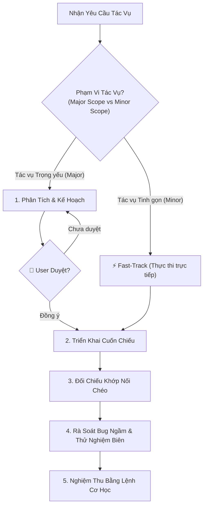

# HƯỚNG DẪN DÀNH CHO AI AGENT (GEMINI CLI ASSISTANT)
## DỰ ÁN: HỆ THỐNG HỖ TRỢ RA QUYẾT ĐỊNH MUA HÀNG TÍCH HỢP AI (DSS AI PURCHASE)
### HỢP ĐỒNG KIẾN TRÚC & QUY TẮC PHÁT TRIỂN TOÀN DỰ ÁN (STRICT ARCHITECTURAL CONTRACT)

> **Mục tiêu tối thượng:** Tài liệu này đóng vai trò là "Bản Hiến Pháp Kỹ Thuật" và Hợp Đồng Bắt Buộc (Strict Architectural Contract) cho AI Agent trong suốt vòng đời dự án (lập trình, kiểm thử, refactor, bảo trì).
> Mọi chỉ thị trong tài liệu này có tính chất **Cưỡng Chế Tuyệt Đối (Zero Deviation)**. AI Agent **KHÔNG CÓ QUYỀN** tự ý suy diễn, hạ thấp tiêu chuẩn hoặc thực hiện các giải pháp tình thế ngắn hạn làm tổn hại đến tính toàn vẹn của hệ thống.

---

## 1. TRIẾT LÝ PHÁT TRIỂN CỐT LÕI (CORE ETHOS)

1. **Tuân thủ tài liệu đặc tả tuyệt đối (Specification As Law):**
   * Toàn bộ kiến trúc, cơ sở dữ liệu, tên trường, công thức toán học, hợp đồng API và mã lỗi đã được quy định chi tiết trong thư mục `docs/`.
   * **CẤM** tự ý thay đổi tên trường, thêm bớt bảng, biến tấu công thức toán, hoặc tự bịa ra các API endpoint ngoài đặc tả.
2. **Nguyên tắc Clean Architecture Bất Biến (The Dependency Invariant):**
   * Chiều phụ thuộc của mã nguồn **CHỈ ĐƯỢC PHÉP HƯỚNG VÀO TRONG** (Inward Dependency): `API / Presentation` $\rightarrow$ `Infrastructure` $\rightarrow$ `Application` $\rightarrow$ `Domain`.
   * Tầng bên trong **TUYỆT ĐỐI KHÔNG BIẾT VÀ KHÔNG PHỤ THUỘC** vào tầng bên ngoài.
3. **Stateless AI Service (Compute Engine Pure):**
   * Dịch vụ AI (Python FastAPI) chỉ đóng vai trò là Engine tính toán số học thuần túy. **Tuyệt đối không kết nối trực tiếp đến PostgreSQL**.
   * Mọi dữ liệu lịch sử bán hàng và tham số phải được Backend cung cấp qua HTTP payload.
4. **Bảo Toàn Tính Toàn Vẹn Dữ Liệu & Giao Dịch ACID (`BR-001`, `BR-018`):**
   * Mọi tác vụ ghi từ 2 bảng trở lên, hoặc thay đổi trạng thái kèm biến động tồn kho/lịch sử bắt buộc bọc trong transaction (`IUnitOfWork` hoặc `prisma.$transaction`).
   * Vị trí tồn kho $IP = \text{On-Hand} + \text{On-Order}$ phải duy trì tính toàn vẹn tuyệt đối để chống đặt hàng trùng lặp.

---

## 2. HỢP ĐỒNG RANH GIỚI KIẾN TRÚC & PHỤ THUỘC (ARCHITECTURAL BOUNDARIES CONTRACT)

Mọi tệp mã nguồn trong dự án bắt buộc tuân thủ hợp đồng ranh giới 4 tầng dưới đây:

```
┌────────────────────────────────────────────────────────────────────────┐
│                        API / PRESENTATION LAYER                        │
│   (Express, Controllers, Middlewares, Routes, Zod Schemas, HTTP Codes) │
└───────────────────────────────────┬────────────────────────────────────┘
                                    │ (Calls Use Cases & Maps DTOs)
                                    ▼
┌────────────────────────────────────────────────────────────────────────┐
│                           APPLICATION LAYER                            │
│   (Use Cases, Application DTOs, Ports/Interfaces, App Exceptions)      │
└───────────────────┬───────────────────────────────┬────────────────────┘
                    │ (Implements Ports)            │ (Orchestrates)
                    ▼                               ▼
┌──────────────────────────────────────┐  ┌──────────────────────────────┐
│         INFRASTRUCTURE LAYER         │  │         DOMAIN LAYER         │
│ (Prisma, Repositories, Security/Auth,│  │ (Entities, Value Objects,    │
│  External Clients, File Parsers)     │  │  Domain Services, Invariants,│
│                                      │  │  Domain Repos, Pure Errors)  │
└──────────────────────────────────────┘  └──────────────────────────────┘
```

### 2.1. Ma Trận Quyền Hạn & Cấm Phụ Thuộc Chéo (Layer Access Matrix)

| Tầng (Layer) | Được Phép Import / Phụ Thuộc | TUYỆT ĐỐI CẤM Import / Phụ Thuộc |
| :--- | :--- | :--- |
| **Domain** | Chỉ dùng kiểu dữ liệu nguyên bản của TypeScript. | **CẤM 100%**: Application, Infrastructure, Presentation, Express, Prisma, các thư viện runtime bên ngoài (HTTP, Crypto, File, DB drivers), mã trạng thái HTTP. |
| **Application** | `Domain`, các Interfaces/Ports của tầng mình, DTOs, Application Exceptions. | **CẤM 100%**: Infrastructure (Prisma, Axios client cụ thể), Presentation (Express req/res, HTTP codes), các thư viện môi trường cụ thể (phải trừu tượng hóa qua Ports). |
| **Infrastructure**| `Domain`, `Application` (để triển khai Ports/Interfaces), các thư viện bên thứ ba chuyên trách (PrismaClient, Bcrypt, Axios, ExcelJS). | **CẤM 100%**: Presentation Layer (Controllers, Express req/res, Route Handlers). |
| **Presentation** | `Domain`, `Application` (Use Cases, DTOs, Exceptions), Zod, Express framework, Infrastructure (chỉ để khởi tạo Dependency Injection cho Use Cases tại Composition Root). | **CẤM 100%**: Thực thi truy vấn cơ sở dữ liệu hoặc logic nghiệp vụ trực tiếp trong Controller. Mọi hành động bắt buộc phải ủy quyền cho Use Cases. |

### 2.2. Nguyên Tắc Độc Lập Môi Trường (Runtime & Technology Independence)

1. **Không rò rỉ cơ chế môi trường vào Core Logic:**
   * Tầng `Domain` và `Application` không được trực tiếp phụ thuộc vào các API riêng biệt của môi trường runtime (Node.js built-ins, OS-specific APIs, Database drivers).
   * Mọi nhu cầu tương tác với môi trường bên ngoài (ví dụ: băm mật khẩu, mã hóa token, gọi API AI, gửi email, đọc file, truy cập hệ thống file) **BẮT BUỘC** phải được định nghĩa dưới dạng **Port (Interface)** tại `application/ports/` và triển khai cụ thể tại `infrastructure/`.
2. **Chiến lược quản lý định danh thực thể (Entity Identity Strategy):**
   * Chiến lược định danh thực thể (ID generation) phải tuân thủ nghiêm ngặt theo thiết kế cơ sở dữ liệu (`docs/04-data-model/physical-schema.sql`).
   * Nếu cơ sở dữ liệu đảm nhiệm việc sinh ID (`gen_random_uuid()` / `@default(uuid())`), Domain Entity cho phép `id?: string` là trường tùy chọn khi khởi tạo mới. Tầng Application **tuyệt đối không tự ý gọi các thư viện runtime để sinh ID** nếu không được quy định qua Port chuyên trách.

### 2.3. Hợp Đồng Phân Cấp Xử Lý Lỗi (Two-Tier Exception Architecture)

Hệ thống phân tách lỗi nghiêm ngặt thành 2 cấp độ, cấm lẫn lộn trách nhiệm:

#### Cấp độ 1: Domain Exceptions (`backend/src/domain/exceptions/`)
* **Bản chất:** Đại diện cho vi phạm quy tắc bất biến nghiệp vụ cốt lõi (Business Invariants).
* **Quy tắc bắt buộc:**
  * Kế thừa từ `DomainException` (chỉ chứa `message`, `code = 'BUSINESS_RULE_VIOLATION'`, `details`).
  * **TUYỆT ĐỐI KHÔNG CHỨA HTTP STATUS CODE** (không `400`, `404`, `422`, không `statusCode` property).
  * Chỉ được ném ra từ Domain Entities, Value Objects hoặc Domain Services khi một quy tắc toán học/kinh doanh bị vi phạm (ví dụ: `InvalidOrderStateException`, `InvalidWeightDistributionException`, `OutOfStockException`).

#### Cấp độ 2: Application Exceptions (`backend/src/application/exceptions/`)
* **Bản chất:** Đại diện cho các lỗi điều phối luồng ứng dụng, tra cứu tài nguyên hoặc kiểm soát truy cập.
* **Quy tắc bắt buộc:**
  * Kế thừa từ `ApplicationException` (chỉ chứa `message`, `code`, `details`).
  * Không chứa mã HTTP trực tiếp trong class.
  * Các loại ngoại lệ chuẩn của tầng:
    * `EntityNotFoundException` (Mã: `RESOURCE_NOT_FOUND`)
    * `DuplicateResourceException` (Mã: `DUPLICATE_RESOURCE`)
    * `ValidationException` (Mã: `VALIDATION_ERROR`)
    * `UnauthorizedException` (Mã: `INVALID_CREDENTIALS` / `TOKEN_EXPIRED`)
    * `ForbiddenException` (Mã: `FORBIDDEN`)

#### Ánh Xạ Ngoại Lệ Sang HTTP (Presentation Layer Exclusive)
* Tệp `backend/src/api/middlewares/errorMiddleware.ts` là **NƠI DUY NHẤT** trong toàn bộ hệ thống được phép biết về mã trạng thái HTTP:
  * `ApplicationException (RESOURCE_NOT_FOUND)` $\rightarrow$ **404 Not Found**
  * `ApplicationException (DUPLICATE_RESOURCE)` $\rightarrow$ **409 Conflict**
  * `ApplicationException (INVALID_CREDENTIALS)` $\rightarrow$ **401 Unauthorized**
  * `ApplicationException (FORBIDDEN)` $\rightarrow$ **403 Forbidden**
  * `ApplicationException (VALIDATION_ERROR)` hoặc `ZodError` $\rightarrow$ **400 Bad Request**
  * `DomainException` $\rightarrow$ **422 Unprocessable Entity** (hoặc `400` tùy cấu hình Envelope)
  * Lỗi không xác định $\rightarrow$ **500 Internal Server Error**
* Tất cả phản hồi lỗi phải đóng gói theo chuẩn Envelope:
  ```json
  {
    "success": false,
    "error": {
      "code": "RESOURCE_NOT_FOUND",
      "message": "Không tìm thấy sản phẩm với mã SKU: SKU-12345",
      "details": []
    },
    "timestamp": "2026-09-05T11:00:00.000Z"
  }
  ```

### 2.4. Hợp Đồng Tầng Presentation (Controllers & Routes)
Nhằm đảm bảo tính Testable và bám sát nguyên lý Inversion of Control:
1. **Cấm khởi tạo toàn cục (No Global Instantiation):** Các Controller không được phép tự khởi tạo (dùng `new`) các Dependencies (như Use Cases, Repositories) ở cấp độ Module hoặc bên trong hàm.
2. **Tiêm phụ thuộc thủ công (Manual Constructor Injection):** Mọi Controller phải tiêm các dependencies thông qua `constructor`.
3. **Cấm dùng Static Method:** Các phương thức xử lý (handler) của Controller phải là properties (arrow function) hoặc instance method, không được dùng `static`.
4. **Composition Root (DI Container):** Tệp `infrastructure/di/container.ts` đóng vai trò là Composition Root duy nhất của toàn bộ ứng dụng. Đây là NƠI DUY NHẤT được phép `new` các Repository, Use Case, UnitOfWork và tiêm chúng vào Controller. Các tệp định tuyến (Routes) tuyệt đối không tự khởi tạo phụ thuộc mà chỉ import Controller đã được cấu hình sẵn từ `container.ts`.
5. **CatchAsync Wrapper:** Không viết lại khối `try/catch` vô nghĩa trong Controller. Mọi hàm xử lý phải được bọc trong middleware `catchAsync` để gom lỗi về Error Middleware tập trung.

---

## 3. HỢP ĐỒNG TOÀN VẸN DỮ LIỆU, GIAO DỊCH & DỊCH VỤ AI

### 3.1. Tính Toàn Vẹn Dữ Liệu & Đồng Bộ Schema 4 Tầng
1. **Single Source of Truth:**
   * Tệp DDL [`docs/04-data-model/physical-schema.sql`](docs/04-data-model/physical-schema.sql) và Từ điển dữ liệu [`docs/04-data-model/data-dictionary.md`](docs/04-data-model/data-dictionary.md) là căn cứ tối cao.
2. **Tính Nhất Quán Tuyệt Đối (Quadruple Consistency):**
   * Bắt buộc khớp nối 1:1 giữa:
     `Tên cột SQL & Check Constraints` $\equiv$ `Prisma Model` $\equiv$ `Domain Entity Properties` $\equiv$ `DTO / Zod Schemas`.
   * Cấm tự ý đổi kiểu dữ liệu (ví dụ: `DECIMAL(12,2)` sang `FLOAT` gây sai số tiền tệ).

### 3.2. Hợp Đồng Giao Dịch ACID (Transaction Boundary)
* Bất kỳ Use Case nào thực hiện thao tác ghi trên nhiều bảng, hoặc cập nhật trạng thái có liên đới đến số liệu kho (như `UC-012` Tạo PO, `UC-013` Hủy PO, `UC-014` Nhận hàng & cập nhật tồn kho) **BẮT BUỘC** phải được bọc trong giao dịch nguyên tử (`IUnitOfWork` hoặc `prisma.$transaction`).
* Cấm thực hiện các truy vấn ghi độc lập nối tiếp nhau mà không có cơ chế rollback khi xảy ra lỗi giữa chừng.

### 3.3. Hợp Đồng Dịch Vụ AI (Stateless Compute Contract)
* Dịch vụ AI (Python FastAPI) hoàn toàn không có trạng thái và không kết nối cơ sở dữ liệu.
* **Cơ chế Fallback bắt buộc (`BR-007`):**
  * Mọi lời gọi sang AI Service phải có cấu hình Timeout tối đa 4 giây.
  * Nếu AI Service bị timeout, gặp lỗi kết nối (5xx/network error), hoặc trả về kết quả có sai số WAPE > 40%, Backend **BẮT BUỘC** tự động kích hoạt thuật toán Fallback nội bộ (SMA-7: Trung bình trượt 7 ngày) và ghi rõ nguồn tính toán trong log/metadata.
  * Hệ thống không được phép văng lỗi 500 ra người dùng chỉ vì dịch vụ AI tạm thời mất kết nối.

---

## 4. QUY TRÌNH 5 GIAI ĐOẠN PHÁT TRIỂN BẮT BUỘC (STRICT 5-STAGE PROTOCOL)

Khi nhận bất kỳ yêu cầu lập trình, Agent tuân thủ tuần tự theo luồng phân loại và kiểm soát dưới đây:



### Giai đoạn 1: Phân Loại Tác Vụ & Cổng Duyệt Kế Hoạch (Planning & Gate Condition)

Để cân bằng giữa **tính kỷ luật kiến trúc** và **tốc độ phát triển**, Agent áp dụng phân loại tác vụ theo điều kiện sau:

#### Nhóm 1: Tác Vụ Trọng Yếu (Major Scope) $\rightarrow$ 🛑 CỔNG DUYỆT BẮT BUỘC (Hard Approval Gate)
* **Phạm vi áp dụng:**
  1. Triển khai Use Case mới hoặc Phase mới.
  2. Thay đổi Database Schema / Migrations / DDL / Prisma Model.
  3. Thay đổi hợp đồng API (Thêm/sửa URL Endpoint, Zod Schema request/response, HTTP status code).
  4. Thay đổi luồng nghiệp vụ cốt lõi, công thức tính toán (`BR-001` $\rightarrow$ `BR-026`), hoặc State Machine đơn hàng.
  5. Tái cấu trúc (Refactor) diện rộng ảnh hưởng từ 2 tầng kiến trúc trở lên.
* **Quy trình bắt buộc:**
  1. **Đọc tài liệu mục tiêu:** Tra cứu Bảng Điều Hướng (Section 6 & 7), đọc kỹ file đặc tả liên quan.
  2. **Lập Ma trận truy xuất (Traceability Matrix):** `Yêu Cầu / Use Case` $\rightarrow$ `Domain Entity / Service` $\rightarrow$ `Use Case / DTO` $\rightarrow$ `Prisma / Repo` $\rightarrow$ `Controller / API`.
  3. **Trình bày kế hoạch hành động:** Liệt kê file `[NEW]` / `[MODIFY]` và mô tả logic cốt lõi.
  4. 🛑 **DỪNG LẠI CHỜ USER DUYỆT:** CẤM tự ý sửa code khi chưa có sự xác nhận ("Đồng ý", "Duyệt", "Proceed", ...) từ người dùng.

#### Nhóm 2: Tác Vụ Tinh Gọn (Minor Scope) $\rightarrow$ ⚡ ĐƯỢC PHÉP BỎ QUA GATE (Fast-Track)
* **Phạm vi áp dụng:**
  1. Sửa bug nhỏ cục bộ (phạm vi 1 file / 1 hàm, không đổi interface hoặc hợp đồng dữ liệu bên ngoài).
  2. Tinh chỉnh thông báo lỗi (Error messages), câu chữ hiển thị tiếng Việt, cập nhật comments / docstrings.
  3. Bổ sung hoặc cập nhật Unit Tests / Integration Tests cho logic đã có.
  4. Sửa lỗi cú pháp, lint warnings, hoặc lỗi ép kiểu TypeScript không làm đổi hành vi hệ thống.
* **Quy trình tinh gọn:**
  * Được phép triển khai trực tiếp mã nguồn mà **không cần dừng lại chờ duyệt kế hoạch**, giúp triệt tiêu ma sát và đẩy nhanh tiến độ đồ án.
  * **Ràng buộc an toàn:** Dù bỏ qua Gate ở Giai đoạn 1, tác vụ vẫn **bắt buộc tuân thủ 100%** Hợp đồng ranh giới kiến trúc (Section 2) và phải vượt qua Cổng nghiệm thu cơ học (Section 9) trước khi báo cáo hoàn thành.

### Giai đoạn 2: Triển Khai Cuốn Chiếu Theo Chiều Sâu (Inside-Out Implementation)
1. Viết code tuần tự theo chiều từ trong ra ngoài:
   * **Bước 1:** `Domain` (Entities, Value Objects, Domain Services, Repositories Interfaces, Domain Exceptions).
   * **Bước 2:** `Application` (Ports, DTOs, Use Cases, Application Exceptions).
   * **Bước 3:** `Infrastructure` (Repository Implementations, Database Adapters, Security Services).
   * **Bước 4:** `Presentation` (Zod Schemas, Controllers, Middlewares, Routes).
2. Không triển khai tầng bên ngoài khi tầng bên trong chưa hoàn thiện và chưa thỏa mãn tính bất biến.

### Giai đoạn 3: Kiểm Tra Khớp Nối & Nhất Quán Chéo (Cross-Layer Consistency)
* Đối chiếu tên biến, tên cột, kiểu dữ liệu giữa Schema DB, Prisma Model, Domain Entity và API DTO.
* Đảm bảo tính toán tồn kho theo đúng công thức $IP = \text{On-Hand} + \text{On-Order}$ (`BR-001`).
* Đảm bảo máy trạng thái đơn hàng tuân thủ quy tắc chuyển trạng thái (`BR-025`).

### Giai đoạn 4: Rà Soát Bug Ngầm & Thử Nghiệm Biên (Deep Audit & Edge-Case Inspection)
* **Số học & Phép chia:** Kiểm soát triệt để nguy cơ chia cho 0 (mẫu số = 0 khi tính WAPE, OTIF, % biến động tồn kho).
* **Làm tròn số (`BR-009`, `BR-010`):** Kiểm tra làm tròn lên theo MOQ và bội số Pack Size.
* **Nullability & Undefined:** Kiểm tra an toàn khi mảng dữ liệu rỗng, xử lý sản phẩm mới Cold Start (`UC-008`).
* **Tính nguyên tử:** Đảm bảo toàn bộ nghiệp vụ đa bước có transaction bảo vệ.

### Giai đoạn 5: Nghiệm Thu Bằng Lệnh Cơ Học & Bàn Giao (Mechanical Verification)
* Chạy toàn bộ các lệnh kiểm tra tự động tại Section 9.
* Chỉ bàn giao khi toàn bộ lệnh kiểm tra trả về kết quả đạt 100%.

---

## 5. CẤU TRÚC THƯ MỤC CHUẨN CỦA DỰ ÁN (CANONICAL DIRECTORY TREE)

Mọi mã nguồn Backend bắt buộc tuân theo cấu trúc đã quy định trong `docs/05-architecture/backend-architecture.md`:

```
backend/src/
├── domain/                        # TẦNG 1: DOMAIN LAYER (Pure TS, Zero Runtime Libs)
│   ├── entities/                  # Product, Supplier, Inventory, PurchaseOrder, etc.
│   ├── value-objects/             # SKU, POCode, RiskLevel, Money, WeightDistribution
│   ├── services/                  # InventoryCalculator, ABCXYZClassifier, OrderRoundingService, SupplierScoringService
│   ├── repositories/              # IProductRepository, ISupplierRepository, etc. (Interfaces)
│   └── exceptions/                # DomainException, OutOfStockException, InvalidOrderStateException, etc.
├── application/                   # TẦNG 2: APPLICATION LAYER
│   ├── use-cases/                 # Các Use Case thực thi nghiệp vụ
│   ├── dtos/                      # Request / Response DTOs
│   ├── exceptions/                # ApplicationException, EntityNotFoundException, DuplicateResourceException, etc.
│   └── ports/                     # IAIForecastClient, ITokenService, IPasswordHasher, IUnitOfWork, IFileParser
├── infrastructure/                # TẦNG 3: INFRASTRUCTURE LAYER
│   ├── database/                  # prisma.ts, PrismaUnitOfWork.ts
│   ├── repositories/              # PrismaProductRepository, PrismaInventoryRepository, etc.
│   ├── external-services/         # AxiosAIForecastClient.ts
│   ├── security/                  # BcryptPasswordHasher.ts, JwtTokenService.ts
│   └── file-parsers/              # ExcelFileParser.ts
└── api/                           # TẦNG 4: PRESENTATION / API LAYER
    ├── controllers/               # Express Controllers
    ├── middlewares/               # authMiddleware, rbacMiddleware, validateMiddleware, errorMiddleware, uploadMiddleware
    ├── validations/               # Zod Schemas
    ├── routes/                    # Express Routers
    └── server.ts                  # Express Application Server Entrypoint
```

---

## 6. BẢNG ĐIỀU HƯỚNG TÀI LIỆU THEO TÁC VỤ (TASK-TO-DOCUMENT ROUTER)

Trước khi thực hiện một tác vụ cụ thể, Agent hãy mở chính xác tài liệu được liên kết:

| Nhóm Tác Vụ Cần Làm | File Tài Liệu Bắt Buộc Phải Đọc Trước | Nội Dung Trọng Tâm Cần Nắm Bắt |
| :--- | :--- | :--- |
| **Tìm hiểu nghiệp vụ, logic tính toán** | [`docs/02-requirements/business-rules.md`](docs/02-requirements/business-rules.md) | 26 quy tắc nghiệp vụ (`BR-001` $\rightarrow$ `BR-026`), công thức tính ROP, SS, Qraw, Pareto ABC, CV XYZ, OTIF. |
| **Xem chi tiết 17 luồng Use Case** | [`docs/03-use-cases/overview.md`](docs/03-use-cases/overview.md) và các file `docs/03-use-cases/UC-xxx.md` | Luồng sự kiện chính, ngoại lệ, điều kiện tiên quyết, dữ liệu đầu vào/ra của từng Use Case. |
| **Cơ sở dữ liệu, bảng, cột, kiểu dữ liệu** | [`docs/04-data-model/physical-schema.sql`](docs/04-data-model/physical-schema.sql)<br>[`docs/04-data-model/data-dictionary.md`](docs/04-data-model/data-dictionary.md) | DDL 18 bảng chuẩn PostgreSQL, kiểu dữ liệu, ràng buộc Foreign Key, Unique, Check Constraint, ENUMs. |
| **Toàn vẹn dữ liệu, giao dịch nhận hàng ACID** | [`docs/04-data-model/data-flow-and-integrity.md`](docs/04-data-model/data-flow-and-integrity.md) | Luồng luân chuyển dữ liệu, cơ chế bọc giao dịch ACID trong nhận hàng (`UC-014`), chống đặt trùng (`BR-001`). |
| **Thiết kế Backend & Clean Architecture** | [`docs/05-architecture/backend-architecture.md`](docs/05-architecture/backend-architecture.md) | Cấu trúc 4 tầng Clean Architecture, phân quyền RBAC, quản lý transaction bằng Unit of Work. |
| **Thiết kế Dịch vụ AI (Python FastAPI)** | [`docs/05-architecture/ai-service-architecture.md`](docs/05-architecture/ai-service-architecture.md) | Kiến trúc Stateless AI, mô hình Holt-Winters + SMA-7, cơ chế Fallback tự động khi WAPE > 40%. |
| **Thiết kế Giao diện Frontend React** | [`docs/05-architecture/frontend-architecture.md`](docs/05-architecture/frontend-architecture.md) | Cấu trúc Feature-based, bảng màu 5 cấp độ rủi ro tồn kho, biểu đồ ECharts 9 ô ABC-XYZ và dải mây dự báo. |
| **Quy chuẩn API Endpoint & Mã lỗi** | [`docs/06-api-design/endpoints-spec.md`](docs/06-api-design/endpoints-spec.md)<br>[`docs/06-api-design/openapi.yaml`](docs/06-api-design/openapi.yaml) | Chuẩn Envelope phản hồi `{ success, data, meta, timestamp }`, quy chuẩn mã lỗi HTTP & Error Codes. |
| **Hợp đồng giao tiếp Backend <-> AI Service** | [`docs/06-api-design/internal-ai-contracts.md`](docs/06-api-design/internal-ai-contracts.md) | Định dạng Payload JSON gọi dự báo đơn SKU và batch toàn bộ danh mục, cấu trúc dải tin cậy 95%. |
| **Kế hoạch triển khai & Tiêu chuẩn nghiệm thu** | [`docs/07-implementation-plan/overview.md`](docs/07-implementation-plan/overview.md)<br>[`docs/07-implementation-plan/phase-details.md`](docs/07-implementation-plan/phase-details.md) | Lộ trình 7 Phase (Phase 0 $\rightarrow$ Phase 6), tiêu chí Definition of Done (DoD), checklist kiểm thử. |

---

## 7. BẢNG TRA CỨU USE CASE $\leftrightarrow$ FILE TÀI LIỆU CHI TIẾT

| Mã UC | Tên Use Case | Đường Dẫn Tài Liệu |
| :--- | :--- | :--- |
| **UC-001** | Quản lý danh mục sản phẩm (CRUD, Pack size, MOQ) | [`docs/03-use-cases/UC-001-quan-ly-danh-muc-san-pham.md`](docs/03-use-cases/UC-001-quan-ly-danh-muc-san-pham.md) |
| **UC-002** | Quản lý danh mục nhà cung cấp & bảng giá theo SKU | [`docs/03-use-cases/UC-002-quan-ly-danh-muc-nha-cung-cap.md`](docs/03-use-cases/UC-002-quan-ly-danh-muc-nha-cung-cap.md) |
| **UC-003** | Nạp dữ liệu bán hàng & tồn kho (Excel/CSV) | [`docs/03-use-cases/UC-003-nap-du-lieu-ban-hang-va-ton-kho.md`](docs/03-use-cases/UC-003-nap-du-lieu-ban-hang-va-ton-kho.md) |
| **UC-004** | Theo dõi tồn kho & cảnh báo 5 cấp rủi ro | [`docs/03-use-cases/UC-004-theo-doi-ton-kho-va-canh-bao-rui-ro.md`](docs/03-use-cases/UC-004-theo-doi-ton-kho-va-canh-bao-rui-ro.md) |
| **UC-005** | Xem phân tích ma trận 9 ô ABC - XYZ | [`docs/03-use-cases/UC-005-xem-phan-tich-ma-tran-abc-xyz.md`](docs/03-use-cases/UC-005-xem-phan-tich-ma-tran-abc-xyz.md) |
| **UC-006** | Xem chi tiết phân tích sản phẩm 360° | [`docs/03-use-cases/UC-006-xem-chi-tiet-phan-tich-san-pham.md`](docs/03-use-cases/UC-006-xem-chi-tiet-phan-tich-san-pham.md) |
| **UC-007** | Xem dự báo nhu cầu bán lẻ AI (7/14/30 ngày) | [`docs/03-use-cases/UC-007-xem-du-bao-nhu-cau-ban-le.md`](docs/03-use-cases/UC-007-xem-du-bao-nhu-cau-ban-le.md) |
| **UC-008** | Nhập lượng bán dự kiến cho SP mới Cold Start | [`docs/03-use-cases/UC-008-nhap-luong-ban-du-kien-cho-san-pham-moi.md`](docs/03-use-cases/UC-008-nhap-luong-ban-du-kien-cho-san-pham-moi.md) |
| **UC-009** | Xem đánh giá & xếp hạng nhà cung cấp | [`docs/03-use-cases/UC-009-xem-danh-gia-va-xep-hang-nha-cung-cap.md`](docs/03-use-cases/UC-009-xem-danh-gia-va-xep-hang-nha-cung-cap.md) |
| **UC-010** | Xem khuyến nghị mua hàng thông minh (Explainable)| [`docs/03-use-cases/UC-010-xem-khuyen-nghi-mua-hang-thong-minh.md`](docs/03-use-cases/UC-010-xem-khuyen-nghi-mua-hang-thong-minh.md) |
| **UC-011** | Chạy lại phân tích & cập nhật DSS on-demand | [`docs/03-use-cases/UC-011-chay-lai-phan-tich-va-cap-nhat-khuyen-nghi.md`](docs/03-use-cases/UC-011-chay-lai-phan-tich-va-cap-nhat-khuyen-nghi.md) |
| **UC-012** | Lập và xác nhận đơn mua hàng (PO DRAFT -> ORDERED)| [`docs/03-use-cases/UC-012-lap-va-xac-nhan-don-mua-hang.md`](docs/03-use-cases/UC-012-lap-va-xac-nhan-don-mua-hang.md) |
| **UC-013** | Quản lý & tra cứu lịch sử đơn mua hàng / Hủy đơn | [`docs/03-use-cases/UC-013-quan-ly-va-tra-cuu-lich-su-don-mua-hang.md`](docs/03-use-cases/UC-013-quan-ly-va-tra-cuu-lich-su-don-mua-hang.md) |
| **UC-014** | Ghi nhận nhận hàng & Cập nhật tồn kho nguyên tử | [`docs/03-use-cases/UC-014-ghi-nhan-nhan-hang-va-cap-nhat-ton-kho.md`](docs/03-use-cases/UC-014-ghi-nhan-nhan-hang-va-cap-nhat-ton-kho.md) |
| **UC-015** | Đăng nhập & Quản lý phiên làm việc cá nhân | [`docs/03-use-cases/UC-015-dang-nhap-va-quan-ly-phien-lam-viec.md`](docs/03-use-cases/UC-015-dang-nhap-va-quan-ly-phien-lam-viec.md) |
| **UC-016** | Quản lý tài khoản người dùng (CRUD, Khóa, Phân quyền)| [`docs/03-use-cases/UC-016-quan-ly-tai-khoan-nguoi-dung.md`](docs/03-use-cases/UC-016-quan-ly-tai-khoan-nguoi-dung.md) |
| **UC-017** | Cấu hình trọng số đánh giá nhà cung cấp (Admin) | [`docs/03-use-cases/UC-017-cau-hinh-trong-so-danh-gia-nha-cung-cap.md`](docs/03-use-cases/UC-017-cau-hinh-trong-so-danh-gia-nha-cung-cap.md) |

---

## 8. QUY CHUẨN ĐẶT TÊN & ĐỊNH DẠNG MÃ NGUỒN (CODE CONVENTIONS)

1. **Ngôn ngữ trong mã nguồn:**
   * Mã nguồn, biến, hàm, class, comments kỹ thuật: **Tiếng Anh 100%**.
   * Thông báo lỗi trả về cho người dùng (UI messages, validation messages, toast): **Tiếng Việt 100%**.
2. **Quy tắc đặt tên (Naming Conventions):**
   * Class, Interface, Type, Component React: `PascalCase` (ví dụ: `ProductService`, `IProductRepository`, `InventoryTable`).
   * Biến, hàm, thuộc tính: `camelCase` (ví dụ: `calculateSafetyStock`, `onHand`, `totalAmount`).
   * Tên bảng CSDL, tên cột SQL: `snake_case` (ví dụ: `purchase_orders`, `committed_lead_time`).
   * Tên file React Component: `PascalCase.tsx` (ví dụ: `KpiRiskCards.tsx`).
   * Tên file Service, Controller, Router: `camelCase.ts` hoặc `PascalCase.ts` theo chuẩn Clean Architecture (`productRoutes.ts`, `ProductController.ts`, `CreateProductUseCase.ts`).
   * Tên hằng số, ENUM values: `UPPER_SNAKE_CASE` (ví dụ: `OUT_OF_STOCK`, `ORDERED`).
3. **Mã sinh tự động:**
   * Mã đơn mua hàng: Bắt buộc định dạng `PO-YYYYMMDD-XXXX` (ví dụ: `PO-20260904-0001`) (`BR-024`).

---

## 9. CỔNG NGHIỆM THU CƠ HỌC BẮT BUỘC TRƯỚC KHI BÀN GIAO (MECHANICAL VERIFICATION GATE)

Trước khi xác nhận hoàn thành bất kỳ tác vụ nào, Agent **BẮT BUỘC** phải tự chạy các lệnh kiểm tra tự động sau và báo cáo kết quả:

### 9.1. Quét Vi Phạm Ranh Giới Kiến Trúc (Architecture Boundary Scan)
Chạy kiểm tra tĩnh để phát hiện mọi vi phạm chiều phụ thuộc:
```bash
# 1. Kiểm tra Domain Purity: Phải trả về 0 kết quả (Không chứa express, prisma, statusCode, res.status)
git grep -i -E "(express|prisma|@prisma|statusCode|res\.status)" backend/src/domain/

# 2. Kiểm tra Application Purity: Phải trả về 0 kết quả (Không chứa express, prisma, res.status)
git grep -i -E "(express|prisma|@prisma|res\.status)" backend/src/application/

# 3. Kiểm tra Presentation Boundary: Không được thực thi truy vấn Prisma trực tiếp trong Controllers
git grep -i -E "(prisma\.[a-z]+\.(find|create|update|delete))" backend/src/api/
```
*Tiêu chuẩn nghiệm thu:* Toàn bộ các lệnh grep trên **BẮT BUỘC PHẢI TRẢ VỀ RỖNG (0 MATCHES)**. Nếu có bất kỳ kết quả nào, task bị coi là thất bại và phải sửa ngay.

### 9.2. Kiểm Tra Biên Dịch TypeScript Khắt Khe (Strict Compilation)
```bash
# Biên dịch toàn bộ Backend bằng Docker (hoặc tsc --noEmit)
docker build --target builder -t backend-test ./backend
```
*Tiêu chuẩn nghiệm thu:* Mã thoát `0`, không có cảnh báo hoặc lỗi biên dịch TypeScript.

### 9.3. Kiểm Tra Tự Động Toàn Bộ Test Suite (Automated Tests)
```bash
# Chạy toàn bộ Unit & Integration tests
docker run --rm backend-test npm test
```
*Tiêu chuẩn nghiệm thu:* 100% test suites và test cases phải chuyển sang màu xanh (PASS).
