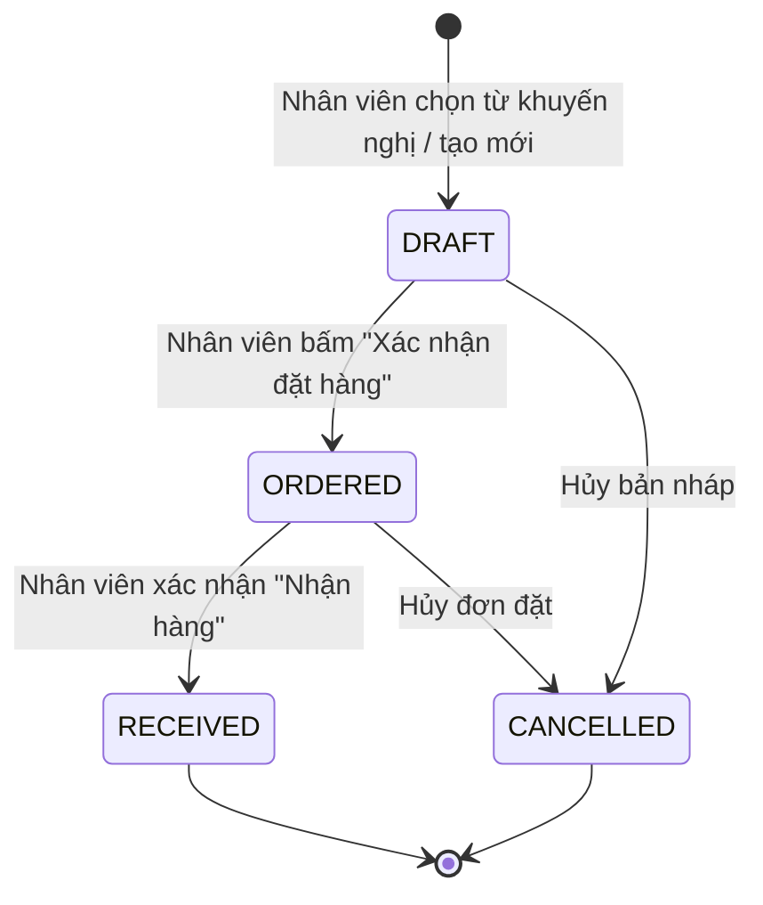

# Business Rules (Quy Tắc Nghiệp Vụ Chuẩn Hóa)

Tài liệu này định nghĩa toàn bộ các quy tắc, công thức toán học và logic nghiệp vụ tất định (deterministic) được áp dụng trong **Hệ thống hỗ trợ ra quyết định mua hàng tích hợp AI**.

---

## 📋 BẢNG THEO DÕI QUYẾT ĐỊNH NGHIỆP VỤ (DECISION LOG)

| ID | Nhóm nghiệp vụ | Quyết định cuối cùng đã thống nhất |
| :--- | :--- | :--- |
| **DEC-001** | Trạng thái tồn kho | Chuẩn hóa 5 cấp độ: `OUT_OF_STOCK`, `CRITICAL`, `WARNING`, `NORMAL`, `OVERSTOCK`. |
| **DEC-002** | Công thức Safety Stock | Phương pháp thống kê: $\text{SS} = \lceil Z \times \sigma_d \times \sqrt{L} \rceil$ với $Z = 1.65$ (95% Service Level). |
| **DEC-003** | $D_{avg}$ trong ROP | Ưu tiên lấy từ Nhu cầu trung bình ngày do AI dự báo, fallback về trung bình quá khứ 30 ngày. |
| **DEC-004** | Ngưỡng Overstock | $\text{Max Stock} = \text{ROP} + \text{Dự báo bán 30 ngày}$ để cảnh báo hàng tồn đọng vốn. |
| **DEC-005** | Phân tầng dữ liệu | 3 tầng: `Cold Start (<14d)` $\rightarrow$ `SMA-7 (14-29d)` $\rightarrow$ `AI Ready (≥30d)`. |
| **DEC-006** | Đánh giá sai số AI | Sử dụng **WAPE** (kết hợp **MAE**); nếu $\text{WAPE} > 40\%$ tự động fallback về SMA-7. |
| **DEC-007** | Tổng cầu dự báo | $\text{Forecasted Demand}_T = \lceil \sum_{t=1}^T \max(0, \hat{y}_t) \rceil$ (chặn số âm, làm tròn lên số nguyên). |
| **DEC-008** | Trigger dự báo | Chạy tự động khi Import dữ liệu mới / Đầu ngày mới + Chạy On-demand khi bấm nút. |
| **DEC-009** | Phân loại ABC | Xếp hạng theo Doanh thu bán hàng; Ngưỡng tích lũy: A ($\le 80\%$), B ($80\%-95\%$), C ($> 95\%$). |
| **DEC-010** | Phân loại XYZ | Đo biến động bằng Hệ số biến thiên ($CV = \sigma_d / \mu_d$): X ($\le 0.5$), Y ($0.5-1.0$), Z ($> 1.0$). |
| **DEC-011** | Ma trận ABC-XYZ | Kết hợp 9 nhóm (AX $\rightarrow$ CZ) để tối ưu chiến lược dự trữ và cảnh báo mua hàng. |
| **DEC-012** | Công thức điểm NCC | 4 tiêu chí chuẩn hóa: $S_{price}$ (Giá), $S_{otif}$ (OTIF), $S_{quality}$ (Chất lượng), $S_{leadtime}$ (Tốc độ giao). |
| **DEC-013** | Trọng số NCC | Mặc định: **OTIF 35% - Chất lượng 30% - Giá 20% - Tốc độ 15%** (Admin tùy chỉnh). |
| **DEC-014** | Cửa sổ đánh giá NCC | Tính trên **10 lần giao gần nhất**; NCC mới (< 3 lần) gắn nhãn `NEW_SUPPLIER`. |
| **DEC-015** | Lượng mua thô ($Q_{raw}$) | $Q_{raw} = \text{Demand}_T + \text{SS} - (\text{On-Hand} + \text{On-Order})$ (chống đặt trùng lặp 100%). |
| **DEC-016** | Làm tròn đơn hàng | $Q_1 = \max(Q_{raw}, \text{MOQ})$, sau đó làm tròn $\lceil Q_1 / \text{Pack Size} \rceil \times \text{Pack Size}$. |
| **DEC-017** | Thời điểm đặt hàng | Phân nhánh: $\text{IP} \le \text{ROP}$ (Hôm nay) vs $\text{IP} > \text{ROP}$ (Tính ngày dự kiến chạm ROP). |
| **DEC-018** | Gợi ý NCC tối ưu | Thứ tự ưu tiên: **Score cao nhất $\rightarrow$ Lead time ngắn nhất $\rightarrow$ Giá rẻ nhất** (kèm Explainable Insights). |
| **DEC-019** | Vòng đời đơn hàng | 1 thực thể thống nhất với 4 trạng thái: `DRAFT` $\rightarrow$ `ORDERED` $\rightarrow$ `RECEIVED` / `CANCELLED`. |
| **DEC-020** | Khóa đơn hàng | Khóa chỉnh sửa khi đơn ở trạng thái `ORDERED` để đảm bảo toàn vẹn dữ liệu tồn kho. |
| **DEC-021** | Số lượng thực nhập | $Q_{accepted} = Q_{delivered} - Q_{defective}$; chỉ cộng đúng $Q_{accepted}$ vào tồn kho $\text{On-Hand}$. |
| **DEC-022** | Cập nhật tồn kho | Thực hiện giao dịch nguyên tử: $\text{On-Hand} \uparrow$ và $\text{On-Order} \downarrow$. |
| **DEC-023** | Ghi log giao hàng | Ghi nhận $\text{IsOTIF}, Q_{defective}$ vào `DeliveryHistory` sau mỗi lần nhận hàng để tự động tính lại điểm NCC. |
| **DEC-024** | Vòng đời sản phẩm | Tự động chuyển cấp độ xử lý theo số ngày dữ liệu: Cold Start $\rightarrow$ Basic $\rightarrow$ AI Ready. |
| **DEC-025** | Sản phẩm vô hiệu | `IsActive = false` loại trừ hoàn toàn khỏi phân tích, dự báo và khuyến nghị. |
| **DEC-026** | Hàng tồn bất động | Cảnh báo `DEAD_STOCK` nếu 30 ngày không bán được, gán số lượng đề xuất mua $= 0$. |

---

## 1. QUY TẮC TỒN KHO & ĐIỂM ĐẶT HÀNG LẠI (INVENTORY & REORDER RULES)

### **BR-001: Vị trí Tồn kho Định vị (Inventory Position - IP)**
Để loại trừ hoàn toàn việc đặt mua trùng lặp khi đã có đơn hàng đang trên đường về, hệ thống tính toán **Vị trí tồn kho (Inventory Position)**:
$$\text{Inventory Position (IP)} = \text{On-Hand} + \text{On-Order}$$
* $\text{On-Hand}$: Số lượng tồn kho thực tế khả dụng tại cửa hàng.
* $\text{On-Order}$: Tổng số lượng sản phẩm nằm trong các Đơn mua hàng ở trạng thái `ORDERED` (chưa nhận hàng).

---

### **BR-002: Phân cấp 5 Cấp độ Rủi ro Tồn kho (Inventory Risk Levels)**
Trạng thái rủi ro tồn kho của từng sản phẩm được đánh giá theo thứ tự ưu tiên từ trên xuống dưới:

| Thứ tự | Mã trạng thái | Tên trạng thái | Điều kiện định lượng | Hành động nghiệp vụ |
| :---: | :--- | :--- | :--- | :--- |
| **1** | `OUT_OF_STOCK` | **Hết hàng** | $\text{On-Hand} \le 0$ | Cảnh báo đỏ khẩn cấp; mất doanh thu ngay lập tức. |
| **2** | `CRITICAL` | **Nguy cấp** | $\text{Inventory Position} < \text{Safety Stock}$ | Đã thâm hụt vào mức dự phòng an toàn. |
| **3** | `WARNING` | **Cần đặt hàng** | $\text{Safety Stock} \le \text{Inventory Position} \le \text{ROP}$ | Chạm ngưỡng đặt hàng lại, cần tạo đơn mua ngay. |
| **4** | `OVERSTOCK` | **Tồn dư / Đọng vốn** | $\text{Inventory Position} > \text{Max Stock}$ | Vượt mức tối đa, cảnh báo không mua thêm. |
| **5** | `NORMAL` | **An toàn** | $\text{ROP} < \text{Inventory Position} \le \text{Max Stock}$ | Mức tồn kho lý tưởng, không cần hành động. |

---

### **BR-003: Công thức tính Tồn kho an toàn (Safety Stock - SS)**
$$\text{Safety Stock (SS)} = \lceil Z \times \sigma_d \times \sqrt{L} \rceil$$
* $Z = 1.65$: Hệ số phục vụ tương ứng với Service Level $95\%$.
* $\sigma_d$: Độ lệch chuẩn của lượng bán hàng ngày trong 30 ngày gần nhất:
  $$\sigma_d = \sqrt{\frac{1}{n-1}\sum_{i=1}^n (y_i - \bar{y})^2}$$
* $L$: Thời gian giao hàng cam kết (Lead Time tính theo ngày) của nhà cung cấp chính.
* *Fallback:* Nếu sản phẩm mới có dưới 14 ngày dữ liệu: $\text{SS} = \lceil D_{expected} \times 2 \text{ ngày} \rceil$.

---

### **BR-004: Công thức tính Điểm đặt hàng lại (Reorder Point - ROP) & Tồn kho tối đa (Max Stock)**
$$\text{ROP} = \lceil (D_{avg} \times L) + \text{Safety Stock} \rceil$$
$$\text{Max Stock} = \text{ROP} + \lceil D_{avg} \times 30 \text{ ngày} \rceil$$
* $D_{avg}$: Nhu cầu bán trung bình mỗi ngày (lấy từ Dự báo AI chu kỳ tới theo **BR-007**, fallback về trung bình quá khứ 30 ngày).
* $L$: Lead time cam kết của nhà cung cấp chính.

---

### **BR-005: Chỉ số Số ngày bán còn lại (Days of Supply - DoS)**
$$\text{Days of Supply (DoS)} = \begin{cases} 0 & \text{nếu } \text{On-Hand} \le 0 \\ \frac{\text{On-Hand}}{D_{avg}} & \text{nếu } D_{avg} > 0 \\ 999 & \text{nếu } D_{avg} = 0 \text{ (Hàng tồn bất động - Dead Stock)} \end{cases}$$

---

## 2. QUY TẮC DỰ BÁO NHU CẦU & AI (DEMAND FORECASTING RULES)

### **BR-006: Phân tầng Dữ liệu Dự báo (Data Maturity Tiers)**
1. **Tier 1 - `COLD_START` ($N_{days} < 14$ ngày):** Không chạy mô hình toán học; cho phép nhân viên nhập lượng bán dự kiến ngày ($D_{expected}$).
2. **Tier 2 - `BASIC_FORECAST` ($14 \le N_{days} < 30$ ngày):** Áp dụng thuật toán Trung bình trượt 7 ngày (Simple Moving Average - SMA-7):
   $$\hat{y}_t = \frac{1}{7}\sum_{i=1}^7 y_{t-i}$$
3. **Tier 3 - `AI_READY` ($N_{days} \ge 30$ ngày):** Áp dụng mô hình Machine Learning / AI (học xu hướng bán hàng và tính chu kỳ ngày trong tuần).

---

### **BR-007: Đánh giá Sai số Mô hình (Model Evaluation) & Cơ chế Fallback**
Hệ thống đo lường chất lượng mô hình dự báo bằng chỉ số **WAPE** và **MAE**:
$$\text{WAPE} = \frac{\sum_{i=1}^n |y_i - \hat{y}_i|}{\sum_{i=1}^n y_i} \times 100\% \qquad ; \qquad \text{MAE} = \frac{1}{n}\sum_{i=1}^n |y_i - \hat{y}_i|$$

* **Quy tắc Fallback an toàn (Usability Threshold):**
  * Nếu $\text{WAPE} \le 40\%$: Mô hình AI đạt chuẩn $\rightarrow$ Sử dụng kết quả dự báo AI.
  * Nếu $\text{WAPE} > 40\%$: Mô hình AI bị nhiễu $\rightarrow$ Hệ thống tự động fallback về **SMA-7** và gắn cờ cảnh báo *"Độ tin cậy thấp, đã chuyển sang ước lượng an toàn"*.

---

### **BR-008: Công thức Tổng cầu Dự báo trong chu kỳ $T$ ngày**
Với $T \in \{7, 14, 30\}$ ngày, tổng lượng cầu dự kiến ($\text{Forecasted Demand}_T$) được tính bằng:
$$\text{Forecasted Demand}_T = \left\lceil \sum_{t=1}^T \max(0, \hat{y}_t) \right\rceil \qquad ; \qquad D_{avg} = \frac{\text{Forecasted Demand}_T}{T}$$

---

## 3. QUY TẮC PHÂN LOẠI SẢN PHẨM ABC / XYZ (CLASSIFICATION RULES)

### **BR-009: Phân loại Ma trận ABC theo Doanh thu**
Toàn bộ sản phẩm được sắp xếp giảm dần theo tổng doanh thu 30 ngày gần nhất ($\text{Revenue} = \sum \text{Quantity} \times \text{Selling Price}$) và tính tỷ lệ phần trăm tích lũy ($\text{Cumulative \%}$):
* **Nhóm A (Mặt hàng trọng điểm):** $\text{Cumulative \%} \le \mathbf{80\%}$ (Đóng góp 80% doanh thu).
* **Nhóm B (Mặt hàng trung bình):** $\mathbf{80\%} < \text{Cumulative \%} \le \mathbf{95\%}$ (Đóng góp 15% doanh thu tiếp theo).
* **Nhóm C (Mặt hàng giá trị thấp):** $\text{Cumulative \%} > \mathbf{95\%}$ (Đóng góp 5% doanh thu còn lại).

---

### **BR-010: Phân loại Ma trận XYZ theo Độ ổn định Nhu cầu**
Tính Hệ số biến thiên ($CV$) của lượng bán hàng ngày trong 30 ngày gần nhất:
$$CV = \frac{\sigma_d}{\mu_d}$$
* **Nhóm X ($CV \le 0.5$):** Nhu cầu **rất ổn định**, bán đều $\rightarrow$ AI dự báo cực chuẩn, mức dự phòng SS thấp.
* **Nhóm Y ($0.5 < CV \le 1.0$):** Nhu cầu **biến động trung bình**, có mùa vụ $\rightarrow$ AI dự báo tốt.
* **Nhóm Z ($CV > 1.0$):** Nhu cầu **biến động mạnh / ngắt quãng** $\rightarrow$ Cần mức dự phòng SS cao.

---

### **BR-011: Ma trận kết hợp ABC-XYZ trong Quản trị Mua hàng**
* **AX, AY:** Sản phẩm chiến lược bán chạy $\rightarrow$ Ưu tiên gợi ý mua hàng cao nhất, kiểm soát nguồn cung hàng ngày.
* **AZ:** Doanh thu cao nhưng sức mua thất thường $\rightarrow$ Duy trì Safety Stock cao để tránh đứt hàng.
* **BX, BY, BZ:** Áp dụng quy tắc đặt hàng định kỳ theo ROP.
* **CX, CY:** Mua theo lô lớn giãn cách.
* **CZ:** Mặt hàng ít tiền bán lắt nhắt $\rightarrow$ Kiểm soát chặt chẽ, không bao giờ mua vượt ROP.

---

## 4. QUY TẮC ĐÁNH GIÁ HIỆU SUẤT NHÀ CUNG CẤP (SUPPLIER EVALUATION RULES)

### **BR-012: Công thức Điểm thành phần (Thang điểm 100)**
Được tính toán trên **10 lần giao hàng gần nhất** (hoặc 90 ngày gần nhất):

1. **Điểm Đơn Giá ($S_{price}$):**
   $$S_{price} = \frac{P_{min}}{P_{supplier}} \times 100$$
   *(Trong đó $P_{min}$ là đơn giá thấp nhất của sản phẩm trong số các NCC; nếu chỉ có 1 NCC thì $S_{price} = 100$).*

2. **Điểm Đúng Hạn & Đủ Lượng ($S_{otif}$ - On-Time In-Full):**
   Đợt giao hàng $k$ đạt chuẩn $\text{OTIF}_k = 1$ khi: $\text{Actual Delivery Date} \le \text{Promised Date}$ **VÀ** $Q_{delivered} \ge Q_{ordered}$.
   $$S_{otif} = \frac{\sum_{k=1}^N \text{OTIF}_k}{N} \times 100$$

3. **Điểm Chất Lượng Hàng Hóa ($S_{quality}$):**
   $$S_{quality} = \left(1 - \frac{\sum_{k=1}^N Q_{defective, k}}{\sum_{k=1}^N Q_{delivered, k}}\right) \times 100$$

4. **Điểm Tốc Độ Giao Hàng ($S_{leadtime}$):**
   $$S_{leadtime} = \frac{LT_{min}}{LT_{supplier}} \times 100$$
   *(Trong đó $LT_{min}$ là Lead time ngắn nhất của sản phẩm; NCC giao nhanh nhất được 100 điểm).*

---

### **BR-013: Điểm Hiệu Suất Tổng Hợp ($Score_{NCC}$) & Trọng số Mặc định**
$$Score_{NCC} = (0.35 \times S_{otif}) + (0.30 \times S_{quality}) + (0.20 \times S_{price}) + (0.15 \times S_{leadtime})$$
* Admin có quyền tùy chỉnh tỷ lệ trọng số trên giao diện cấu hình hệ thống.
* **Nhà cung cấp mới (< 3 lần giao):** Gắn nhãn `NEW_SUPPLIER`, tạm thời tính điểm dựa trên $S_{price}$ và $S_{leadtime}$ đã biết.

---

## 5. QUY TẮC KHUYẾN NGHỊ MUA HÀNG (PURCHASE RECOMMENDATION RULES)

### **BR-014: Công thức tính Số lượng Mua Đề Xuất ($Q_{suggested}$)**
1. **Tính lượng thiếu hụt thô ($Q_{raw}$):**
   $$Q_{raw} = \text{Forecasted Demand}_T + \text{Safety Stock} - (\text{On-Hand} + \text{On-Order})$$
2. **Quy tắc điều chỉnh theo MOQ và Pack Size:**
   * Nếu $Q_{raw} \le 0 \rightarrow Q_{suggested} = 0$ *(Không cần mua)*.
   * Nếu $Q_{raw} > 0$:
     * Bước 1 (Áp dụng MOQ): $Q_1 = \max(Q_{raw}, \text{MOQ})$.
     * Bước 2 (Làm tròn theo Bội số đóng gói / Thùng / Lốc):
       $$Q_{suggested} = \left\lceil \frac{Q_1}{\text{Pack Size}} \right\rceil \times \text{Pack Size}$$

---

### **BR-015: Quy tắc xác định Thời điểm Đặt Hàng (Suggested Order Date)**
* Nếu $\text{Inventory Position} \le \text{ROP} \rightarrow \text{Suggested Date} = \mathbf{Hôm\ nay\ (Today)}$.
* Nếu $\text{Inventory Position} > \text{ROP}$:
  $$\text{Days Until Reorder} = \max\left(0, \left\lfloor \frac{\text{Inventory Position} - \text{ROP}}{D_{avg}} \right\rfloor \right)$$
  $$\text{Suggested Date} = \text{Today} + \text{Days Until Reorder}$$

---

### **BR-016: Quy tắc Chọn Nhà Cung Cấp Tối Ưu & Giải thích Minh bạch**
Khi một mặt hàng cần mua có nhiều nhà cung cấp cùng phân phối, hệ thống chọn theo thứ tự ưu tiên:
1. **Ưu tiên 1:** Nhà cung cấp có **$Score_{NCC}$ cao nhất**.
2. **Ưu tiên 2 (Tie-break 1):** Nhà cung cấp có **Lead time ngắn nhất**.
3. **Ưu tiên 3 (Tie-break 2):** Nhà cung cấp có **Đơn giá rẻ nhất**.
4. **Giải thích minh bạch (Explainable Insights):** Mỗi khuyến nghị bắt buộc hiển thị căn cứ rõ ràng: *"Đề xuất mua 48 lon (2 thùng) từ NCC ABC (Điểm: 92/100, Giá: 15.000đ, Giao: 2 ngày, OTIF: 98%) vì tồn kho chỉ còn đủ bán trong 2.1 ngày"*.

---

## 6. QUY TẮC ĐƠN MUA HÀNG & NHẬN HÀNG (ORDER & RECEIPT RULES)

### **BR-017: Máy Trạng Thái Đơn Mua Hàng (Order State Machine)**
Hệ thống quản lý đơn mua hàng qua 4 trạng thái tuần tự và nghiêm ngặt:

* `DRAFT`: Bản nháp, có thể sửa đổi tự do, không ảnh hưởng tồn kho.
* `ORDERED`: Đã chốt đặt hàng $\rightarrow$ **Khóa đơn, tăng $\text{On-Order}$** theo số lượng đặt.
* `RECEIVED`: Đã nhận hàng $\rightarrow$ **Tăng $\text{On-Hand}$ thực nhận, giảm $\text{On-Order}$ về 0**, ghi log đánh giá NCC.
* `CANCELLED`: Đã hủy $\rightarrow$ **Giảm $\text{On-Order}$ về 0**.

---

### **BR-018: Quy tắc Nhận Hàng & Cập nhật Tồn kho (Goods Receipt Update)**
Khi nhận hàng từ nhà cung cấp cho một đơn hàng:
1. **Xác định các đại lượng số lượng:**
   * $Q_{ordered}$: Số lượng đặt trong đơn.
   * $Q_{delivered}$: Số lượng NCC thực tế giao tới.
   * $Q_{defective}$: Số lượng hàng lỗi/hỏng bị từ chối trả lại.
   * $\mathbf{Q_{accepted} = Q_{delivered} - Q_{defective}}$ (Số lượng hàng đạt chuẩn thực nhập kho).
2. **Cập nhật tồn kho (Giao dịch nguyên tử - Atomic Transaction):**
   $$\text{On-Hand}_{new} = \text{On-Hand}_{old} + \mathbf{Q_{accepted}}$$
   $$\text{On-Order}_{new} = \text{On-Order}_{old} - Q_{ordered}$$
3. **Cập nhật trạng thái:** Chuyển trạng thái đơn sang `RECEIVED`.

---

### **BR-019: Quy tắc Ghi nhận Lịch sử Giao hàng (Delivery History Log)**
Sau khi nhận hàng, hệ thống tự động lưu bản ghi vào bảng `DeliveryHistory` để phục vụ tính điểm NCC:
* $\text{IsOnTime} = (\text{Actual Date} \le \text{Promised Date}) \ ? \ 1 : 0$.
* $\text{IsFull} = (Q_{delivered} \ge Q_{ordered}) \ ? \ 1 : 0$.
* $\text{IsOTIF} = \text{IsOnTime} \times \text{IsFull}$.
* Ghi nhận $Q_{defective}$ và $Q_{delivered}$.

---

## 7. QUY TẮC XỬ LÝ SẢN PHẨM MỚI & NGOẠI LỆ (EDGE CASE RULES)

### **BR-020: Quy tắc Chuyển giao Vòng đời Dữ liệu Sản phẩm**
* Sản phẩm tự động chuyển trạng thái phân tích theo số ngày giao dịch lịch sử:
  $$\text{Cold Start (< 14 ngày)} \xrightarrow{\text{Tự động}} \text{Basic SMA-7 (14 – 29 ngày)} \xrightarrow{\text{Tự động}} \text{AI Model (≥ 30 ngày)}$$

---

### **BR-021: Quy tắc Sản phẩm Vô hiệu hóa (Inactive Products)**
* Nếu sản phẩm có thuộc tính $\text{IsActive} = \text{false}$:
  * Hệ thống loại trừ hoàn toàn khỏi bảng Dashboard cảnh báo tồn kho.
  * Không chạy dự báo AI và không sinh khuyến nghị mua hàng.

---

### **BR-022: Quy tắc Sản phẩm Không có Nhà Cung Cấp (No Supplier)**
* Nếu sản phẩm chưa được liên kết với bất kỳ nhà cung cấp nào:
  * Hiển thị trạng thái cảnh báo `NO_SUPPLIER` trên danh mục.
  * Không thể sinh khuyến nghị mua hàng cho đến khi Admin thiết lập nhà cung cấp.

---

### **BR-023: Quy tắc Hàng Tồn Bất Động (Dead Stock)**
* Nếu một sản phẩm có $\text{On-Hand} > 0$ nhưng không bán được chiếc nào trong 30 ngày liên tục ($D_{avg} = 0$):
  * Gắn nhãn cảnh báo `DEAD_STOCK`.
  * Hiển thị $\text{Days of Supply} = 999$ ngày.
  * Tuyệt đối không sinh khuyến nghị mua hàng ($Q_{suggested} = 0$).

---

## 8. QUY TẮC BỔ SUNG CHO ĐƠN MUA HÀNG (PURCHASE ORDER RULES)

### **BR-024: Quy tắc Sinh Mã Đơn Mua Hàng (PO Code Generation)**
* Mã đơn mua hàng được hệ thống tự động sinh theo cấu trúc định dạng chuẩn duy nhất:
  $$\text{PO Code} = \text{PO-YYYYMMDD-XXXX}$$
  *(Trong đó `YYYYMMDD` là ngày tạo đơn theo định dạng năm-tháng-ngày; `XXXX` là số thứ tự tăng dần bắt đầu từ `0001` trong ngày).*

---

### **BR-025: Quy tắc Khóa Đơn Hàng & Ràng Buộc Sửa Đổi (Order Locking & Immutability)**
* Phân quyền thao tác theo trạng thái đơn hàng:
  * **`DRAFT` (Bản nháp):** Cho phép người dùng toàn quyền thêm/bớt mặt hàng, chỉnh sửa số lượng, đổi nhà cung cấp hoặc xóa bản nháp mà không ảnh hưởng đến số liệu tồn kho.
  * **`ORDERED` (Đã đặt):** Khóa cứng toàn bộ danh mục sản phẩm và số lượng đặt mua, ngăn chặn mọi thao tác chỉnh sửa trực tiếp để bảo toàn tính toàn vẹn của lượng hàng đang chờ về ($\text{On-Order}$). Chỉ cho phép 2 thao tác tiếp theo: *Ghi nhận nhận hàng (`UC-014`)* hoặc *Hủy đơn (`UC-013`)*.
  * **`RECEIVED` & `CANCELLED` (Đóng đơn):** Trạng thái kết thúc (Terminal States) ở chế độ chỉ đọc (Read-only), vĩnh viễn không thể khôi phục hay chỉnh sửa.

---

### **BR-026: Quy tắc Ngày Hẹn Giao Hàng Mặc Định (Default Promised Delivery Date)**
* Khi tạo đơn mua hàng mới, hệ thống tự động gợi ý ngày hẹn giao hàng cam kết dự kiến:
  $$\text{Promised Date} = \text{Order Date} + LT_{supplier}$$
  *(Trong đó $LT_{supplier}$ là thời gian giao hàng cam kết tính theo ngày của Nhà cung cấp được chọn; người dùng có thể điều chỉnh lại ngày này theo thỏa thuận thực tế với đối tác).*

