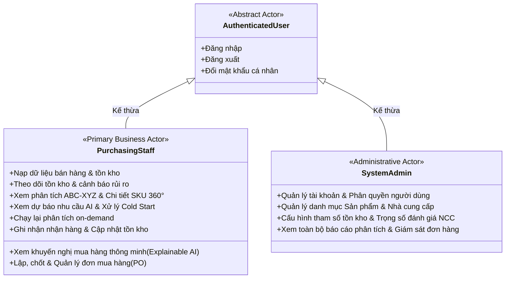

# Use Case Overview & Catalog: Hệ Thống Hỗ Trợ Ra Quyết Định Mua Hàng Tích Hợp AI

---

## 📋 BẢNG THEO DÕI QUYẾT ĐỊNH USE CASE (DECISION LOG)

| ID | Nhóm phân tích | Quyết định cuối cùng đã thống nhất |
| :--- | :--- | :--- |
| **DEC-UC-001** | Mô hình Tác tử | Áp dụng mô hình phân cấp kế thừa UML: `Authenticated User` $\rightarrow$ `Purchasing Staff` & `System Admin`. |
| **DEC-UC-002** | Quyền giám sát của Admin | Admin có quyền truy cập xem toàn bộ các báo cáo Dashboard tồn kho, Dự báo AI, Khuyến nghị và Lịch sử đơn hàng. |
| **DEC-UC-003** | Phạm vi `UC-001` (Sản phẩm) | Giữ gộp thông tin cơ bản và tham số tồn kho an toàn trong cùng form quản lý sản phẩm `UC-001`. |
| **DEC-UC-004** | Use Case chi tiết sản phẩm 360° | Bổ sung Use Case riêng `UC-006: Xem chi tiết phân tích sản phẩm` cung cấp góc nhìn toàn cảnh về 1 SKU. |
| **DEC-UC-005** | Tính toán tồn kho `UC-004` | Hệ thống tự động tính toán thời gian thực (Real-time) các chỉ số $\text{IP}, \text{DoS}$ và 5 cấp độ rủi ro khi mở màn hình. |
| **DEC-UC-006** | Nhóm UC Tồn kho & Phân tích | 3 Use Case độc lập: `UC-004` (Dashboard tồn kho), `UC-005` (Ma trận ABC-XYZ), `UC-006` (Chi tiết SKU 360°). |
| **DEC-UC-007** | Minh bạch dự báo `UC-007` | Hiển thị chuỗi thời gian 7/14/30 ngày, chỉ số sai số WAPE/MAE và cờ trạng thái thuật toán (AI / Fallback SMA-7). |
| **DEC-UC-008** | Luồng Cold Start `UC-008` | Cho phép nhập $D_{expected}$ cho sản phẩm mới; tự động chuyển cấp độ xử lý khi đạt $\ge 14$ ngày dữ liệu. |
| **DEC-UC-009** | Tương tác ma trận `UC-005` | Cho phép người dùng click vào từng ô trong ma trận 9 ô (AX $\rightarrow$ CZ) để lọc danh sách sản phẩm tương ứng. |
| **DEC-UC-010** | Báo cáo chi tiết NCC `UC-009` | Hiển thị đầy đủ 4 điểm thành phần ($S_{price}, S_{otif}, S_{quality}, S_{leadtime}$) và lịch sử 10 lần giao hàng gần nhất. |
| **DEC-UC-011** | Cấu hình trọng số NCC `UC-017` | Chỉ Admin có quyền thay đổi trọng số; ràng buộc $\sum = 100\%$ và tự động kích hoạt tính lại điểm toàn bộ NCC. |
| **DEC-UC-012** | Cấu trúc Khuyến nghị `UC-010` | Hiển thị đầy đủ 5 nhóm thông tin: Sản phẩm, Số liệu tồn kho, Đề xuất số lượng/ngày đặt, Gợi ý NCC kèm Explainable Insights. |
| **DEC-UC-013** | Chạy lại phân tích `UC-011` | Tách thành Use Case riêng kích hoạt toàn bộ pipeline tính toán DSS on-demand trong thời gian $< 5$s. |
| **DEC-UC-014** | Lập và chốt đơn mua `UC-012` | Hỗ trợ lưu `DRAFT` và xác nhận chốt `ORDERED` (khóa đơn và tự động tăng lượng $\text{On-Order}$ của sản phẩm). |
| **DEC-UC-015** | Quản lý & Hủy đơn `UC-013` | Tra cứu danh sách theo 4 trạng thái và cho phép Hủy đơn (`CANCELLED` $\rightarrow$ giải phóng $\text{On-Order}$ về 0). |
| **DEC-UC-016** | Ghi nhận nhận hàng `UC-014` | Giao dịch nguyên tử: $Q_{accepted} = Q_{delivered} - Q_{defective}$; tăng $\text{On-Hand}$, xóa $\text{On-Order}$, đóng `RECEIVED` & ghi log NCC. |
| **DEC-UC-017** | Xác thực tài khoản `UC-015` | Gộp Đăng nhập, Đăng xuất và Đổi mật khẩu cá nhân cho `Authenticated User`. |
| **DEC-UC-018** | Quản lý người dùng `UC-016` | Admin quản lý CRUD tài khoản, kích hoạt/khóa tài khoản, gán vai trò Staff/Admin và Reset mật khẩu. |
| **DEC-UC-019** | Ràng buộc trọng số NCC | Đảm bảo tính toán tự động cập nhật ngay khi Admin lưu cấu hình trọng số mới. |
| **DEC-UC-020** | Danh mục 17 Use Cases | Chốt toàn bộ danh mục 17 Use Cases phân bổ chuẩn xác vào 7 nhóm nghiệp vụ. |
| **DEC-UC-021** | Ma trận truy vết 34 FRs $\leftrightarrow$ 17 UCs | Đảm bảo 100% Functional Requirements được bao phủ trọn vẹn, không có Requirement hay Use Case mồ côi. |

---

## 1. Actor Model (Mô hình Hóa Tác Tử)

Hệ thống được thiết kế theo mô hình phân cấp tác tử chuẩn UML:

> **Nguyên tắc mô hình hóa AI:** AI Engine là **thành phần xử lý tính toán nội bộ của hệ thống (Internal DSS Processing Component)** phục vụ trực tiếp các Use Case `UC-007`, `UC-010`, `UC-011`, không mô hình hóa AI thành Actor bên ngoài.

---

## 2. Use Case Catalog (Danh mục 17 Use Cases Chuẩn Hóa)

| Nhóm nghiệp vụ | Mã UC | Tên Use Case | Primary Actor | Supporting Actor | Mục đích nghiệp vụ cốt lõi | FR liên quan |
| :--- | :---: | :--- | :--- | :--- | :--- | :--- |
| **G1. Quản lý Dữ liệu & Tiếp nhận** | **UC-001** | Quản lý danh mục sản phẩm | `System Admin` | `Purchasing Staff` *(xem)* | Xem, thêm, sửa thông tin sản phẩm và tham số tồn kho an toàn (`IsActive`). | `FR-001`, `FR-003` |
| | **UC-002** | Quản lý danh mục nhà cung cấp | `System Admin` | `Purchasing Staff` *(xem)* | Quản lý thông tin NCC, danh mục phân phối, đơn giá nhập, MOQ, Lead time. | `FR-002` |
| | **UC-003** | Nạp dữ liệu bán hàng & tồn kho | `Purchasing Staff` | `System Admin` | Nạp dữ liệu bán hàng & tồn kho qua file Excel/CSV hoặc Form nhập nhanh. | `FR-004`, `FR-005`, `FR-006` |
| **G2. Phân tích Tồn kho & Phân loại** | **UC-004** | Theo dõi tồn kho & cảnh báo rủi ro | `Purchasing Staff` | `System Admin` *(xem)* | Dashboard tồn kho thời gian thực, tính SS/ROP, lọc 5 cấp độ rủi ro & `DEAD_STOCK`. | `FR-007`, `FR-008`, `FR-010`, `FR-011` |
| | **UC-005** | Xem phân tích ma trận ABC - XYZ | `Purchasing Staff` | `System Admin` *(xem)* | Phân tích danh mục qua ma trận 9 ô ABC-XYZ (Doanh thu & Độ ổn định $CV$). | `FR-009` |
| | **UC-006** | Xem chi tiết phân tích sản phẩm | `Purchasing Staff` | `System Admin` *(xem)* | Bức tranh toàn cảnh 360° của 1 SKU: Tồn kho, Lịch sử bán, Dự báo AI, Bảng giá NCC. | `FR-007`, `FR-009`, `FR-012`, `FR-014` |
| **G3. Dự báo Nhu cầu Bán hàng (AI)** | **UC-007** | Xem dự báo nhu cầu bán lẻ | `Purchasing Staff` | `System Admin` *(xem)* | Biểu đồ chuỗi thời gian 7/14/30 ngày, chỉ số WAPE/MAE và cờ trạng thái AI / Fallback. | `FR-012`, `FR-013`, `FR-014`, `FR-015` |
| | **UC-008** | Nhập lượng bán dự kiến cho SP mới | `Purchasing Staff` | — | Nhập lượng bán dự kiến ngày ($D_{expected}$) cho các sản phẩm ở trạng thái `COLD_START`. | `FR-016` |
| **G4. Đánh giá Nhà Cung Cấp** | **UC-009** | Xem đánh giá & xếp hạng nhà cung cấp | `Purchasing Staff` | `System Admin` *(xem)* | Bảng xếp hạng $Score_{NCC}$, chi tiết 4 điểm ($S_{price}, S_{otif}, S_{quality}, S_{leadtime}$) & lịch sử giao. | `FR-019`, `FR-020` |
| **G5. Khuyến nghị Mua hàng (AI/DSS)** | **UC-010** | Xem khuyến nghị mua hàng thông minh | `Purchasing Staff` | `System Admin` *(xem)* | Danh sách đề xuất mua tối ưu ($Q_{suggested}$, Ngày đặt, Gợi ý NCC) kèm Explainable Insights. | `FR-021`, `FR-023`, `FR-024`, `FR-025` |
| | **UC-011** | Chạy lại phân tích & cập nhật khuyến nghị | `Purchasing Staff` | — | Kích hoạt hệ thống tính lại toàn bộ dự báo và gợi ý mua hàng on-demand trong $< 5$s. | `FR-022` |
| **G6. Quản lý Đơn Mua & Nhận Hàng** | **UC-012** | Lập và xác nhận đơn mua hàng | `Purchasing Staff` | — | Tạo đơn từ khuyến nghị / thêm mới, chỉnh sửa số lượng/NCC, chốt đơn sang `ORDERED`. | `FR-026`, `FR-027`, `FR-028`, `FR-029` |
| | **UC-013** | Quản lý & tra cứu lịch sử đơn mua hàng | `Purchasing Staff` | `System Admin` *(xem)* | Tra cứu danh sách đơn theo 4 trạng thái (`DRAFT`, `ORDERED`, `RECEIVED`, `CANCELLED`) & Hủy đơn. | `FR-030` |
| | **UC-014** | Ghi nhận nhận hàng & Cập nhật tồn kho | `Purchasing Staff` | — | Nhập $Q_{delivered}, Q_{defective} \rightarrow$ Tăng $\text{On-Hand}$, Xóa $\text{On-Order}$, đóng `RECEIVED` & ghi log NCC. | `FR-017`, `FR-018` |
| **G7. Quản trị Hệ thống** | **UC-015** | Đăng nhập & Quản lý phiên làm việc | `Authenticated User` | — | Xác thực tài khoản, duy trì phiên an toàn, đổi mật khẩu cá nhân và Đăng xuất. | `FR-031` |
| | **UC-016** | Quản lý tài khoản người dùng | `System Admin` | — | Quản lý danh sách tài khoản (CRUD, Khóa/Mở khóa, Phân quyền Staff/Admin, Reset mật khẩu). | `FR-032`, `FR-033` |
| | **UC-017** | Cấu hình trọng số đánh giá nhà cung cấp | `System Admin` | — | Tùy chỉnh tỷ trọng % của 4 tiêu chí đánh giá NCC ($\sum = 100\%$) và tự động tính lại điểm. | `FR-034` |

---

## 3. Traceability Matrix (Ma Trận Truy Vết 2 Chiều: 34 FRs $\leftrightarrow$ 17 UCs)

| Functional Requirement (FR) | Nội dung tóm tắt | Ánh xạ Use Case (UC) | Trạng thái truy vết |
| :--- | :--- | :---: | :---: |
| **FR-001** | Quản lý danh mục sản phẩm | `UC-001` | ✅ 100% Khớp |
| **FR-002** | Quản lý danh mục nhà cung cấp | `UC-002` | ✅ 100% Khớp |
| **FR-003** | Cấu hình tham số ngưỡng tồn kho sản phẩm | `UC-001` | ✅ 100% Khớp |
| **FR-004** | Import dữ liệu bán hàng & tồn kho qua file | `UC-003` | ✅ 100% Khớp |
| **FR-005** | Form nhập liệu nhanh bán hàng & tồn kho | `UC-003` | ✅ 100% Khớp |
| **FR-006** | Kiểm tra hợp lệ dữ liệu đầu vào | `UC-003` | ✅ 100% Khớp |
| **FR-007** | Theo dõi tồn kho khả dụng hiện tại | `UC-004`, `UC-006` | ✅ 100% Khớp |
| **FR-008** | Tự động tính toán Safety Stock & ROP | `UC-004` | ✅ 100% Khớp |
| **FR-009** | Phân loại ma trận ABC - XYZ | `UC-005`, `UC-006` | ✅ 100% Khớp |
| **FR-010** | Phân loại 5 cấp độ rủi ro tồn kho | `UC-004` | ✅ 100% Khớp |
| **FR-011** | Cảnh báo hàng tồn bất động (`DEAD_STOCK`) | `UC-004` | ✅ 100% Khớp |
| **FR-012** | Phân tích chuỗi thời gian bán hàng | `UC-006`, `UC-007` | ✅ 100% Khớp |
| **FR-013** | Dự báo nhu cầu theo 7, 14, 30 ngày | `UC-007` | ✅ 100% Khớp |
| **FR-014** | Trực quan hóa biểu đồ xu hướng dự báo | `UC-006`, `UC-007` | ✅ 100% Khớp |
| **FR-015** | Đánh giá sai số WAPE/MAE & Fallback SMA-7 | `UC-007` | ✅ 100% Khớp |
| **FR-016** | Xử lý sản phẩm Cold Start (< 14 ngày) | `UC-008` | ✅ 100% Khớp |
| **FR-017** | Màn hình ghi nhận nhận hàng từ NCC | `UC-014` | ✅ 100% Khớp |
| **FR-018** | Tự động cộng $Q_{accepted}$, giảm $\text{On-Order}$ | `UC-014` | ✅ 100% Khớp |
| **FR-019** | Chấm điểm hiệu suất NCC 4 tiêu chí | `UC-009` | ✅ 100% Khớp |
| **FR-020** | Báo cáo xếp hạng & lịch sử 10 lần giao của NCC | `UC-009` | ✅ 100% Khớp |
| **FR-021** | Tự động hiển thị danh sách khuyến nghị mua hàng | `UC-010` | ✅ 100% Khớp |
| **FR-022** | Nút "Chạy lại phân tích" on-demand | `UC-011` | ✅ 100% Khớp |
| **FR-023** | Đầy đủ thông tin khuyến nghị ($Q_{suggested}$, Ngày, NCC) | `UC-010` | ✅ 100% Khớp |
| **FR-024** | Giải thích minh bạch (Explainable Insights) | `UC-010` | ✅ 100% Khớp |
| **FR-025** | Loại trừ SP vô hiệu hóa và Dead Stock khỏi gợi ý | `UC-010` | ✅ 100% Khớp |
| **FR-026** | Chọn sản phẩm từ khuyến nghị để tạo đơn mua | `UC-012` | ✅ 100% Khớp |
| **FR-027** | Chỉnh sửa số lượng hoặc đổi NCC trước khi chốt | `UC-012` | ✅ 100% Khớp |
| **FR-028** | Thêm sản phẩm ngoài danh sách khuyến nghị | `UC-012` | ✅ 100% Khớp |
| **FR-029** | Xác nhận chốt đơn mua sang `ORDERED` | `UC-012` | ✅ 100% Khớp |
| **FR-030** | Lưu trữ và tra cứu lịch sử đơn (4 trạng thái) | `UC-013` | ✅ 100% Khớp |
| **FR-031** | Đăng nhập, đăng xuất và quản lý phiên an toàn | `UC-015` | ✅ 100% Khớp |
| **FR-032** | Quản lý danh sách tài khoản người dùng | `UC-016` | ✅ 100% Khớp |
| **FR-033** | Phân quyền truy cập theo vai trò (RBAC) | `UC-015`, `UC-016` | ✅ 100% Khớp |
| **FR-034** | Cấu hình tùy chỉnh trọng số đánh giá NCC | `UC-017` | ✅ 100% Khớp |

---

## 4. Kiểm tra Tính Nhất Quán Toàn Diện (Final Integrity & Consistency Check)

1. **Tính bao phủ Requirements (FR Coverage):** Đạt **100%** (Toàn bộ 34 FRs đều có ít nhất 1 Use Case tương ứng).
2. **Không có Use Case mồ côi (No Orphan UC):** Đạt **100%** (Toàn bộ 17 UCs đều bắt nguồn trực tiếp từ Scope và Functional Requirements đã chốt).
3. **Tính độc lập & Ranh giới (Boundary Clarity):** Mỗi Use Case đại diện cho một mục tiêu độc lập (User Goal) của Actor, không chồng chéo, không phân mảnh vi mô.
4. **Tính tương thích Business Rules (BR Alignment):**
   * Hoàn toàn đồng nhất về các định nghĩa: 5 cấp độ rủi ro, $SS, ROP, DoS, WAPE$, ma trận ABC-XYZ, bộ 4 điểm NCC, công thức $Q_{suggested}$ chống đặt trùng, máy trạng thái 4 cấp của Đơn mua hàng và công thức nhận hàng $Q_{accepted} = Q_{delivered} - Q_{defective}$.
