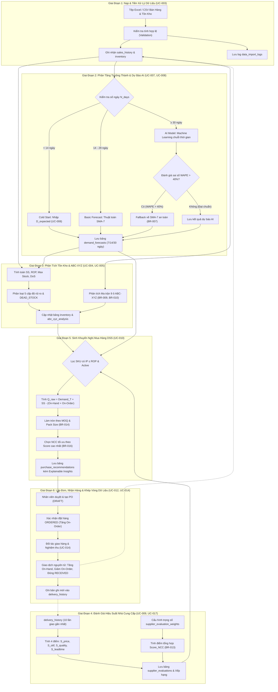
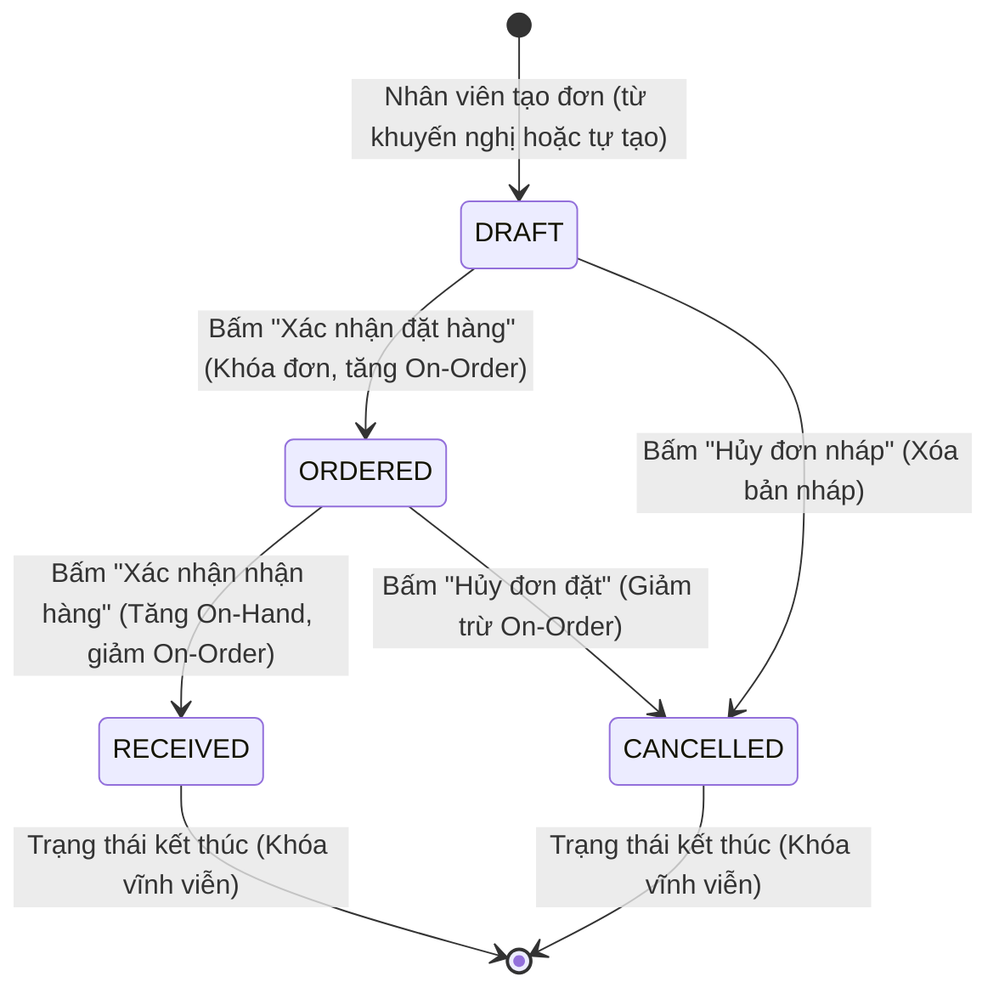

# Data Flow & Integrity: Luồng Dữ Liệu & Ràng Buộc Toàn Vẹn

---

## 1. Chu Trình Dữ Liệu Khép Kín (End-to-End Closed-Loop Data Cycle)

Hệ thống hỗ trợ ra quyết định mua hàng (DSS) vận hành theo chu trình dữ liệu 6 giai đoạn khép kín, đảm bảo phản hồi tức thì và không bị sai lệch số liệu:



---

## 2. Đặc Tả Máy Trạng Thái Đơn Mua Hàng (PO State Machine)

Mọi đơn mua hàng (`purchase_orders`) phải tuân thủ nghiêm ngặt máy trạng thái 4 cấp định nghĩa tại **BR-017**. Các chuyển đổi trạng thái tác động trực tiếp đến số lượng tồn kho khả dụng và số lượng hàng đang chờ về:



### Bảng Tác Động Định Lượng Của Các Chuyển Đổi Trạng Thái:

| Trạng Thái Ban Đầu | Hành Động Kích Hoạt | Trạng Thái Đích | Tác Động Tới $\text{On-Order}$ | Tác Động Tới $\text{On-Hand}$ | Ràng Buộc Sửa Đổi Dữ Liệu (Immutability) |
| :---: | :--- | :---: | :---: | :---: | :--- |
| *(Mới tạo)* | Lưu đơn nháp | **`DRAFT`** | **Không đổi ($+0$)** | **Không đổi ($+0$)** | Cho phép thêm, sửa, xóa dòng hàng và đổi NCC tự do (`BR-025`). |
| **`DRAFT`** | Hủy đơn nháp | **`CANCELLED`**| **Không đổi ($+0$)** | **Không đổi ($+0$)** | Khóa vĩnh viễn (Terminal state). |
| **`DRAFT`** | Xác nhận đặt hàng | **`ORDERED`** | **Tăng: $+ \sum Q_{ordered}$** | **Không đổi ($+0$)** | **Khóa cứng đơn hàng**, không cho phép sửa đổi danh mục hoặc số lượng (`BR-025`). |
| **`ORDERED`** | Hủy đơn đặt hàng | **`CANCELLED`**| **Giảm: $- \sum Q_{ordered}$** | **Không đổi ($+0$)** | Khóa vĩnh viễn, giải phóng lượng hàng chờ về để phục hồi vị trí tồn kho $\text{IP}$. |
| **`ORDERED`** | Xác nhận nhận hàng | **`RECEIVED`** | **Giảm: $- \sum Q_{ordered}$** | **Tăng: $+ \sum Q_{accepted}$** | Khóa vĩnh viễn, đóng đơn và ghi nhận lịch sử vào `delivery_history` (`BR-018`). |

---

## 3. Đặc Tả Giao Dịch Cơ Sở Dữ Liệu Nguyên Tử (Atomic Database Transactions)

Để tuân thủ tiêu chuẩn phi chức năng về tính toàn vẹn dữ liệu (`NFR-007`), hệ thống bắt buộc phải thực thi 2 nghiệp vụ trọng yếu dưới dạng **Giao Dịch Cơ Sở Dữ Liệu Nguyên Tử (ACID Transactions)**. Nếu bất kỳ một bước nào thất bại, toàn bộ giao dịch phải được phục hồi nguyên trạng (Rollback 100%).

---

### Giao Dịch 1: Xác Nhận Chốt Đơn Mua Hàng (`UC-012`)

* **Mục tiêu:** Chuyển trạng thái đơn sang `ORDERED`, khóa đơn và cập nhật tăng $\text{On-Order}$ để chống đặt trùng lặp.
* **Mã giả Transaction (SQL Pseudocode):**

```sql
BEGIN TRANSACTION;

-- Bước 1: Khóa bi quan bản ghi đơn hàng để tránh xung đột đồng thời
SELECT id, status, supplier_id 
FROM purchase_orders 
WHERE id = :order_id AND status = 'DRAFT' 
FOR UPDATE;

-- Bước 2: Cập nhật trạng thái đơn sang ORDERED và ghi nhận người xác nhận
UPDATE purchase_orders
SET status = 'ORDERED',
    confirmed_by = :current_user_id,
    confirmed_at = CURRENT_TIMESTAMP,
    updated_at = CURRENT_TIMESTAMP
WHERE id = :order_id;

-- Bước 3: Cập nhật tăng On-Order trong bảng inventory cho từng sản phẩm trong đơn
UPDATE inventory inv
SET on_order = inv.on_order + poi.ordered_quantity,
    updated_at = CURRENT_TIMESTAMP
FROM purchase_order_items poi
WHERE poi.order_id = :order_id 
  AND poi.product_sku = inv.product_sku;

-- Bước 4: Ghi log kiểm toán thao tác
INSERT INTO audit_logs (user_id, action, entity_name, entity_id, new_values)
VALUES (:current_user_id, 'PO_CONFIRM', 'purchase_orders', :order_id::text, jsonb_build_object('status', 'ORDERED'));

COMMIT;
```

---

### Giao Dịch 2: Ghi Nhận Nhận Hàng & Cập Nhật Tồn Kho Thực Tế (`UC-014`, `BR-018`)

* **Mục tiêu:** Ghi nhận số lượng thực giao $Q_{delivered}$ và hàng lỗi $Q_{defective}$, tính số lượng thực nhập kho đạt chuẩn $Q_{accepted}$, tăng $\text{On-Hand}$, giảm giải phóng $\text{On-Order}$, đóng đơn `RECEIVED` và lưu log `delivery_history`.
* **Mã giả Transaction (SQL Pseudocode):**

```sql
BEGIN TRANSACTION;

-- Bước 1: Khóa bản ghi đơn hàng đang ở trạng thái ORDERED
SELECT id, supplier_id, order_date, promised_delivery_date
FROM purchase_orders
WHERE id = :order_id AND status = 'ORDERED'
FOR UPDATE;

-- Bước 2: Lặp qua từng dòng chi tiết đơn để cập nhật số lượng kiểm đếm thực tế
-- Giả sử dữ liệu kiểm đếm được truyền vào bảng tạm hoặc mảng tham số: (:sku, :delivered_qty, :defective_qty)
UPDATE purchase_order_items
SET delivered_quantity = :delivered_qty,
    defective_quantity = :defective_qty,
    accepted_quantity = (:delivered_qty - :defective_qty)
WHERE order_id = :order_id AND product_sku = :sku;

-- Bước 3: Cập nhật kho 2 chiều nguyên tử trong bảng inventory
-- Tăng On-Hand đúng bằng Q_accepted; Giảm On-Order đúng bằng Q_ordered (chặn số âm bằng GREATEST)
UPDATE inventory inv
SET on_hand = inv.on_hand + (poi.delivered_quantity - poi.defective_quantity),
    on_order = GREATEST(0, inv.on_order - poi.ordered_quantity),
    updated_at = CURRENT_TIMESTAMP
FROM purchase_order_items poi
WHERE poi.order_id = :order_id 
  AND poi.product_sku = inv.product_sku;

-- Bước 4: Chuyển trạng thái đơn mua hàng sang RECEIVED
UPDATE purchase_orders
SET status = 'RECEIVED',
    actual_delivery_date = :actual_delivery_date,
    updated_at = CURRENT_TIMESTAMP
WHERE id = :order_id;

-- Bước 5: Tính toán các chỉ số OTIF và Lead time thực tế
-- is_on_time = (actual_delivery_date <= promised_delivery_date)
-- is_in_full = (total_delivered >= total_ordered)
-- is_otif = is_on_time AND is_in_full
INSERT INTO delivery_history (
    order_id,
    supplier_id,
    promised_date,
    actual_delivery_date,
    total_ordered_quantity,
    total_delivered_quantity,
    total_defective_quantity,
    total_accepted_quantity,
    lead_time_days,
    is_on_time,
    is_in_full,
    is_otif,
    notes,
    received_by,
    received_at
) VALUES (
    :order_id,
    :supplier_id,
    :promised_delivery_date,
    :actual_delivery_date,
    :sum_ordered_qty,
    :sum_delivered_qty,
    :sum_defective_qty,
    :sum_accepted_qty,
    (:actual_delivery_date - :order_date),
    (:actual_delivery_date <= :promised_delivery_date),
    (:sum_delivered_qty >= :sum_ordered_qty),
    ((:actual_delivery_date <= :promised_delivery_date) AND (:sum_delivered_qty >= :sum_ordered_qty)),
    :receipt_notes,
    :current_user_id,
    CURRENT_TIMESTAMP
);

-- Bước 6: Cập nhật trạng thái các khuyến nghị liên quan sang ORDERED
UPDATE purchase_recommendations
SET status = 'ORDERED'
WHERE product_sku IN (SELECT product_sku FROM purchase_order_items WHERE order_id = :order_id)
  AND status = 'PENDING';

COMMIT;
```

---

## 4. Cơ Chế Làm Mới Dữ Liệu & Vô Hiệu Hóa Bộ Nhớ Tạm (DSS Refresh & Cache Invalidation)

Để đảm bảo hiệu năng tải trang $< 2$ giây (`NFR-001`) trong khi vẫn cập nhật số liệu mới nhất khi có biến động, hệ thống áp dụng cơ chế **DSS Analytics Snapshot Cache** kết hợp **Kích hoạt tính toán lại On-Demand (`UC-011`)**:

```
┌─────────────────────────────────────────────────────────────────────────────┐
│                      SỰ KIỆN KÍCH HOẠT TÍNH TOÁN LẠI                        │
├────────────────────────────────┬────────────────────────────────────────────┤
│ Sự kiện kích hoạt (Triggers)   │ Phạm vi tính toán lại (Execution Scope)    │
├────────────────────────────────┼────────────────────────────────────────────┤
│ 1. Nạp file bán hàng/kho mới   │ Chạy lại Dự báo AI + Tính lại ABC-XYZ      │
│    (UC-003)                    │ + Cập nhật DSS Recommendations             │
├────────────────────────────────┼────────────────────────────────────────────┤
│ 2. Hoàn tất nhận hàng          │ Tính lại Điểm hiệu suất NCC (UC-009)       │
│    (UC-014)                    │ + Cập nhật Dashboard tồn kho (UC-004)      │
│                                │ + Gỡ sản phẩm khỏi danh sách đề xuất mua   │
├────────────────────────────────┼────────────────────────────────────────────┤
│ 3. Admin sửa trọng số NCC      │ Tính lại điểm tổng hợp Score_NCC của       │
│    (UC-017)                    │ toàn bộ đối tác + Cập nhật lại gợi ý NCC   │
├────────────────────────────────┼────────────────────────────────────────────┤
│ 4. Bấm "Chạy lại phân tích"    │ Thực thi trọn vẹn toàn bộ Pipeline tính    │
│    (UC-011)                    │ toán DSS trong thời gian < 5 giây (NFR-002)│
└────────────────────────────────┴────────────────────────────────────────────┘
```

---

## 5. Quy Tắc Xử Lý Ràng Buộc Dữ Liệu Ngoại Lệ (Edge Cases Handling)

| Tình Huống Ngoại Lệ | Quy Tắc Nghiệp Vụ Tham Chiếu | Cơ Chế Xử Lý Mức Dữ Liệu |
| :--- | :--- | :--- |
| **Sản phẩm bị vô hiệu hóa** | `BR-021`, `UC-001` | Mọi câu lệnh truy vấn sinh dự báo, cảnh báo rủi ro tồn kho và khuyến nghị mua hàng đều bắt buộc phải có mệnh đề: `WHERE products.is_active = TRUE`. |
| **Sản phẩm chưa có Nhà cung cấp** | `BR-022`, `UC-002` | Bản ghi trong `purchase_recommendations` có trường `recommended_supplier_id = NULL`. Giao diện vô hiệu hóa checkbox tạo đơn cho dòng này và hiển thị cảnh báo `NO_SUPPLIER`. |
| **Hàng tồn bất động (Dead Stock)** | `BR-023`, `FR-011` | Cập nhật trường `inventory.is_dead_stock = TRUE`, gán `inventory.days_of_supply = 999.0` và ép buộc số lượng đề xuất mua: `suggested_quantity = 0`. |
| **Sản phẩm mới (Cold Start)** | `BR-006`, `BR-020`, `UC-008` | Nếu $N_{days} < 14$, lấy giá trị `cold_start_inputs.expected_daily_sales` làm $D_{avg}$; tính $\text{SS} = \lceil D_{expected} \times 2 \rceil$. Khi $N_{days} \ge 14$, tự động chuyển sang mô hình tính toán thống kê. |
| **Nạp dữ liệu trùng ngày bán** | `UC-003` | Nhờ ràng buộc `UNIQUE (product_sku, sale_date)`, hệ thống áp dụng câu lệnh `ON CONFLICT (product_sku, sale_date) DO UPDATE` để ghi đè số lượng bán mới nhất mà không sinh lỗi trùng khóa. |

---

## 6. Kết Luận

Tài liệu Đặc tả Luồng dữ liệu và Tính toàn vẹn này thiết lập một cơ chế vận hành dữ liệu chuẩn xác, minh bạch và an toàn tuyệt đối. Bằng việc áp dụng giao dịch nguyên tử ACID cho mọi tác vụ liên quan đến kho và đơn hàng, hệ thống loại trừ triệt để nguy cơ lệch số liệu tồn kho, đảm bảo chất lượng vận hành cao nhất cho giải pháp hỗ trợ ra quyết định mua hàng.
