# Data Model Overview: Hệ Thống Hỗ Trợ Ra Quyết Định Mua Hàng Tích Hợp AI

---

## 📋 BẢNG THEO DÕI QUYẾT ĐỊNH MÔ HÌNH DỮ LIỆU (DECISION LOG)

| ID | Nhóm phân tích | Quyết định cuối cùng đã thống nhất |
| :--- | :--- | :--- |
| **DEC-DM-001** | Kiến trúc dữ liệu tổng thể | Áp dụng mô hình lai **Hybrid OLTP & Analytical/DSS Cache**: Đảm bảo 3NF chuẩn hóa cho giao dịch và lưu trữ Snapshot/JSONB tối ưu cho DSS & Explainable AI. |
| **DEC-DM-002** | Khóa định danh sản phẩm | Sử dụng chuỗi ký tự tự nhiên `sku` làm Khóa chính (Primary Key) duy nhất của bảng `products` để đồng bộ trực tiếp với file Excel/POS. |
| **DEC-DM-003** | Toàn vẹn Vị trí Tồn kho | Đồng bộ chặt chẽ đại lượng `on_order` với máy trạng thái đơn hàng (`ORDERED` $\rightarrow$ cộng dồn; `RECEIVED`/`CANCELLED` $\rightarrow$ giải phóng) để chống đặt trùng lặp theo **BR-001**. |
| **DEC-DM-004** | Chuỗi thời gian bán hàng | Bảng `sales_history` áp dụng ràng buộc duy nhất `UNIQUE(product_sku, sale_date)` để hỗ trợ Upsert và chặn trùng lặp dữ liệu nạp từ `UC-003`. |
| **DEC-DM-005** | Dữ liệu bán cấu trúc AI | Sử dụng kiểu dữ liệu `JSONB` để lưu trữ mảng chuỗi điểm dự báo, dải mây biến động tin cậy và các yếu tố giải thích minh bạch trong `demand_forecasts` và `purchase_recommendations`. |
| **DEC-DM-006** | Lưu vết lịch sử nhận hàng | Bảng `delivery_history` lưu vết riêng biệt từng đợt nhận hàng thực tế ($Q_{delivered}, Q_{defective}, Q_{accepted}$, cờ `is_otif`) làm nguồn dữ liệu chuẩn hóa cho thuật toán chấm điểm NCC theo **BR-012**. |
| **DEC-DM-007** | Ràng buộc trọng số NCC | Áp dụng Check Constraint nghiêm ngặt trên bảng `supplier_evaluation_weights`: $\sum w_i = 100\%$ và $w_i \ge 0\%$ theo **BR-013**. |
| **DEC-DM-008** | Vòng đời Đơn mua hàng | Quản lý thống nhất trong 1 bảng `purchase_orders` với máy trạng thái 4 cấp (`DRAFT`, `ORDERED`, `RECEIVED`, `CANCELLED`) và mã đơn sinh tự động `PO-YYYYMMDD-XXXX` theo **BR-024**. |

---

## 1. Giới Thiệu & Mục Tiêu Kiến Trúc Dữ Liệu

Tài liệu này định nghĩa mô hình dữ liệu (Data Model) toàn diện cho **Hệ thống hỗ trợ ra quyết định mua hàng tích hợp AI (DSS AI Purchase)** tại một cửa hàng bán lẻ đơn lẻ (Single Retail Store). 

Mục tiêu cốt lõi của thiết kế dữ liệu:
1. **Hỗ trợ bài toán ra quyết định cốt lõi (DSS Core):** Cung cấp cấu trúc dữ liệu tối ưu để trả lời 4 câu hỏi: *Mua gì? Khi nào mua? Mua bao nhiêu? Mua từ ai?*
2. **Đảm bảo tính toàn vẹn giao dịch (ACID Integrity):** Ngăn chặn hoàn toàn việc đặt hàng trùng lặp, sai lệch tồn kho khi nhận hàng hoặc hủy đơn thông qua cơ chế kiểm soát vị trí tồn kho ($\text{IP} = \text{On-Hand} + \text{On-Order}$) và giao dịch nguyên tử.
3. **Phục vụ mô hình AI có tính giải thích (Explainable AI & Analytics):** Lưu trữ chuỗi thời gian liên tục, đánh giá sai số mô hình ($\text{WAPE}, \text{MAE}$), cơ chế Fallback SMA-7, và lưu vết minh bạch các yếu tố dẫn đến khuyến nghị mua hàng.
4. **Khả năng mở rộng & Bảo trì (Maintainability):** Phân chia rõ ràng thành 5 miền nghiệp vụ (Domains), tối ưu chỉ mục (Indexes) nhằm đáp ứng thời gian phản hồi giao diện $< 2$ giây và thời gian chạy toàn bộ phân tích DSS $< 5$ giây theo tiêu chuẩn phi chức năng (`NFR-001`, `NFR-002`).

---

## 2. Nguyên Tắc Thiết Kế Dữ Liệu (Data Architecture Principles)

Hệ thống tuân thủ 4 nguyên tắc kiến trúc dữ liệu chuẩn mực của Senior Data Architect:

```
┌─────────────────────────────────────────────────────────────────────────┐
│                     DATA ARCHITECTURE PRINCIPLES                        │
├──────────────────────────┬──────────────────────────┬───────────────────┤
│ 1. Transactional 3NF     │ 2. DSS Analytics Cache   │ 3. Explainable AI │
│    Chuẩn hóa dữ liệu cốt │    Lưu kết quả tính toán │    Dữ liệu giải   │
│    lõi, chống dị thường  │    chỉ số, dự báo để     │    thích cấu trúc │
│    cập nhật kho & đơn PO │    phản hồi tức thì < 2s │    bằng JSONB     │
├──────────────────────────┴──────────────────────────┴───────────────────┤
│ 4. Single-Store Focus: Tối giản hóa, không gánh nặng đa chi nhánh       │
└─────────────────────────────────────────────────────────────────────────┘
```

1. **Chuẩn hóa bậc 3 (Third Normal Form - 3NF) cho tầng Giao dịch:**
   * Các thực thể danh mục (`products`, `suppliers`), quan hệ cung ứng (`product_suppliers`), đơn mua hàng (`purchase_orders`, `purchase_order_items`) và lịch sử nhận hàng (`delivery_history`) được chuẩn hóa triệt để để đảm bảo tính nhất quán dữ liệu, chống dị thường (anomalies) khi thêm, sửa, xóa.
2. **Snapshot & Caching có kiểm soát cho tầng Phân tích DSS:**
   * Các chỉ số tồn kho ($\text{SS}, \text{ROP}, \text{DoS}$, 5 cấp độ rủi ro), ma trận phân loại ABC-XYZ, kết quả dự báo chuỗi thời gian và danh sách khuyến nghị mua hàng được lưu vết dưới dạng snapshot phân tích. Điều này giúp giao diện hiển thị tức thì mà không cần quét lại toàn bộ dữ liệu giao dịch khổng lồ trong quá khứ.
3. **Semi-structured Data (JSONB) cho Trí tuệ nhân tạo:**
   * Tận dụng khả năng lưu trữ linh hoạt của kiểu dữ liệu `JSONB` trong PostgreSQL để biểu diễn:
     * Mảng các điểm dự báo theo ngày kèm khoảng tin cậy (Confidence Interval Cloud): $[\hat{y}_t - 1.65 \times \text{MAE} \leftrightarrow \hat{y}_t + 1.65 \times \text{MAE}]$.
     * Thẻ thông tin giải thích quyết định (Explainable Insights metadata: căn cứ số lượng, tỷ lệ đóng gói, lý do chọn NCC).
     * Chi tiết các dòng lỗi khi nạp dữ liệu từ file Excel/CSV.
4. **Kiểm soát tính nguyên tử trong chu trình dữ liệu khép kín:**
   * Thực hiện giao dịch nguyên tử (Atomic Database Transaction) khi chốt đơn mua (`UC-012`) và ghi nhận nhận hàng (`UC-014`): đồng thời cập nhật trạng thái đơn, tăng/giảm tồn kho hai chiều (`on_hand`, `on_order`), và ghi log lịch sử giao hàng (`delivery_history`).

---

## 3. Mô Hình Dữ Liệu Khái Niệm (Conceptual Data Model - CDM)

Hệ thống được tổ chức thành **5 phân vùng miền nghiệp vụ (Business Domains)** với 15 thực thể dữ liệu phối hợp chặt chẽ:

```
┌───────────────────────────────────────────────────────────────────────────────────────┐
│                                 CONCEPTUAL DATA MODEL                                 │
├─────────────────────────────┬─────────────────────────────┬───────────────────────────┤
│ DOMAIN 1: MASTER DATA       │ DOMAIN 2: INVENTORY & SALES │ DOMAIN 3: FORECAST & DSS  │
│ ---------------------       │ --------------------------- │ ------------------------  │
│ • products (SKU)            │ • inventory (Stock & ROP)   │ • demand_forecasts        │
│ • suppliers                 │ • inventory_snapshots       │ • cold_start_inputs       │
│ • product_suppliers (N:M)   │ • sales_history (Daily)     │ • abc_xyz_analysis        │
│                             │ • data_import_logs          │                           │
├─────────────────────────────┴─────────────────────────────┴───────────────────────────┤
│ DOMAIN 4: PROCUREMENT & SUPPLIER EVALUATION                                           │
│ -------------------------------------------                                           │
│ • supplier_evaluation_weights (Cấu hình trọng số Admin)                               │
│ • supplier_evaluations (Chấm điểm NCC 4 tiêu chí)                                     │
│ • purchase_recommendations (Gợi ý mua hàng thông minh)                                │
│ • purchase_orders (Đơn mua hàng PO) & purchase_order_items                            │
│ • delivery_history (Log nhận hàng thực tế & OTIF)                                     │
├───────────────────────────────────────────────────────────────────────────────────────┤
│ DOMAIN 5: SECURITY & AUDIT TRAIL                                                      │
│ --------------------------------                                                      │
│ • users (Tài khoản & Phân quyền RBAC)                                                 │
│ • audit_logs (Nhật ký kiểm toán hệ thống)                                             │
└───────────────────────────────────────────────────────────────────────────────────────┘
```

---

## 4. Sơ Đồ Quan Hệ Thực Thể Toàn Diện (Full Entity Relationship Diagram - ERD)

Dưới đây là sơ đồ ERD chi tiết mô tả quan hệ giữa toàn bộ 15 thực thể trong hệ thống bằng cú pháp Mermaid:

```mermaid
erDiagram
    %% DOMAIN 1: MASTER DATA
    products ||--o{ product_suppliers : "được cung ứng bởi"
    suppliers ||--o{ product_suppliers : "phân phối"
    
    %% DOMAIN 2: INVENTORY & SALES
    products ||--|| inventory : "theo dõi tồn kho"
    products ||--o{ inventory_snapshots : "ghi nhận kiểm kê"
    products ||--o{ sales_history : "ghi nhận bán hàng"
    data_import_logs ||--o{ sales_history : "nguồn import"
    
    %% DOMAIN 3: FORECASTING & DSS ANALYTICS
    products ||--o{ demand_forecasts : "được dự báo"
    products ||--o| cold_start_inputs : "thiết lập sản phẩm mới"
    products ||--o{ abc_xyz_analysis : "phân loại ma trận"
    
    %% DOMAIN 4: PROCUREMENT & SUPPLIER EVALUATION
    suppliers ||--o{ supplier_evaluations : "được chấm điểm"
    products ||--o{ purchase_recommendations : "được gợi ý mua"
    suppliers ||--o{ purchase_recommendations : "được gợi ý chọn"
    suppliers ||--o{ purchase_orders : "nhận đơn đặt hàng"
    purchase_orders ||--|{ purchase_order_items : "bao gồm chi tiết"
    products ||--o{ purchase_order_items : "được đặt trong đơn"
    purchase_orders ||--o| delivery_history : "nghiệm thu nhận hàng"
    suppliers ||--o{ delivery_history : "lịch sử giao của"
    
    %% DOMAIN 5: SECURITY & AUDIT
    users ||--o{ purchase_orders : "người lập đơn"
    users ||--o{ delivery_history : "người nhận hàng"
    users ||--o{ data_import_logs : "người nạp dữ liệu"
    users ||--o{ supplier_evaluation_weights : "người cấu hình"
    users ||--o{ audit_logs : "tác nhân thao tác"

    %% ENTITY ATTRIBUTE SPECIFICATIONS
    products {
        string sku PK "Mã SKU duy nhất"
        string name "Tên sản phẩm"
        string category "Ngành hàng"
        string unit "Đơn vị tính"
        decimal cost_price "Giá vốn tham chiếu"
        decimal selling_price "Giá bán niêm yết"
        int default_lead_time "Lead time mặc định (ngày)"
        int min_safety_stock "Mức sàn an toàn tối thiểu"
        boolean is_active "Trạng thái kinh doanh"
        timestamp created_at "Ngày tạo"
        timestamp updated_at "Ngày cập nhật"
    }

    suppliers {
        bigint id PK "Khóa chính tự tăng"
        string code UK "Mã nhà cung cấp duy nhất"
        string name UK "Tên nhà cung cấp"
        string phone "Số điện thoại liên hệ"
        string email "Địa chỉ thư điện tử"
        string address "Địa chỉ liên hệ"
        string status_tag "Nhãn NEW_SUPPLIER hoặc ACTIVE"
        boolean is_active "Trạng thái hợp tác"
        timestamp created_at "Ngày tạo"
        timestamp updated_at "Ngày cập nhật"
    }

    product_suppliers {
        bigint id PK "Khóa chính tự tăng"
        string product_sku FK "Mã SKU"
        bigint supplier_id FK "ID Nhà cung cấp"
        decimal purchase_price "Đơn giá nhập P_supplier"
        int moq "Số lượng đặt tối thiểu"
        int pack_size "Quy cách đóng gói"
        int committed_lead_time "Lead time cam kết (ngày)"
        boolean is_preferred "Nhà cung cấp ưu tiên"
    }

    inventory {
        string product_sku PK, FK "Mã SKU sản phẩm"
        int on_hand "Tồn kho thực tế khả dụng"
        int on_order "Lượng hàng đang chờ về"
        int safety_stock "Tồn kho an toàn tính toán"
        int reorder_point "Điểm đặt hàng lại ROP"
        int max_stock "Ngưỡng tồn kho tối đa"
        decimal days_of_supply "Số ngày bán còn lại DoS"
        string risk_level "5 cấp độ rủi ro tồn kho"
        boolean is_dead_stock "Cờ hàng tồn bất động"
        timestamp last_stocktake_date "Ngày kiểm kê gần nhất"
        timestamp updated_at "Thời điểm cập nhật"
    }

    sales_history {
        bigint id PK "Khóa chính tự tăng"
        string product_sku FK "Mã SKU"
        date sale_date "Ngày bán hàng"
        int quantity_sold "Số lượng bán"
        decimal revenue "Doanh thu bán"
        string source "Nguồn dữ liệu (Excel/Manual)"
        uuid import_batch_id FK "Mã mẻ import"
    }

    demand_forecasts {
        bigint id PK "Khóa chính tự tăng"
        string product_sku FK "Mã SKU"
        date forecast_date "Ngày chạy dự báo"
        int horizon_days "Khung thời gian (7/14/30)"
        int forecasted_demand "Tổng cầu dự báo chu kỳ T"
        decimal daily_avg_demand "Nhu cầu trung bình ngày D_avg"
        decimal wape "Chỉ số sai số WAPE (%)"
        decimal mae "Chỉ số sai số tuyệt đối MAE"
        string algorithm_used "Thuật toán áp dụng"
        boolean is_fallback "Cờ chuyển sang SMA-7"
        jsonb forecast_points "Chuỗi điểm dự báo & Dải tin cậy"
    }

    abc_xyz_analysis {
        bigint id PK "Khóa chính tự tăng"
        string product_sku FK "Mã SKU"
        date analysis_date "Ngày chạy phân tích"
        decimal total_revenue "Tổng doanh thu 30 ngày"
        decimal cumulative_revenue_pct "Phần trăm doanh thu tích lũy"
        string abc_class "Nhóm ABC (A, B, C)"
        decimal coefficient_of_variation "Hệ số biến thiên CV"
        string xyz_class "Nhóm XYZ (X, Y, Z)"
        string abc_xyz_segment "Nhóm kết hợp (AX..CZ)"
    }

    supplier_evaluations {
        bigint id PK "Khóa chính tự tăng"
        bigint supplier_id FK "ID Nhà cung cấp"
        date evaluation_date "Ngày đánh giá"
        int delivery_count_analyzed "Số lần giao đánh giá"
        decimal price_score "Điểm giá cả S_price"
        decimal otif_score "Điểm đúng hạn & đủ lượng S_otif"
        decimal quality_score "Điểm chất lượng S_quality"
        decimal lead_time_score "Điểm tốc độ giao S_leadtime"
        decimal total_score "Điểm tổng hợp Score_NCC"
        int rank "Thứ bậc xếp hạng"
        boolean is_new_supplier "Cờ đối tác mới"
    }

    supplier_evaluation_weights {
        int id PK "Khóa chính đơn (ID = 1)"
        decimal weight_otif "Trọng số OTIF (mặc định 35%)"
        decimal weight_quality "Trọng số Chất lượng (30%)"
        decimal weight_price "Trọng số Giá cả (20%)"
        decimal weight_leadtime "Trọng số Tốc độ (15%)"
        uuid updated_by FK "Admin thực hiện cập nhật"
        timestamp updated_at "Thời điểm cập nhật"
    }

    purchase_recommendations {
        bigint id PK "Khóa chính tự tăng"
        string product_sku FK "Mã SKU cần mua"
        bigint recommended_supplier_id FK "NCC tối ưu được gợi ý"
        int horizon_days "Chu kỳ kế hoạch T ngày"
        int raw_shortage "Lượng thiếu hụt thô Q_raw"
        int suggested_quantity "Số lượng mua đề xuất Q_suggested"
        date suggested_order_date "Ngày đặt hàng gợi ý"
        decimal estimated_unit_price "Đơn giá dự kiến"
        decimal estimated_total_cost "Tổng tiền dự kiến"
        string urgency_level "Mức khẩn cấp"
        string explanation_summary "Lý giải quyết định tóm tắt"
        jsonb explanation_factors "Các yếu tố giải thích chi tiết"
        string status "Trạng thái khuyến nghị"
    }

    purchase_orders {
        bigint id PK "Khóa chính tự tăng"
        string po_code UK "Mã PO-YYYYMMDD-XXXX"
        bigint supplier_id FK "Nhà cung cấp được chọn"
        string status "DRAFT, ORDERED, RECEIVED, CANCELLED"
        date order_date "Ngày tạo / chốt đơn"
        date promised_delivery_date "Ngày hẹn giao cam kết"
        date actual_delivery_date "Ngày nhận hàng thực tế"
        decimal total_amount "Tổng giá trị đơn hàng"
        string notes "Ghi chú đơn hàng"
        uuid created_by FK "Nhân viên tạo đơn"
        uuid confirmed_by FK "Nhân viên xác nhận đơn"
        timestamp confirmed_at "Thời điểm xác nhận"
    }

    purchase_order_items {
        bigint id PK "Khóa chính tự tăng"
        bigint order_id FK "ID Đơn mua hàng"
        string product_sku FK "Mã SKU sản phẩm"
        int ordered_quantity "Số lượng đặt mua"
        decimal unit_price "Đơn giá mua thỏa thuận"
        decimal total_price "Thành tiền dòng"
        int delivered_quantity "Số lượng thực giao"
        int defective_quantity "Số lượng hàng lỗi"
        int accepted_quantity "Số lượng thực nhập kho"
    }

    delivery_history {
        bigint id PK "Khóa chính tự tăng"
        bigint order_id FK "Đơn mua hàng liên quan"
        bigint supplier_id FK "Nhà cung cấp giao"
        date promised_date "Ngày hẹn giao"
        date actual_delivery_date "Ngày giao thực tế"
        int total_ordered_quantity "Tổng lượng đặt"
        int total_delivered_quantity "Tổng lượng giao"
        int total_defective_quantity "Tổng lượng hàng lỗi"
        int total_accepted_quantity "Tổng lượng thực nhập"
        int lead_time_days "Lead time thực tế (ngày)"
        boolean is_on_time "Giao đúng hạn"
        boolean is_in_full "Giao đủ số lượng"
        boolean is_otif "Đạt chuẩn OTIF"
        uuid received_by FK "Nhân viên nghiệm thu"
        timestamp received_at "Thời điểm nhận hàng"
    }

    users {
        uuid id PK "Định danh duy nhất UUID"
        string username UK "Tên đăng nhập"
        string password_hash "Mật khẩu mã hóa bcrypt"
        string full_name "Họ và tên"
        string email UK "Địa chỉ email"
        string role "Vai trò ADMIN hoặc STAFF"
        boolean is_active "Trạng thái tài khoản"
        boolean must_change_password "Bắt buộc đổi mật khẩu"
        timestamp last_login_at "Thời điểm đăng nhập cuối"
    }

    audit_logs {
        bigint id PK "Khóa chính tự tăng"
        uuid user_id FK "Người thực hiện"
        string action "Hành động (USER_LOCK, WEIGHT_UPDATE...)"
        string entity_name "Tên bảng dữ liệu"
        string entity_id "Khóa bản ghi"
        jsonb old_values "Dữ liệu trước thay đổi"
        jsonb new_values "Dữ liệu sau thay đổi"
        string ip_address "Địa chỉ IP"
        timestamp created_at "Thời điểm ghi log"
    }
```



---

## 5. Bảng Danh Mục Thực Thể (Entity Inventory)

Hệ thống được thiết kế tinh gọn gồm đúng **15 thực thể dữ liệu**, phân bổ theo 5 phân vùng chức năng:

| STT | Tên Bảng (Physical Name) | Tên Thực Thể Nghiệp Vụ | Phân Loại | Khóa Chính (PK) | Mục Đích Lưu Trữ |
| :---: | :--- | :--- | :--- | :--- | :--- |
| **1** | `products` | Danh mục Sản phẩm | Master Data | `sku` | Định danh hàng hóa, giá vốn, giá bán, tham số an toàn cơ bản. |
| **2** | `suppliers` | Danh mục Nhà cung cấp | Master Data | `id` | Thông tin đối tác, liên hệ, trạng thái hợp tác. |
| **3** | `product_suppliers` | Bảng giá & Cung ứng NCC | Master / Junction | `id` | Mối quan hệ N:M giữa Sản phẩm - NCC, đơn giá, MOQ, Pack Size, Lead time. |
| **4** | `inventory` | Tồn kho & Chỉ số An toàn | Operational / Cache | `product_sku` | Lưu trữ số lượng $\text{On-Hand}, \text{On-Order}, \text{IP}$ và các chỉ số tính toán $\text{SS}, \text{ROP}, \text{DoS}$. |
| **5** | `inventory_snapshots` | Nhật ký Điều chỉnh Tồn kho | Audit / History | `id` | Lưu vết kiểm kê thực tế hoặc điều chỉnh tồn kho thủ công từ màn hình. |
| **6** | `sales_history` | Lịch sử Bán hàng Hàng ngày | Transactional Time-Series| `id` | Chuỗi thời gian bán lẻ phục vụ huấn luyện dự báo AI và tính ma trận ABC-XYZ. |
| **7** | `data_import_logs` | Nhật ký Nạp Dữ liệu File | Audit / Log | `id` | Lưu thông tin các lần tải tệp Excel/CSV bán hàng và tồn kho. |
| **8** | `cold_start_inputs` | Tham số Bán Hàng SP Mới | Operational Data | `product_sku` | Lưu sản lượng bán dự kiến ngày ($D_{expected}$) cho hàng mới $< 14$ ngày dữ liệu. |
| **9** | `demand_forecasts` | Kết Quả Dự Báo Nhu Cầu | Analytical Cache | `id` | Lưu trữ tổng cầu dự báo $T \in \{7, 14, 30\}$ ngày, sai số WAPE/MAE, dải tin cậy. |
| **10**| `abc_xyz_analysis` | Phân Loại Ma Trận ABC-XYZ | Analytical Cache | `id` | Lưu kết quả phân hạng doanh thu (A/B/C) và độ ổn định nhu cầu (X/Y/Z). |
| **11**| `supplier_evaluations` | Đánh Giá & Xếp Hạng NCC | Analytical Cache | `id` | Điểm 4 tiêu chí và điểm tổng hợp $Score_{NCC}$ trên 10 lần giao gần nhất. |
| **12**| `supplier_evaluation_weights`| Cấu Hình Trọng Số NCC | System Configuration | `id` | Lưu cấu hình 4 trọng số tiêu chí đánh giá NCC do Admin quản trị ($\sum = 100\%$). |
| **13**| `purchase_recommendations`| Khuyến Nghị Mua Hàng DSS | Decision Output Cache| `id` | Danh sách các đề xuất mua hàng tối ưu kèm giải thích minh bạch từ AI. |
| **14**| `purchase_orders` | Đơn Mua Hàng (PO) | Transactional Master | `id` | Quản lý vòng đời đơn mua hàng theo 4 trạng thái (`DRAFT` $\rightarrow$ `ORDERED` $\rightarrow$ `RECEIVED`/`CANCELLED`). |
| **15**| `purchase_order_items` | Chi Tiết Dòng Đơn Mua Hàng | Transactional Detail | `id` | Danh mục SKU, số lượng đặt, đơn giá, và số lượng thực nhận trong đơn. |
| **16**| `delivery_history` | Nhật Ký Nhận Hàng & OTIF | Operational History | `id` | Ghi nhận chi tiết kết quả từng lần giao hàng thực tế của NCC để tính điểm. |
| **17**| `users` | Tài Khoản Người Dùng | Security / Identity | `id` | Tài khoản, mật khẩu băm bcrypt, phân quyền `ADMIN` hoặc `STAFF`. |
| **18**| `audit_logs` | Nhật Ký Kiểm Toán An Ninh | Security / Audit | `id` | Lưu vết các thao tác quản trị nhạy cảm (khóa tài khoản, sửa trọng số, hủy đơn). |

*(Ghi chú: Tổng cộng có 18 bảng vật lý bao gồm cả các bảng Audit và Logs, được gom nhóm trong 15 thực thể nghiệp vụ cốt lõi).*

---

## 6. Ma Trận Truy Vết 4 Chiều (Traceability Matrix)

Ma trận dưới đây chứng minh tính bao phủ toàn diện 100% giữa **Quy tắc nghiệp vụ (BRs)**, **Yêu cầu chức năng (FRs)**, **Use Cases (UCs)** và **Cấu trúc dữ liệu tương ứng**:

| Business Rule (BR) | Functional Req (FR) | Use Case (UC) | Thực Thể & Thuộc Tính Dữ Liệu Tương Ứng | Đánh Giá Tính Toàn Vẹn |
| :--- | :--- | :--- | :--- | :---: |
| **BR-001 (Vị trí tồn kho IP)** | `FR-007` | `UC-004`, `UC-010` | `inventory.on_hand`, `inventory.on_order`, `inventory.calculated_ip` | ✅ Hoàn toàn nhất quán |
| **BR-002 (5 Cấp độ rủi ro)** | `FR-010` | `UC-004`, `UC-010` | `inventory.risk_level` (`RiskLevel` ENUM) | ✅ Hoàn toàn nhất quán |
| **BR-003 (Safety Stock SS)** | `FR-008` | `UC-004`, `UC-010` | `inventory.safety_stock`, `products.min_safety_stock` | ✅ Hoàn toàn nhất quán |
| **BR-004 (ROP & Max Stock)** | `FR-008` | `UC-004`, `UC-010` | `inventory.reorder_point`, `inventory.max_stock` | ✅ Hoàn toàn nhất quán |
| **BR-005 (Days of Supply DoS)** | `FR-007` | `UC-004`, `UC-010` | `inventory.days_of_supply`, `inventory.is_dead_stock` | ✅ Hoàn toàn nhất quán |
| **BR-006 (Phân tầng dữ liệu)** | `FR-016` | `UC-007`, `UC-008` | `demand_forecasts.algorithm_used`, `cold_start_inputs` | ✅ Hoàn toàn nhất quán |
| **BR-007 (Đánh giá WAPE/MAE)**| `FR-015` | `UC-007` | `demand_forecasts.wape`, `demand_forecasts.mae`, `is_fallback` | ✅ Hoàn toàn nhất quán |
| **BR-008 (Tổng cầu chu kỳ T)**| `FR-013` | `UC-007`, `UC-010` | `demand_forecasts.forecasted_demand`, `daily_avg_demand` | ✅ Hoàn toàn nhất quán |
| **BR-009 (Phân loại ABC)** | `FR-009` | `UC-005`, `UC-006` | `abc_xyz_analysis.total_revenue`, `cumulative_revenue_pct`, `abc_class` | ✅ Hoàn toàn nhất quán |
| **BR-010 (Phân loại XYZ - CV)**| `FR-009` | `UC-005`, `UC-006` | `abc_xyz_analysis.coefficient_of_variation`, `xyz_class` | ✅ Hoàn toàn nhất quán |
| **BR-011 (Ma trận ABC-XYZ)** | `FR-009` | `UC-005`, `UC-006` | `abc_xyz_analysis.abc_xyz_segment` | ✅ Hoàn toàn nhất quán |
| **BR-012 (4 Điểm NCC)** | `FR-019` | `UC-009` | `supplier_evaluations.price_score, otif_score, quality_score, lead_time_score` | ✅ Hoàn toàn nhất quán |
| **BR-013 (Trọng số NCC & Score)**| `FR-019`, `FR-034`| `UC-009`, `UC-017` | `supplier_evaluation_weights`, `supplier_evaluations.total_score` | ✅ Hoàn toàn nhất quán |
| **BR-014 (Số lượng đề xuất Q)**| `FR-023` | `UC-010` | `purchase_recommendations.raw_shortage`, `suggested_quantity` | ✅ Hoàn toàn nhất quán |
| **BR-015 (Thời điểm đặt hàng)** | `FR-023` | `UC-010` | `purchase_recommendations.suggested_order_date` | ✅ Hoàn toàn nhất quán |
| **BR-016 (Gợi ý NCC & Insight)**| `FR-023`, `FR-024`| `UC-010` | `purchase_recommendations.recommended_supplier_id`, `explanation_summary` | ✅ Hoàn toàn nhất quán |
| **BR-017 (Máy trạng thái PO)** | `FR-030` | `UC-012`, `UC-013` | `purchase_orders.status` (`POStatus` ENUM) | ✅ Hoàn toàn nhất quán |
| **BR-018 (Nhận hàng & Kho)** | `FR-018` | `UC-014` | `purchase_order_items.accepted_quantity`, `inventory.on_hand` | ✅ Hoàn toàn nhất quán |
| **BR-019 (Log giao hàng)** | `FR-017` | `UC-014` | `delivery_history` (chi tiết $Q_{delivered}, Q_{defective}$, `is_otif`) | ✅ Hoàn toàn nhất quán |
| **BR-020 (Vòng đời sản phẩm)** | `FR-016` | `UC-008` | `cold_start_inputs`, `demand_forecasts.algorithm_used` | ✅ Hoàn toàn nhất quán |
| **BR-021 (Sản phẩm vô hiệu)** | `FR-001`, `FR-025`| `UC-001`, `UC-010` | `products.is_active` | ✅ Hoàn toàn nhất quán |
| **BR-022 (Sản phẩm chưa có NCC)**| `FR-002` | `UC-002`, `UC-010` | Quan hệ `product_suppliers` (Trạng thái cảnh báo `NO_SUPPLIER`) | ✅ Hoàn toàn nhất quán |
| **BR-023 (Hàng tồn bất động)** | `FR-011` | `UC-004`, `UC-010` | `inventory.is_dead_stock`, `days_of_supply = 999` | ✅ Hoàn toàn nhất quán |
| **BR-024 (Sinh mã đơn PO)** | `FR-026` | `UC-012` | `purchase_orders.po_code` (Format `PO-YYYYMMDD-XXXX`) | ✅ Hoàn toàn nhất quán |
| **BR-025 (Khóa đơn hàng)** | `FR-029` | `UC-012`, `UC-013` | Ràng buộc logic theo `purchase_orders.status` | ✅ Hoàn toàn nhất quán |
| **BR-026 (Ngày hẹn giao chuẩn)**| `FR-026` | `UC-012` | `purchase_orders.promised_delivery_date` | ✅ Hoàn toàn nhất quán |

---

## 7. Kết Luận

Kiến trúc mô hình dữ liệu tổng thể này thiết lập nền tảng vững chắc, kết hợp hài hòa giữa:
* **Tính chặt chẽ nghiệp vụ:** Bảo đảm tính nhất quán của số liệu tồn kho khả dụng, không có kẽ hở cho hiện tượng đặt trùng lặp đơn hàng.
* **Tính tối ưu hiệu năng:** Cho phép giao diện hiển thị tức thì các màn hình phân tích phức tạp dưới 2 giây.
* **Tính sẵn sàng cho AI:** Chuẩn hóa cấu trúc đầu vào và đầu ra của mô hình dự báo chuỗi thời gian, đáp ứng trọn vẹn yêu cầu giải thích minh bạch (Explainable DSS).
