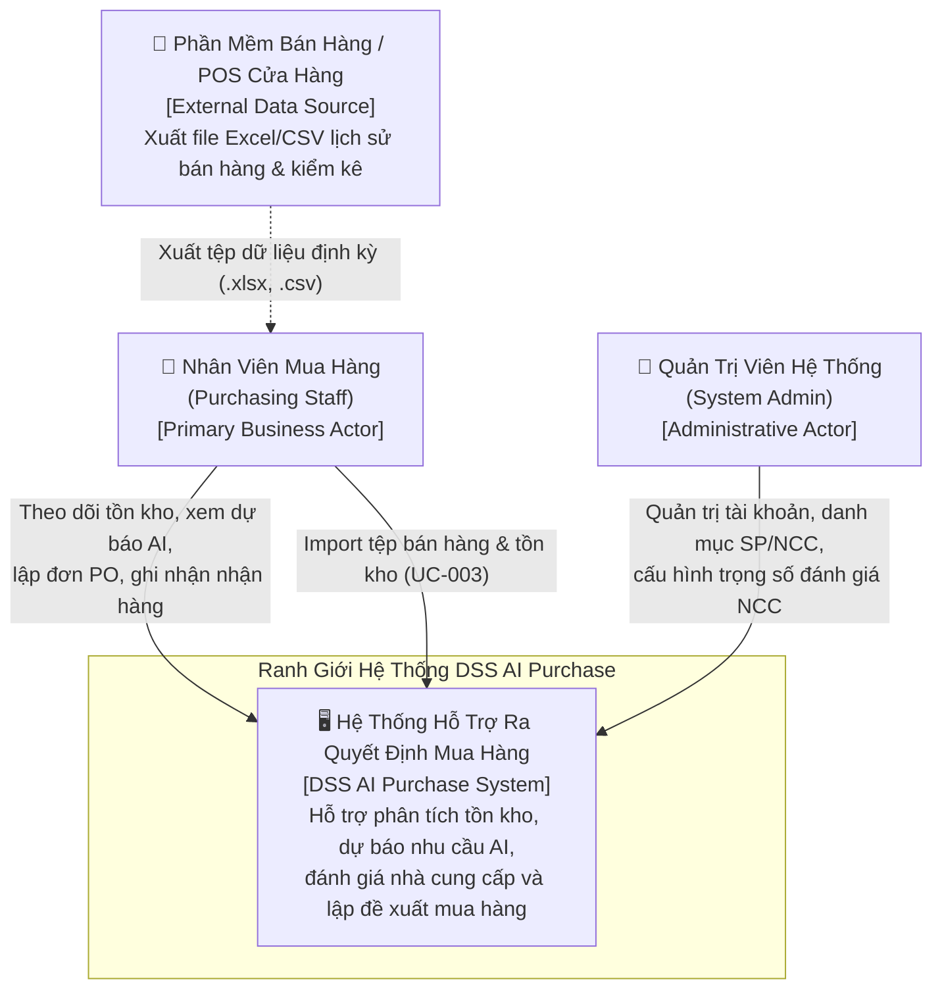
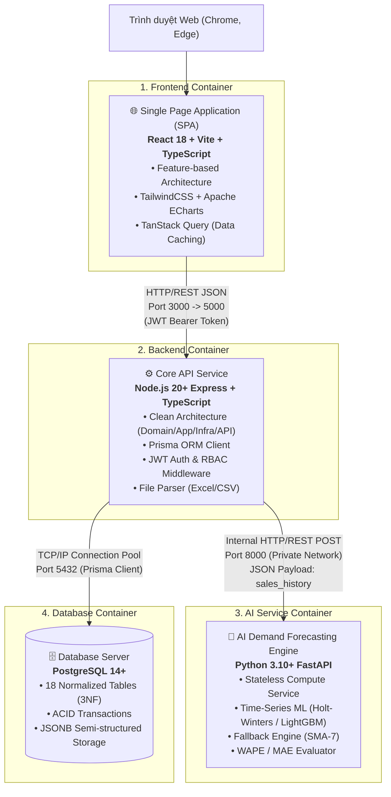

# Architecture Overview: Kiến Trúc Hệ Thống Tổng Thể

---

## 📋 BẢNG THEO DÕI QUYẾT ĐỊNH KIẾN TRÚC (ARCHITECTURE DECISION LOG)

| ID | Vấn Đề Kiến Trúc | Quyết Định Cuối Cùng Đã Thống Nhất | Cơ Sở & Rationale |
| :--- | :--- | :--- | :--- |
| **DEC-ARC-001** | Phong cách kiến trúc hệ thống | **Modular Service-Oriented Architecture (SOA)** gồm 3 dịch vụ chuyên biệt: Frontend SPA, Core Backend API, AI Stateless Engine, và 1 RDBMS PostgreSQL. | Đảm bảo tính phân tách trách nhiệm (Separation of Concerns), phù hợp năng lực lập trình viên, đáp ứng thời gian phản hồi DSS $< 5$s (`NFR-002`). |
| **DEC-ARC-002** | Công nghệ & Phong cách Backend | **Node.js + Express + TypeScript** tổ chức theo **Clean Architecture** (Domain, Application, Infrastructure, Presentation). | Tận dụng sự quen thuộc của lập trình viên, áp dụng quy chuẩn thiết kế phần mềm doanh nghiệp mẫu mực, tách biệt độc lập nghiệp vụ và công nghệ. |
| **DEC-ARC-003** | Cơ chế tương tác Database | **Prisma ORM** trên nền tảng PostgreSQL 14+. | Đảm bảo Type-safety 100% từ Database đến mã nguồn TypeScript, quản lý migration tự động, hỗ trợ Transaction Client cho ACID giao dịch (`NFR-007`). |
| **DEC-ARC-004** | Công nghệ & Phong cách Frontend | **React 18 + Vite + TypeScript** tổ chức theo **Feature-based Architecture**. | Tối ưu tốc độ build cực nhanh của Vite, cấu trúc thư mục theo miền tính năng nghiệp vụ giúp mở rộng dễ dàng, không bị phân mảnh mã nguồn. |
| **DEC-ARC-005** | Giao diện & Trực quan hóa dữ liệu | **TailwindCSS** kết hợp **Apache ECharts** (`echarts-for-react`). | TailwindCSS cho phép tùy biến giao diện linh hoạt, hiện đại; Apache ECharts vượt trội trong việc vẽ biểu đồ chuỗi thời gian có dải mây biến động tin cậy (`FR-014`). |
| **DEC-ARC-006** | Kiến trúc dịch vụ AI | **Python 3.10+ với FastAPI** theo mô hình **Stateless Pure Compute Engine** (Động cơ tính toán không trạng thái, không nối trực tiếp Database). | Giảm thiểu tối đa sự phức tạp về quản trị CSDL cho lập trình viên không thạo Python; biến AI thành hàm tính toán thuần túy qua REST API. |
| **DEC-ARC-007** | Giao tiếp liên dịch vụ | **Synchronous REST API qua HTTP/JSON** trên mạng nội bộ riêng (Private Subnet / Docker Network). | Đơn giản, độ trễ cực thấp ($< 20$ms giữa các container), dễ gỡ lỗi, loại bỏ sự phức tạp không cần thiết của Message Broker cho bài toán 1 cửa hàng bán lẻ. |
| **DEC-ARC-008** | Môi trường đóng gói & Vận hành | **Docker & Docker Compose** đa container (`frontend`, `backend`, `ai-service`, `postgres`). | Chuẩn hóa môi trường phát triển cục bộ và triển khai sản xuất "One-click run" đồng nhất trên mọi máy tính. |

---

## 1. Giới Thiệu & Mục Tiêu Thiết Kế Kiến Trúc

Hệ thống **Hỗ Trợ Ra Quyết Định Mua Hàng Tích Hợp AI (DSS AI Purchase)** được thiết kế chuyên biệt cho mô hình **cửa hàng bán lẻ đơn lẻ (Single Retail Store)** với quy mô quản lý dưới 1.000 SKU sản phẩm.

Kiến trúc phần mềm được định hình nhằm giải quyết 3 thách thức cốt lõi:
1. **Tính độc lập & Khả năng bảo trì cao:** Nghiệp vụ cốt lõi (Domain Business Rules) được bảo vệ tuyệt đối trong Clean Architecture, không bị phụ thuộc vào Express, Prisma hay cơ sở dữ liệu.
2. **Hiệu năng đáp ứng nhanh:** Tải trang tra cứu $< 2$ giây (`NFR-001`), nạp file giao dịch $< 3$ giây (`NFR-003`), và toàn bộ quy trình tính toán phân tích DSS $< 5$ giây (`NFR-002`).
3. **Tính toán AI có giải thích (Explainable AI):** Module dự báo nhu cầu độc lập có khả năng tự đánh giá sai số (WAPE/MAE), tự động Fallback về ước lượng an toàn SMA-7 khi sai số vượt $40\%$ (`BR-007`) và cung cấp dữ liệu số liệu minh bạch cho các khuyến nghị mua hàng.

---

## 2. Sơ Đồ Kiến Trúc Theo Mô Hình C4 (C4 Model Architecture)

### 2.1. C4 Level 1: Sơ Đồ Ngữ Cảnh Hệ Thống (System Context Diagram)

Sơ đồ mô tả vị trí của hệ thống DSS AI Purchase trong môi trường vận hành của cửa hàng bán lẻ, các tác tử tương tác và nguồn dữ liệu tiếp nhận:



---

### 2.2. C4 Level 2: Sơ Đồ Container Hệ Thống (Container Diagram)

Sơ đồ thể hiện các khối ứng dụng (containers), ngăn xếp công nghệ được lựa chọn và giao thức kết nối:



---

## 3. Bảng Tổng Hợp Ngăn Xếp Công Nghệ (Technology Stack Summary)

| Khối Thành Phần | Công Nghệ / Thư Viện Chính | Phiên Bản | Vai Trò & Trách Nhiệm Kỹ Thuật |
| :--- | :--- | :---: | :--- |
| **Frontend Runtime & Build** | **React & Vite** | React 18.x, Vite 5.x | Khởi tạo ứng dụng SPA tốc độ cao, hỗ trợ Hot Module Replacement (HMR) cực nhanh. |
| **Frontend Language** | **TypeScript** | 5.x | Định kiểu tĩnh toàn diện, đồng bộ kiểu dữ liệu với API contracts. |
| **Frontend Styling** | **TailwindCSS** | 3.x | Cung cấp hệ thống Utility classes linh hoạt, chuẩn hóa Design Tokens và bảng màu cảnh báo. |
| **Frontend Data Fetching** | **TanStack Query (React Query)** | 5.x | Quản lý Server State, cơ chế Caching thông minh, tự động vô hiệu hóa cache khi chạy lại phân tích. |
| **Frontend Visualization** | **Apache ECharts** (`echarts-for-react`) | 5.x | Vẽ biểu đồ chuỗi thời gian chuyên nghiệp kết hợp dải mây biến động tin cậy (Confidence Interval Shaded Band). |
| **Backend Runtime** | **Node.js** | 20.x LTS | Môi trường thực thi JavaScript/TypeScript phi đồng bộ non-blocking I/O hiệu năng cao. |
| **Backend Framework** | **Express.js** | 4.x / 5.x | Bộ khung web/API định tuyến linh hoạt, cài đặt middleware phân tầng. |
| **Backend ORM** | **Prisma ORM** | 5.x | Quản trị kết nối cơ sở dữ liệu, tự động sinh migration, hỗ trợ Transaction Client cho ACID giao dịch. |
| **Backend Validation** | **Zod** | 3.x | Kiểm tra dữ liệu đầu vào (Schema validation) từ HTTP request và file import. |
| **Backend Security** | **jsonwebtoken & bcrypt** | Latest | Xác thực qua JWT token và mã hóa bảo mật mật khẩu 1 chiều an toàn. |
| **AI Service Framework** | **FastAPI & Uvicorn** | FastAPI 0.110+, Uvicorn 0.28+ | ASGI web server hiện đại, hỗ trợ async/await, tự sinh tài liệu OpenAPI/Swagger UI. |
| **AI Analytics Engine** | **Pandas, NumPy, Statsmodels** | Latest LTS | Xử lý mảng vector hóa, thực thi thuật toán chuỗi thời gian (Exponential Smoothing / Holt-Winters) và SMA-7. |
| **Database Management** | **PostgreSQL** | 14+ | Lưu trữ dữ liệu quan hệ chuẩn hóa 3NF, bảo đảm toàn vẹn giao dịch ACID và lưu trữ JSONB. |
| **Containerization** | **Docker & Docker Compose** | v2+ | Đóng gói toàn bộ 4 dịch vụ vào container đồng nhất, khởi chạy qua 1 câu lệnh duy nhất. |

---

## 4. Ma Trận Phân Định Ranh Giới Trách Nhiệm (Service Responsibility Matrix)

Để đảm bảo tính độc lập và khả năng bảo trì cao, toàn bộ các chức năng nghiệp vụ được phân định rõ ràng giữa các thành phần:

```
┌─────────────────────────────────────────────────────────────────────────────────────────────┐
│                            SERVICE RESPONSIBILITY BOUNDARIES                                │
├───────────────────────────────┬───────────────────────────────┬─────────────────────────────┤
│ 1. FRONTEND (React)           │ 2. CORE BACKEND (Node.js)     │ 3. AI SERVICE (FastAPI)     │
├───────────────────────────────┼───────────────────────────────┼─────────────────────────────┤
│ • Hiển thị Dashboard tồn kho  │ • Xác thực & Phân quyền RBAC  │ • Nhận chuỗi thời gian lịch │
│ • Biểu đồ xu hướng & dải mây  │ • Quản trị CRUD danh mục      │   sử bán hàng qua HTTP POST │
│ • Giao diện tương tác ma trận │ • Nạp & tiền xử lý file Excel │ • Huấn luyện & sinh dự báo  │
│   9 ô ABC-XYZ (click lọc)     │ • Tính toán ABC-XYZ & SS/ROP  │   chuỗi 7, 14, 30 ngày tới  │
│ • Thẻ giải thích minh bạch    │ • Chấm điểm hiệu suất NCC     │ • Tính toán sai số WAPE/MAE │
│ • Form duyệt & tạo đơn PO     │ • Sinh khuyến nghị & làm tròn │ • Kiểm tra Fallback SMA-7   │
│ • Form ghi nhận nhận hàng     │ • Điều phối giao dịch nguyên  │ • Tính toán dải tin cậy     │
│ • Quản lý Server Cache        │   tử (ACID) khi nhận hàng     │ • Trả về JSON kết quả       │
│                               │ • Làm chủ 100% CSDL PostgreSQL│   (Không kết nối Database)  │
└───────────────────────────────┴───────────────────────────────┴─────────────────────────────┘
```

---

## 5. Đối Soát & Đáp Ứng Yêu Cầu Phi Chức Năng (NFR Mapping Matrix)

Hệ thống kiến trúc được thiết kế thỏa mãn 100% các tiêu chuẩn chất lượng định nghĩa trong tài liệu `02-requirements/non-functional-requirements.md`:

| Mã NFR | Nội Dung Tiêu Chuẩn Phi Chức Năng | Giải Pháp Kiến Trúc Đáp Ứng |
| :--- | :--- | :--- |
| **NFR-001** | Thời gian phản hồi giao diện tra cứu $< 2$ giây. | Áp dụng **TanStack Query** lưu cache phía Client kết hợp với **B-Tree Indexes** trên PostgreSQL và bảng Snapshot phân tích sẵn. |
| **NFR-002** | Thời gian chạy phân tích dự báo DSS $< 5$ giây (cho 1.000 SKU). | Tách riêng AI Engine sang **Python FastAPI với NumPy vectorization**; truyền tải dữ liệu nội bộ qua HTTP private subnet; không gọi API bên thứ ba. |
| **NFR-003** | Thời gian xử lý nạp tệp Excel/CSV $< 3$ giây (cho 5.000 dòng). | Sử dụng thư viện **fast-csv / exceljs** dạng streaming/batch insert qua **Prisma `createMany`** trong Node.js. |
| **NFR-004** | Giao diện trực quan, cảnh báo rủi ro qua màu sắc. | **TailwindCSS** cấu hình Design Tokens chuẩn hóa 5 cấp màu sắc rủi ro; **Apache ECharts** hiển thị trực quan dải mây biến động tin cậy. |
| **NFR-005** | Tính minh bạch & giải thích được (Explainable DSS). | Backend lưu trữ các yếu tố định lượng (DoS, ROP, Lead time, Score NCC) vào trường `explanation_factors` (`JSONB`) và trả về hiển thị dạng thẻ. |
| **NFR-006** | Thân thiện với thao tác nhập liệu, báo lỗi rõ ràng. | Áp dụng **Zod schema validation** tại Controller Backend trả về chi tiết lỗi theo từng trường; Frontend hiển thị Toast / Inline error. |
| **NFR-007** | Đảm bảo tính toàn vẹn giao dịch (ACID) khi nhận hàng. | Triển khai **Prisma `$transaction`** thực thi nguyên tử: tăng `On-Hand`, giảm `On-Order`, đóng đơn `RECEIVED`, ghi log `delivery_history`. |
| **NFR-008** | Tính chính xác của công thức định lượng (SS, ROP, OTIF). | Các công thức được đóng gói trong **Domain Services thuần túy** (Clean Architecture) và kiểm thử Unit Test với độ bao phủ $100\%$. |
| **NFR-009** | Mật khẩu tài khoản phải được mã hóa 1 chiều an toàn. | Sử dụng **bcrypt** với salt rounds = 12 để băm mật khẩu trước khi lưu vào bảng `users`. |
| **NFR-010** | Kiểm soát truy cập dựa trên vai trò (RBAC). | Xây dựng **RBAC Middleware** kiểm tra JWT token, phân quyền nghiêm ngặt giữa `ADMIN` và `STAFF` cho mọi API endpoints. |
| **NFR-011** | Bảo vệ phiên làm việc (Session/Token). | JWT Token có thời hạn hợp lý (ví dụ: 8 tiếng làm việc), cơ chế thu hồi phiên tức thời khi tài khoản bị khóa (`is_active = false`). |
| **NFR-012** | Kiến trúc phân tầng module hóa rõ ràng. | Backend tuân thủ nghiêm ngặt **Clean Architecture 4 tầng**; Frontend áp dụng **Feature-based structure**. |
| **NFR-013** | Khả năng cắm rút, nâng cấp mô hình dự báo AI. | AI Service là **Stateless Micro-service độc lập**; việc thay thế từ Holt-Winters sang LightGBM/Deep Learning hoàn toàn không ảnh hưởng Backend. |

---

## 6. Kết Luận

Kiến trúc hệ thống tổng thể này là sự kết hợp hoàn hảo giữa **tính thực tiễn trong triển khai** và **tính chuẩn mực trong kỹ thuật phần mềm**. Việc biến Python AI Service thành một động cơ tính toán thuần túy không trạng thái giúp loại trừ hoàn toàn rủi ro xung đột kết nối cơ sở dữ liệu, cho phép bạn tập trung toàn lực vào xây dựng các luồng nghiệp vụ mua hàng chất lượng cao trên nền tảng quen thuộc Node.js và React.
