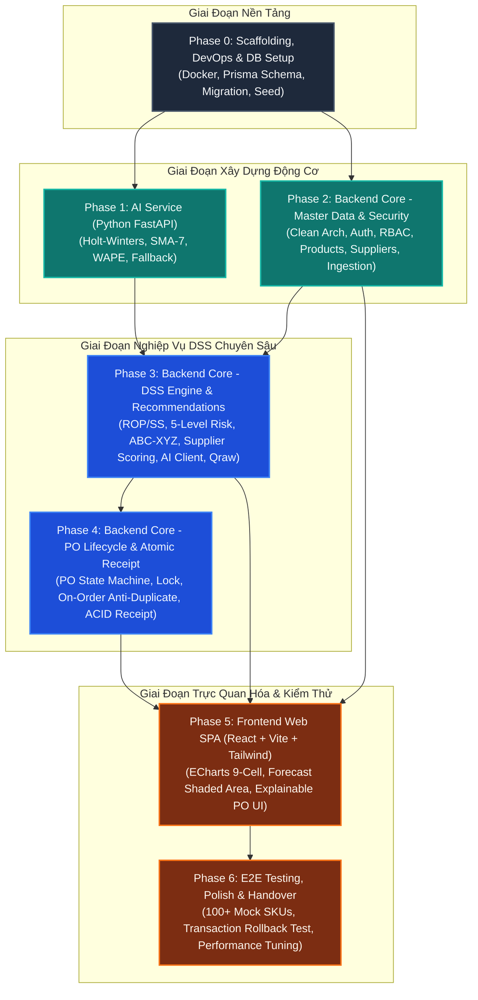

# KẾ HOẠCH TRIỂN KHAI TỔNG THỂ (MASTER IMPLEMENTATION ROADMAP)
## DỰ ÁN: HỆ THỐNG HỖ TRỢ RA QUYẾT ĐỊNH MUA HÀNG TÍCH HỢP AI (DSS AI PURCHASE)

> **Trạng thái:** Sẵn sàng triển khai (Ready for Execution)  
> **Phiên bản:** 1.0  
> **Đối tượng áp dụng:** Senior Tech Lead, Backend/Frontend/AI Engineers, QA & DevOps  
> **Phạm vi hệ thống:** 1 Cửa hàng bán lẻ độc lập (< 1.000 SKU), hỗ trợ quyết định (Human-in-the-loop)

---

## 1. TỔNG QUAN CHIẾN LƯỢC TRIỂN KHAI

Để đảm bảo hệ thống vận hành đúng chuẩn theo thiết kế kiến trúc (**Clean Architecture**, **Feature-Based Architecture**, **Stateless Pure Compute AI Service**) và bảo toàn 100% các quy tắc nghiệp vụ cốt lõi (**Anti-Duplicate**, **ACID Goods Receipt Transaction**, **Explainable Purchase Recommendations**), chiến lược triển khai được chia thành **7 giai đoạn tuần tự (Phase 0 đến Phase 6)**.

### 1.1. Triết Lý & Nguyên Tắc Cốt Lõi (Guiding Principles)
1. **Database-First & Contract-First:** Mọi cấu trúc dữ liệu bắt buộc khởi tạo và đồng bộ từ `physical-schema.sql` và `data-dictionary.md`. Hợp đồng giao tiếp giữa các service tuân thủ chặt chẽ `internal-ai-contracts.md` và `endpoints-spec.md`.
2. **Outside AI, Core Business First:** Xây dựng AI Service độc lập theo chuẩn Stateless Compute Engine trước để kiểm tra tính đúng đắn của thuật toán dự báo (Holt-Winters, SMA-7, WAPE) mà không bị phụ thuộc vào logic cơ sở dữ liệu.
3. **Domain-Driven Isolation:** Tầng Domain của Backend hoàn toàn độc lập, không phụ thuộc vào Framework (Express) hay ORM (Prisma). Toàn bộ công thức toán học ($SS, ROP, Q_{raw}$, ABC-XYZ, OTIF) được bao bọc trong Domain Services có Unit Test bảo vệ 100%.
4. **Transaction Integrity Priority:** Các luồng thay đổi trạng thái đơn hàng và nhận hàng (`UC-012`, `UC-014`) được kiểm thử giao dịch nguyên tử (`prisma.$transaction`) ở mức cô lập cao nhất trước khi nối với Frontend.
5. **Human-In-The-Loop UI:** Frontend chỉ được triển khai khi các API đã hoàn tất và vượt qua kiểm thử hợp đồng (Contract Tests), đảm bảo giao diện tập trung vào trải nghiệm trực quan hóa giải trình đề xuất (Explainable AI) và thao tác nhanh chóng.

---

## 2. SƠ ĐỒ PHỤ THUỘC GIỮA CÁC GIAI ĐOẠN (PHASE DEPENDENCY GRAPH)

---

## 3. BẢNG PHÂN BỔ USE CASE & QUY TẮC NGHIỆP VỤ THEO PHASE

| Giai Đoạn | Tên Giai Đoạn | Use Cases Bao Phủ | Business Rules Thực Thi | Trọng Tâm Nghiệp Vụ |
| :--- | :--- | :--- | :--- | :--- |
| **Phase 0** | Khởi Tạo & Database Setup | — | CSDL Toàn vẹn 3NF, ENUMs | Khởi tạo CSDL PostgreSQL 18 bảng từ `physical-schema.sql`, cấu hình Prisma, Docker Compose `dss-network`. |
| **Phase 1** | Dịch Vụ AI Dự Báo | `UC-007` (Core Model) | `BR-006`, `BR-007`, `BR-008` | Thuật toán Holt-Winters + SMA-7 Fallback khi WAPE > 40%, biên độ tin cậy 95%, tính toán Stateless. |
| **Phase 2** | Backend Master Data & Ingestion | `UC-001`, `UC-002`, `UC-003`, `UC-015`, `UC-016`, `UC-017` | `BR-009`, `BR-010`, `BR-011`, `BR-012`, `BR-013` | Clean Architecture scaffolding, JWT Auth, RBAC, CRUD Sản phẩm & Nhà cung cấp, Nạp dữ liệu bán hàng Excel/CSV. |
| **Phase 3** | Backend DSS & Recommendations | `UC-004`, `UC-005`, `UC-006`, `UC-007`, `UC-008`, `UC-009`, `UC-010`, `UC-011` | `BR-001`, `BR-002`, `BR-003`, `BR-004`, `BR-005`, `BR-013`, `BR-014`, `BR-015`, `BR-016` | Tính toán ROP/SS/DoS, 5 cấp rủi ro tồn kho, Ma trận 9 ô ABC-XYZ, Đánh giá 4 điểm NCC, Gọi AI & Fallback, Đề xuất mua thông minh ($Q_{raw}$, MOQ, Pack Size). |
| **Phase 4** | Backend PO & Atomic Goods Receipt | `UC-012`, `UC-013`, `UC-014` | `BR-001`, `BR-017`, `BR-018`, `BR-019`, `BR-020`, `BR-021`, `BR-024`, `BR-025` | Máy trạng thái PO (`DRAFT` $\rightarrow$ `ORDERED` $\rightarrow$ `RECEIVED`/`CANCELLED`), Tăng `On-Order` chống đặt trùng, Giao dịch nhận hàng nguyên tử ACID (`prisma.$transaction`), Tính OTIF. |
| **Phase 5** | Frontend Web SPA | Toàn bộ `UC-001` đến `UC-017` (UI/UX) | `BR-002` (Bảng màu 5 cấp rủi ro), `BR-025` | Giao diện Feature-Based, TailwindCSS, Apache ECharts (Biểu đồ dải mây & Grid 9 ô ABC-XYZ), Quản lý giỏ hàng gợi ý, Chốt PO và Nhận hàng. |
| **Phase 6** | E2E Testing, Polish & Handover | Toàn bộ luồng nghiệp vụ | Toàn bộ 26 BRs & 13 NFRs | Seed bộ dữ liệu thực tế 100+ SKU, Kiểm thử Rollback giao dịch, Đo kiểm tải NFR-01 đến NFR-05, Hoàn thiện tài liệu bàn giao. |

---

## 4. TIÊU CHUẨN NGHIỆM THU CHẤT LƯỢNG (DEFINITION OF DONE - DoD)

Một giai đoạn (Phase) chỉ được coi là hoàn tất và đủ điều kiện chuyển sang giai đoạn kế tiếp khi thỏa mãn đầy đủ các tiêu chí:

### 4.1. Tiêu Chuẩn Kỹ Thuật (Engineering DoD)
1. **Tuân Thủ Tuyệt Đối Schema:** 100% bảng, tên cột, kiểu dữ liệu, ràng buộc CHECK và khóa ngoại khớp chính xác với `physical-schema.sql` và `data-dictionary.md`. Không tự ý bổ sung cột tùy tiện.
2. **Kiến Trúc Tách Bạch:**
   - Backend tuân thủ Clean Architecture: Tầng Domain không import Prisma, Express hay Zod. Tầng Application điều phối qua Interfaces.
   - AI Service hoàn toàn Stateless: Không import thư viện kết nối database (như psycopg2 hay asyncpg), giao tiếp thuần túy qua HTTP JSON Body.
   - Frontend tổ chức theo `src/features/<feature-name>`: Sử dụng Zod validate response, React Query quản lý cache.
3. **Chuẩn Hóa Phản Hồi:** 100% API Backend bọc trong Uniform Envelope `{ success: true, data: ..., meta?: ..., timestamp: ... }` hoặc `{ success: false, error: { code, message, details?: ... }, timestamp: ... }`.
4. **Độ Bao Phủ Kiểm Thử (Test Coverage):**
   - Các công thức toán cốt lõi trong Domain ($SS, ROP, Q_{raw}$, WAPE, MAE, OTIF, ABC-XYZ) đạt **100% Unit Test Coverage**.
   - Giao dịch nhận hàng nguyên tử (`UC-014`) có Integration Test kiểm tra kịch bản Rollback khi phát sinh lỗi ngoại lệ.
5. **Quy Chuẩn Ngôn Ngữ & Đặt Mã:**
   - Toàn bộ code, biến, hàm, comments: **Tiếng Anh 100%**.
   - Thông báo trả về người dùng, lỗi hiển thị UI: **Tiếng Việt 100%**.
   - Mã PO tuân thủ định dạng tự động `PO-YYYYMMDD-XXXX` (`BR-024`).

---

## 5. MA TRẬN QUẢN TRỊ RỦI RO KỸ THUẬT (TECHNICAL RISK MANAGEMENT)

| # | Rủi Ro Kỹ Thuật Tiềm Ẩn | Mức Độ | Biện Pháp Kiểm Soát & Giải Pháp Kỹ Thuật |
| :-: | :--- | :---: | :--- |
| **R1** | **Xung đột / Lệch dữ liệu khi nhận hàng đồng thời** | **Cao** | Bắt buộc sử dụng `prisma.$transaction` với mức cô lập cao, cập nhật nguyên tử 2 chiều: `on_hand += accepted`, `on_order -= ordered`, đóng trạng thái `RECEIVED` và ghi `delivery_history` trong cùng 1 transaction. |
| **R2** | **Đặt hàng trùng lặp do nhân viên thao tác đè** | **Cao** | Thực thi nghiêm ngặt `BR-001` và `BR-025`: Ngay khi PO chuyển sang `ORDERED`, `on_order` lập tức tăng lên trong DB; khóa cứng danh mục PO; công thức tính $Q_{raw}$ luôn tính $\text{IP} = \text{On-Hand} + \text{On-Order}$. |
| **R3** | **Dịch vụ AI phản hồi chậm hoặc sập (Crash/Timeout)** | **Trung bình** | Backend cấu hình Axios Timeout 4000ms (`NFR-04`). Nếu AI Service timeout hoặc lỗi mạng, tự động kích hoạt **Local Fallback Engine** chạy thuật toán SMA-7 nội bộ trên Node.js (`BR-007`). |
| **R4** | **Lệch kiểu dữ liệu số thực (Floating-Point Inaccuracy)** | **Trung bình** | Trong PostgreSQL sử dụng `DECIMAL(12, 2)` / `DECIMAL(12, 4)`. Trong TypeScript, sử dụng thư viện `decimal.js` hoặc làm tròn có kiểm soát tại các bước tính toán tiền tệ và số lượng. |
| **R5** | **Cache Frontend hiển thị dữ liệu tồn kho cũ** | **Thấp** | Thiết lập quy tắc `queryClient.invalidateQueries` chặt chẽ trong React Query ngay sau khi thực hiện thao tác nhận hàng (`UC-014`), tạo đơn (`UC-012`) hoặc chạy lại phân tích (`UC-011`). |
