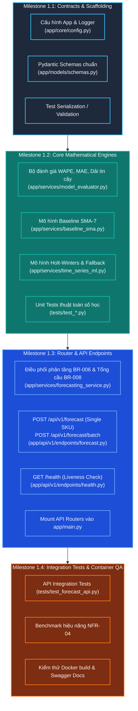

# CHI TIẾT CÁC MILESTONE THỰC THI: PHASE 1 - AI DEMAND FORECASTING SERVICE
## DỰ ÁN: HỆ THỐNG HỖ TRỢ RA QUYẾT ĐỊNH MUA HÀNG TÍCH HỢP AI (DSS AI PURCHASE)

> **Trạng thái:** Kế hoạch thực thi chi tiết (Execution Ready)  
> **Phiên bản:** 1.0  
> **Phạm vi:** Dịch vụ AI Dự báo nhu cầu bán lẻ (`ai-service/` - Python 3.10+ FastAPI)  
> **Kiến trúc áp dụng:** **Stateless Pure Compute Engine** (Tuyệt đối không kết nối trực tiếp CSDL PostgreSQL; nhận mảng lịch sử bán hàng qua HTTP POST từ Backend Node.js, xử lý thuật toán và trả về JSON)  
> **Tài liệu tham chiếu chuẩn:**
> * [`GEMINI.md`](file:///d:/projects/dss-ai-purchase/GEMINI.md)
> * [`overview.md`](file:///d:/projects/dss-ai-purchase/docs/07-implementation-plan/overview.md)
> * [`phase-details.md`](file:///d:/projects/dss-ai-purchase/docs/07-implementation-plan/phase-details.md)
> * [`ai-service-architecture.md`](file:///d:/projects/dss-ai-purchase/docs/05-architecture/ai-service-architecture.md)
> * [`internal-ai-contracts.md`](file:///d:/projects/dss-ai-purchase/docs/06-api-design/internal-ai-contracts.md)
> * [`business-rules.md (BR-006, BR-007, BR-008)`](file:///d:/projects/dss-ai-purchase/docs/02-requirements/business-rules.md)

---

## 1. TỔNG QUAN CHIẾN LƯỢC PHÂN TÁCH MILESTONES

### 1.1. Lý do bắt buộc phải chia nhỏ Phase 1
Mặc dù Phase 1 là một dịch vụ độc lập đóng gói trong thư mục `ai-service/`, việc chia thành **4 chặng (Milestones 1.1 $\rightarrow$ 1.4)** là yêu cầu bắt buộc để đảm bảo:
1. **Tính tương thích hợp đồng giao tiếp (Contract Strictness):** Pydantic Schemas phải khớp 100% từng trường dữ liệu với `internal-ai-contracts.md` và TypeScript DTOs tại Backend Node.js.
2. **Cô lập lỗi thuật toán số học (Mathematical Isolation):** Tách bạch các hàm tính toán cốt lõi (WAPE, MAE, dải tin cậy, Holt-Winters) khỏi lớp API/HTTP để viết Unit Test bao phủ 100% trước khi tích hợp.
3. **Bảo vệ quy tắc Fallback an toàn (`BR-007`):** Ngưỡng sai số $\text{WAPE} > 40\%$ là phòng tuyến cốt lõi ngăn ngừa việc đặt hàng sai lệch; cần kịch bản kiểm thử tự động chuyên biệt để chứng minh cơ chế Fallback luôn hoạt động.
4. **Kiểm soát hiệu năng phi chức năng (`NFR-04`):** Đảm bảo tốc độ dự báo single SKU $< 150\text{ms}$ và batch 100 SKUs $< 3000\text{ms}$.

---

### 1.2. Sơ đồ Luồng Thực Thi Giữa Các Milestones

---

## 2. CHI TIẾT TỪNG MILESTONE THỰC THI

### MILESTONE 1.1: CONTRACTS & CONFIGURATION SCAFFOLDING
* **Mục tiêu:** Xây dựng khung cấu hình và toàn bộ hợp đồng dữ liệu Pydantic Request/Response chuẩn hóa, sẵn sàng cho việc kiểm tra kiểu dữ liệu tự động.
* **Thời gian ước tính:** 1 phiên làm việc.
* **Tài liệu tham chiếu:** [`internal-ai-contracts.md`](file:///d:/projects/dss-ai-purchase/docs/06-api-design/internal-ai-contracts.md), [`ai-service-architecture.md (Mục 4)`](file:///d:/projects/dss-ai-purchase/docs/05-architecture/ai-service-architecture.md).

#### Danh Sách Công Việc (Work Breakdown Structure):
1. **Cấu hình ứng dụng (`app/core/config.py`):**
   * Sử dụng `pydantic-settings` hoặc `pydantic.BaseModel` để quản lý biến môi trường:
     * `PROJECT_NAME`: `"DSS AI Purchase - Forecasting Engine"`
     * `VERSION`: `"1.0.0"`
     * `API_V1_STR`: `"/api/v1"`
     * `PORT`: `8000` (mặc định)
     * `CORS_ORIGINS`: Danh sách các domain cho phép kết nối (mặc định cho phép Docker mạng nội bộ và localhost).
2. **Khai báo Pydantic Schemas (`app/models/schemas.py`):**
   * `AlgorithmUsedEnum`: Enum chuỗi gồm 4 giá trị:
     * `"AI_MODEL"`: Mô hình Holt-Winters đạt chuẩn chất lượng ($\text{WAPE} \le 40\%$).
     * `"FALLBACK_SMA7"`: Mô hình Holt-Winters bị lỗi/nhiễu ($\text{WAPE} > 40\%$), kích hoạt Fallback.
     * `"BASIC_SMA7"`: Dữ liệu lịch sử ở tầng 2 ($14 \le N_{days} < 30$).
     * `"COLD_START_ESTIMATE"`: Dữ liệu lịch sử ở tầng 1 ($N_{days} < 14$).
   * `DailySalesRecord`:
     * `date`: kiểu `datetime.date`
     * `quantity`: kiểu `int = Field(ge=0)`
   * `ForecastRequest`:
     * `sku`: `str`
     * `horizon_days`: `int = Field(14, ge=7, le=30)`
     * `sales_history`: `List[DailySalesRecord]`
     * `expected_daily_sales`: `Optional[int] = Field(None, ge=1)`
   * `ForecastBatchRequest`:
     * `items`: `List[ForecastRequest]`
   * `ForecastPoint`:
     * `date`: `datetime.date`
     * `predicted`: `int` (làm tròn số nguyên $\ge 0$)
     * `lower_bound`: `int` ($\ge 0$)
     * `upper_bound`: `int`
   * `ForecastResponse`:
     * `sku`: `str`
     * `horizon_days`: `int`
     * `forecasted_demand`: `int`
     * `daily_avg_demand`: `float`
     * `wape`: `Optional[float]`
     * `mae`: `Optional[float]`
     * `algorithm_used`: `AlgorithmUsedEnum`
     * `is_fallback`: `bool`
     * `points`: `List[ForecastPoint]`
   * `ForecastBatchResponse`:
     * `total_processed`: `int`
     * `execution_time_ms`: `float`
     * `results`: `List[ForecastResponse]`
   * `HealthResponse`:
     * `status`: `str` (`"HEALTHY"`)
     * `service`: `str` (`"dss-ai-service"`)
     * `version`: `str` (`"1.0.0"`)
     * `uptime_seconds`: `float`
3. **Tiêu chuẩn nghiệm thu Milestone 1.1 (Exit Criteria):**
   * [ ] Schemas khởi tạo thành công không có lỗi cú pháp.
   * [ ] Kiểm tra Pydantic validation: Payload chứa `quantity < 0` hoặc `horizon_days = 5` bị chặn với mã lỗi HTTP 422.
   * [ ] Tên các trường khớp 100% với định dạng snake_case trong `internal-ai-contracts.md`.

---

### MILESTONE 1.2: CORE MATHEMATICAL & ML ENGINES (PURE COMPUTE)
* **Mục tiêu:** Cài đặt độc lập toàn bộ các hàm toán học, thống kê và mô hình dự báo chuỗi thời gian dưới dạng Pure Functions; kiểm thử bằng Unit Tests với `pytest`.
* **Thời gian ước tính:** 1 - 2 phiên làm việc.
* **Tài liệu tham chiếu:** [`business-rules.md (BR-006, BR-007)`](file:///d:/projects/dss-ai-purchase/docs/02-requirements/business-rules.md), [`ai-service-architecture.md (Mục 5)`](file:///d:/projects/dss-ai-purchase/docs/05-architecture/ai-service-architecture.md).

#### Danh Sách Công Việc (Work Breakdown Structure):
1. **Bộ đánh giá sai số & Dải tin cậy (`app/services/model_evaluator.py`):**
   * Hàm `calculate_wape(actuals: np.ndarray, predictions: np.ndarray) -> float`:
     * Công thức: $\text{WAPE} = \frac{\sum_{i=1}^n |y_i - \hat{y}_i|}{\sum_{i=1}^n y_i} \times 100\%$.
     * Xử lý trường hợp đặc biệt: Nếu $\sum y_i == 0$, nếu mọi $\hat{y}_i == 0$ thì trả về `0.0`, ngược lại trả về `100.0`.
   * Hàm `calculate_mae(actuals: np.ndarray, predictions: np.ndarray) -> float`:
     * Công thức: $\text{MAE} = \frac{1}{n} \sum_{i=1}^n |y_i - \hat{y}_i|$.
   * Hàm `calculate_confidence_interval(predicted: float, metric_error: float) -> tuple[int, int]`:
     * Sử dụng cận tin cậy chuẩn theo hợp đồng:
       $$\text{lower\_bound} = \max(0, \lfloor \hat{y} - 1.65 \cdot \text{metric\_error} \rfloor)$$
       $$\text{upper\_bound} = \lceil \hat{y} + 1.65 \cdot \text{metric\_error} \rceil$$
2. **Mô hình Baseline SMA-7 (`app/services/baseline_sma.py`):**
   * Hàm `predict_sma7(sales_series: pd.Series, horizon_days: int) -> tuple[np.ndarray, float]`:
     * Lấy 7 ngày bán gần nhất: `window = sales_series.iloc[-7:]`.
     * Tính trung bình: $\text{sma\_val} = \text{float}(window.\text{mean}())$.
     * Giá trị dự báo cho mỗi ngày trong chu kỳ $T$: $\hat{y}_t = \max(0.0, \text{sma\_val})$.
     * Ước lượng độ biến thiên: $\text{error\_margin} = \text{float}(window.\text{std}())$. Nếu độ lệch chuẩn là NaN hoặc 0 thì mặc định là `1.0`.
     * Trả về `(predictions, error_margin)`.
3. **Mô hình Holt-Winters & Cơ chế Fallback (`app/services/time_series_ml.py`):**
   * Hàm `predict_holt_winters(sales_series: pd.Series, horizon_days: int) -> tuple[np.ndarray, Optional[float], float, bool]`:
     * **Bước 1: Backtesting 7 ngày gần nhất:**
       * Tập huấn luyện (Train): $N - 7$ ngày đầu (`sales_series.iloc[:-7]`).
       * Tập kiểm thử (Test): 7 ngày cuối (`sales_series.iloc[-7:]`).
     * **Bước 2: Huấn luyện & Đánh giá thử nghiệm:**
       * Sử dụng `ExponentialSmoothing(train, trend="add", seasonal="add", seasonal_periods=7, initialization_method="estimated").fit()`.
       * Dự báo 7 ngày kiểm thử và chặn dưới bằng 0: `test_preds = np.maximum(0, model.forecast(7))`.
       * Tính `wape = calculate_wape(test.to_numpy(), test_preds)` và `mae = calculate_mae(test.to_numpy(), test_preds)`.
       * Nếu mô hình phát sinh ngoại lệ không hội tụ $\rightarrow$ gán `wape = 999.0`, `mae = 0.0`.
     * **Bước 3: Thực thi quy tắc Fallback `BR-007`:**
       * Nếu `wape > 40.0`:
         * Kích hoạt fallback: Dùng `predict_sma7` trên 7 ngày gần nhất.
         * Trả về `(predictions, wape, fallback_mae, is_fallback=True)`.
     * **Bước 4: Huấn luyện trên toàn bộ chuỗi khi đạt chuẩn:**
       * Nếu `wape <= 40.0`:
         * Huấn luyện lại trên toàn bộ `sales_series`.
         * Dự báo `horizon_days` tiếp theo: `preds = np.maximum(0, full_model.forecast(horizon_days))`.
         * Trả về `(preds, wape, mae, is_fallback=False)`.
4. **Unit Tests Cho Thuật Toán Số Học:**
   * `tests/test_model_evaluator.py`: Kiểm tra tính WAPE, MAE với dữ liệu thực tế đã tính tay trước; kiểm tra mẫu số 0; kiểm tra cận dưới $\ge 0$.
   * `tests/test_baseline_sma.py`: Kiểm tra chuỗi 7 ngày cố định; kiểm tra dự báo đều cho $T$ ngày.
   * `tests/test_time_series_ml.py`:
     * Kiểm thử với chuỗi 35 ngày có tính chu kỳ tuần rõ rệt $\rightarrow$ WAPE $\le 40\%$, `is_fallback == False`.
     * Kiểm thử với chuỗi 35 ngày biến động nhiễu cực đoan $\rightarrow$ WAPE $> 40\%$, kích hoạt `is_fallback == True`.
5. **Tiêu chuẩn nghiệm thu Milestone 1.2 (Exit Criteria):**
   * [ ] Toàn bộ Unit Tests toán học chạy thành công 100% bằng `pytest tests/test_*.py`.
   * [ ] Không có giá trị dự báo âm phát sinh trong bất kỳ kịch bản nào.
   * [ ] Cơ chế Fallback được kích hoạt chuẩn xác khi sai số WAPE vượt 40%.

---

### MILESTONE 1.3: SERVICE COORDINATOR & API ENDPOINTS
* **Mục tiêu:** Hiện thực hóa bộ điều phối nghiệp vụ phân tầng dữ liệu theo `BR-006`, tích hợp công thức tổng cầu `BR-008`, xây dựng và gắn các API endpoints vào ứng dụng FastAPI.
* **Thời gian ước tính:** 1 phiên làm việc.
* **Tài liệu tham chiếu:** [`business-rules.md (BR-006, BR-008)`](file:///d:/projects/dss-ai-purchase/docs/02-requirements/business-rules.md), [`internal-ai-contracts.md`](file:///d:/projects/dss-ai-purchase/docs/06-api-design/internal-ai-contracts.md).

#### Danh Sách Công Việc (Work Breakdown Structure):
1. **Bộ điều phối nghiệp vụ dự báo (`app/services/forecasting_service.py`):**
   * Lớp `ForecastingService`:
     * Hàm `forecast_single_sku(request: ForecastRequest) -> ForecastResponse`:
       * Sắp xếp `sales_history` theo ngày tăng dần.
       * Xác định ngày bán cuối cùng (`last_date`).
       * **TẦNG 1 - `COLD_START_ESTIMATE` ($N_{days} < 14$):**
         * Lấy $D_{expected} = \text{request.expected\_daily\_sales}$ (nếu không có thì mặc định $D_{expected} = 1$).
         * Tạo các điểm ngày tương lai: $\text{predicted} = D_{expected}$, $\text{lower} = \max(0, D_{expected} - 1)$, $\text{upper} = D_{expected} + 1$.
         * $\text{Total Demand} = D_{expected} \times \text{horizon\_days}$, $D_{avg} = D_{expected}$.
       * **TẦNG 2 - `BASIC_SMA7` ($14 \le N_{days} < 30$):**
         * Gọi `predict_sma7(sales_series, horizon)`.
         * Làm tròn số nguyên từng ngày: $\text{pred\_int} = \lceil \hat{y}_t \rceil$.
         * Tạo dải tin cậy với sai số $\sigma$.
         * $\text{Total Demand} = \sum \text{pred\_int}$, $D_{avg} = \text{Total Demand} / \text{horizon}$.
       * **TẦNG 3 - `AI_READY` ($N_{days} \ge 30$):**
         * Gọi `predict_holt_winters(sales_series, horizon)`.
         * Nhận `(preds, wape, mae, is_fallback)`.
         * Nếu `is_fallback`: `algorithm_used = AlgorithmUsedEnum.FALLBACK_SMA7`.
         * Nếu không fallback: `algorithm_used = AlgorithmUsedEnum.AI_MODEL`.
         * Tính toán các điểm ngày tương lai và dải tin cậy theo công thức tại `internal-ai-contracts.md`.
         * Tính tổng lượng cầu chu kỳ theo **`BR-008`**:
           $$\text{Forecasted Demand}_T = \left\lceil \sum_{t=1}^T \max(0, \hat{y}_t) \right\rceil \qquad ; \qquad D_{avg} = \frac{\text{Forecasted Demand}_T}{T}$$
     * Hàm `forecast_batch(request: ForecastBatchRequest) -> ForecastBatchResponse`:
       * Đo thời gian bắt đầu (`time.perf_counter()`).
       * Duyệt và xử lý lần lượt/danh sách các SKU trong `request.items`.
       * Tính tổng thời gian xử lý `execution_time_ms`.
       * Trả về kết quả tổng hợp.
2. **Endpoints API (`app/api/v1/endpoints/`):**
   * `app/api/v1/endpoints/forecast.py`:
     * Route `POST /api/v1/forecast`: Nhận `ForecastRequest`, gọi service và trả về `ForecastResponse` (mã HTTP 200).
     * Route `POST /api/v1/forecast/batch`: Nhận `ForecastBatchRequest`, gọi service và trả về `ForecastBatchResponse` (mã HTTP 200).
   * `app/api/v1/endpoints/health.py`:
     * Route `GET /health`: Trả về `HealthResponse` gồm `{ status: "HEALTHY", service: "dss-ai-service", version: "1.0.0", uptime_seconds: ... }`.
3. **Đăng ký Router & Hoàn thiện Server (`app/api/v1/router.py` & `app/main.py`):**
   * Tập hợp các routes vào `api_router`.
   * Gắn `api_router` vào `app` với tiền tố cấu hình `/api/v1`.
   * Cấu hình ghi nhận thời gian uptime server từ lúc khởi động.
4. **Tiêu chuẩn nghiệm thu Milestone 1.3 (Exit Criteria):**
   * [ ] Khởi động server FastAPI không lỗi cú pháp: `uvicorn app.main:app --reload`.
   * [ ] Truy cập `http://localhost:8000/docs` hiển thị đủ 3 endpoints: `POST /api/v1/forecast`, `POST /api/v1/forecast/batch`, `GET /health`.
   * [ ] Gọi `GET /health` trả về HTTP 200 kèm `status: "HEALTHY"`.
   * [ ] Gọi `POST /api/v1/forecast` với chuỗi 10 ngày trả về đúng `COLD_START_ESTIMATE`.
   * [ ] Gọi `POST /api/v1/forecast` với chuỗi 20 ngày trả về đúng `BASIC_SMA7`.
   * [ ] Gọi `POST /api/v1/forecast` với chuỗi 35 ngày trả về đúng `AI_MODEL` hoặc `FALLBACK_SMA7`.

---

### MILESTONE 1.4: INTEGRATION TEST SUITE, BENCHMARK & CONTAINER QA
* **Mục tiêu:** Viết bộ kiểm thử tích hợp tự động toàn diện qua HTTP Client, kiểm tra các trường hợp biên, đo kiểm hiệu năng theo tiêu chuẩn `NFR-04` và xác nhận container Docker hoạt động độc lập.
* **Thời gian ước tính:** 1 phiên làm việc.
* **Tài liệu tham chiếu:** [`non-functional-requirements.md (NFR-02, NFR-04)`](file:///d:/projects/dss-ai-purchase/docs/02-requirements/non-functional-requirements.md), [`deployment-and-devops.md`](file:///d:/projects/dss-ai-purchase/docs/05-architecture/deployment-and-devops.md).

#### Danh Sách Công Việc (Work Breakdown Structure):
1. **Bộ kiểm thử tích hợp API (`tests/test_forecast_api.py`):**
   * Sử dụng `starlette.testclient.TestClient` hoặc `httpx.AsyncClient`.
   * Kịch bản 1: Kiểm thử `GET /health` trả về 200 OK và đúng schema.
   * Kịch bản 2: Kiểm thử `POST /api/v1/forecast` với SKU mới (Cold start, 5 ngày bán).
   * Kịch bản 3: Kiểm thử `POST /api/v1/forecast` với chuỗi 20 ngày (SMA-7).
   * Kịch bản 4: Kiểm thử `POST /api/v1/forecast` với chuỗi 60 ngày bán ổn định (AI Holt-Winters).
   * Kịch bản 5: Kiểm thử `POST /api/v1/forecast` với chuỗi 60 ngày có đột biến cực mạnh $\rightarrow$ Kiểm tra cờ `is_fallback == true`.
   * Kịch bản 6: Kiểm thử `POST /api/v1/forecast/batch` với 10 SKUs hỗn hợp cả 3 tầng dữ liệu.
   * Kịch bản 7: Kiểm thử dữ liệu biên (Edge cases):
     * Mảng lịch sử có ngày bán bằng 0 liên tiếp.
     * Mảng lịch sử không theo thứ tự ngày $\rightarrow$ Service tự sắp xếp.
     * Kiểm tra cận dưới dải tin cậy: Tuyệt đối không bao giờ âm ($\text{lower\_bound} \ge 0$).
2. **Đo kiểm hiệu năng (Performance Benchmark - `NFR-04`):**
   * Viết script kiểm thử tải nội bộ:
     * Đo 100 lần gọi `POST /api/v1/forecast` cho 1 SKU (chuỗi 60 ngày, horizon 14): Thời gian trung bình $< 150\text{ms}$.
     * Đo gọi `POST /api/v1/forecast/batch` cho 100 SKUs: Tổng thời gian xử lý $< 3000\text{ms}$ (mục tiêu hệ thống $< 3$ giây).
3. **Đóng gói Docker & Kiểm tra Môi trường Chạy Độc Lập:**
   * Kiểm tra `ai-service/Dockerfile`:
     * Base image Python 3.10 / 3.11 slim.
     * Cài đặt dependencies từ `requirements.txt`.
     * Thiết lập lệnh chạy: `uvicorn app.main:app --host 0.0.0.0 --port 8000`.
   * Kiểm tra tích hợp trong `docker-compose.yml`:
     * Chạy lệnh `docker compose up ai-service --build -d`.
     * Kiểm tra lệnh `docker compose ps` hiển thị container `dss-ai-service` trạng thái `running` (healthy).
4. **Tiêu chuẩn nghiệm thu Milestone 1.4 (Exit Criteria & Phase 1 Done):**
   * [ ] 100% test cases trong `pytest tests/` vượt qua (Pass rate 100%).
   * [ ] Đo kiểm benchmark thỏa mãn tiêu chuẩn `NFR-04`.
   * [ ] Image Docker build thành công, dung lượng tối ưu ($< 350\text{MB}$).
   * [ ] Tài liệu hướng dẫn kiểm thử Swagger UI sẵn sàng cho giai đoạn Phase 2 và Phase 3.

---

## 3. BẢNG TỔNG KẾT TÁC ĐỘNG TỆP TIN (FILE IMPACT MATRIX)

| STT | Đường Dẫn Tệp Tin | Trạng Thái | Trách Nhiệm & Chức Năng Cụ Thể | Milestone |
| :---: | :--- | :---: | :--- | :---: |
| 1 | `ai-service/app/core/config.py` | **NEW** | Đọc biến môi trường, cấu hình CORS, app title, version | **M1.1** |
| 2 | `ai-service/app/models/schemas.py` | **NEW** | Pydantic Request/Response models khớp 100% contracts | **M1.1** |
| 3 | `ai-service/app/services/model_evaluator.py` | **NEW** | Tính WAPE, MAE, Dải tin cậy 95% ($\text{lower} \ge 0$) | **M1.2** |
| 4 | `ai-service/app/services/baseline_sma.py` | **NEW** | Thuật toán SMA-7 và phương sai ước lượng | **M1.2** |
| 5 | `ai-service/app/services/time_series_ml.py` | **NEW** | Holt-Winters (`statsmodels`), Backtest 7 ngày, Fallback | **M1.2** |
| 6 | `ai-service/app/services/forecasting_service.py` | **NEW** | Điều phối 3 tầng dữ liệu (`BR-006`), tính tổng cầu (`BR-008`), batch | **M1.3** |
| 7 | `ai-service/app/api/v1/endpoints/forecast.py` | **NEW** | `POST /forecast` & `POST /forecast/batch` | **M1.3** |
| 8 | `ai-service/app/api/v1/endpoints/health.py` | **NEW** | `GET /health` kiểm tra trạng thái và uptime | **M1.3** |
| 9 | `ai-service/app/api/v1/router.py` | **NEW** | Gom nhóm các endpoints vào router v1 | **M1.3** |
| 10 | `ai-service/app/main.py` | **MODIFY** | Mount router `/api/v1`, cấu hình middleware, uptime tracking | **M1.3** |
| 11 | `ai-service/tests/test_model_evaluator.py` | **NEW** | Unit test công thức WAPE, MAE, bounds | **M1.2** |
| 12 | `ai-service/tests/test_baseline_sma.py` | **NEW** | Unit test thuật toán SMA-7 | **M1.2** |
| 13 | `ai-service/tests/test_time_series_ml.py` | **NEW** | Unit test Holt-Winters & kích hoạt Fallback | **M1.2** |
| 14 | `ai-service/tests/test_forecast_api.py` | **NEW** | Test tích hợp toàn diện API, edge cases & batch | **M1.4** |

---

## 4. MA TRẬN ĐỐI CHIẾU QUY TẮC NGHIỆP VỤ & NFRs

| Mã Quy Tắc / NFR | Nội Dung Yêu Cầu Kỹ Thuật | Module Cài Đặt Thực Thi | Cách Thức Kiểm Chứng |
| :--- | :--- | :--- | :--- |
| **`BR-006`** | Phân tầng dữ liệu 3 tiers: Cold Start ($< 14$), SMA-7 ($14-29$), AI ($\ge 30$). | `forecasting_service.py` | Test truyền mảng lịch sử 7 ngày, 20 ngày, 40 ngày $\rightarrow$ kiểm tra trường `algorithm_used`. |
| **`BR-007`** | Đo WAPE/MAE; tự động fallback sang SMA-7 nếu $\text{WAPE} > 40\%$. | `model_evaluator.py` `time_series_ml.py` | Test với chuỗi dao động mạnh; xác nhận `is_fallback == True` và thuật toán chuyển sang SMA-7. |
| **`BR-008`** | Tổng cầu chu kỳ: $\lceil \sum \max(0, \hat{y}_t) \rceil$; nhu cầu trung bình ngày $D_{avg}$. | `forecasting_service.py` | Test tổng lượng cầu luôn làm tròn số nguyên không âm và $D_{avg}$ tính đúng. |
| **`NFR-04`** | Thời gian phản hồi: Single SKU $< 150\text{ms}$; Batch 100 SKUs $< 3000\text{ms}$. | `endpoints/forecast.py` | Chạy benchmark test với 100 SKUs và đo lường thời gian thực thi bằng `time.perf_counter()`. |
| **`Stateless`** | Tuyệt đối không import thư viện database, không duy trì kết nối CSDL. | Toàn bộ `ai-service/` | Kiểm tra file mã nguồn và `requirements.txt` không chứa postgres/prisma/sqlalchemy. |
